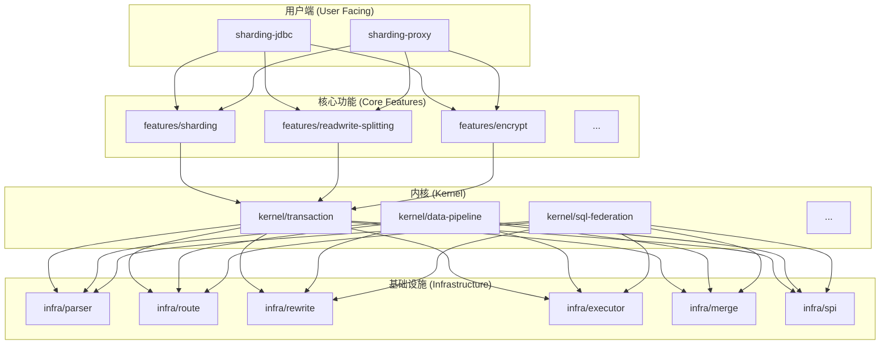
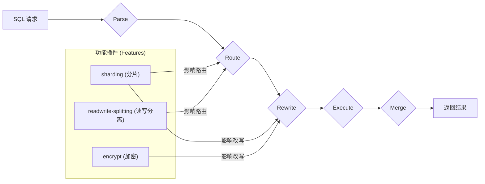

# ShardingSphere 宏观学习手册 (v3 - 重点版)

> **目标**：本手册旨在用最直接的语言和图表，揭示 ShardingSphere 的架构核心与设计本质，为您提供一份“一针见血”的源码学习指南。

---

## 1. 核心思想：一针见血

-   **它不是数据库，而是“数据库的增强工具包”**。它通过拦截和改写 SQL 来实现增强功能，自身不存储数据。
-   **两大形态的本质选择：要性能还是要治理？**
    -   `JDBC`：追求极致性能，在应用内完成所有计算，适合 OLTP。
    -   `Proxy`：追求集中治理，将复杂性收到代理层，适合跨语言、DBA 主导的场景。
-   **所有“功能 (Feature)”都是“插件 (Plugin)”**。无论是分片、读写分离还是加密，它们都作为插件，“挂载”到 SQL 的处理生命周期中。
-   **“可插拔”是其灵魂**。项目的每一层（甚至内核）都基于 SPI 构建，一切皆可替换。这是二次开发的基础。
-   **DistSQL 是未来**。直接抛弃繁琐的 YAML，拥抱 DistSQL。它是现代 ShardingSphere 的标准治理方式。

---

## 2. 架构核心：三层模型与模块依赖

### 2.1. 三层可插拔架构

ShardingSphere 的所有功能都构建在这套逻辑分层模型之上。

1.  **L1 - 内核层 (Kernel Layer)**：提供 SQL 解析、路由、执行、归并等基础能力框架。
2.  **L2 - 功能层 (Feature Layer)**：实现数据分片、读写分离、事务、安全等具体功能。**这些功能即是插件**。
3.  **L3 - 生态层 (Ecosystem Layer)**：负责对接不同的数据库（协议、方言）和客户端，让上层功能可以适配异构环境。

### 2.2. 源码模块依赖关系

这张图揭示了 Maven 模块的静态依赖结构，是理解代码组织的第一步。

**一句话总结：** `infra` 是工具箱，`kernel` 是引擎，`features` 是功能模块，`jdbc/proxy` 是对外暴露的“外壳”。

---

## 3. 引擎脉络：SQL 生命周期与代码入口

理解 SQL 如何在 ShardingSphere 内部被“加工”，是理解其所有功能实现的基础。

### 3.1. SQL 生命周期与插件挂载点

-   **核心流程**: `Parse → Route → Rewrite → Execute → Merge`。
-   **插件作用点**: `sharding` 和 `readwrite-splitting` 主要在 **Route** 阶段生效，决定 SQL 去向；`encrypt` 则在 **Rewrite** 阶段生效，修改 SQL 文本和参数。

### 3.2. 各阶段核心代码入口

| 阶段 | 一句话解释“为什么看它” | 核心代码入口 (类/接口) |
|:---|:---|:---|
| **Parse** | 万物之始，看 SQL 如何变成机器可读的 AST。 | `SQLParserEngine` |
| **Route** | 核心决策点，看分片、读写分离如何决定 SQL 的目的地。 | `SQLRouter` |
| **Rewrite**| SQL 整容室，看 ShardingSphere 如何“偷偷”修改你的 SQL。 | `SQLRewriteEngine` |
| **Execute**| 并发执行器，看多条真实 SQL 如何被并发调度和执行。 | `KernelProcessor` |
| **Merge** | 结果聚合器，看多个数据源的结果如何被合并成一个。 | `ResultMerger` |
| **SPI** | 插件化灵魂，看所有可替换的接口是如何被定义的。 | `ShardingSphereSPI` |
| **JDBC 入口** | JDBC 接入的起点，从这里开始 Debug。 | `ShardingSphereDataSourceFactory` |
| **Proxy 入口** | Proxy 服务的启动类，看服务如何初始化。 | `ShardingSphereProxyBootstrap` |

---

## 4. 核心功能解析

### 4.1. 数据分片 (Sharding)

**一句话总结**：将一张大表的数据，根据规则（如用户 ID 取模）分散到多个物理库或表中，但对应用层保持透明。

-   **关键概念**: `逻辑表` (Logic Table), `真实表` (Actual Table), `分片键` (Sharding Key), `分片算法` (Sharding Algorithm)。
-   **代码入口**: `features/sharding`, `ShardingRule`, `ShardingSphereRoutingEngine`。

### 4.2. 读写分离 (Read/Write Splitting)

**一句话总结**：自动将 `SELECT` 请求路由到从库，将 `INSERT/UPDATE/DELETE` 路由到主库，实现数据库负载均衡。

-   **关键概念**: `主库` (Write DataSource), `从库` (Read DataSource), `负载均衡算法` (Load Balancer)。
-   **代码入口**: `features/readwrite-splitting`, `ReadwriteSplittingRule`, `ReadwriteSplittingDataSourceRouter`。

### 4.3. DistSQL：现代化的治理语言

**一句话总结**：用 SQL 的方式去管理和配置 ShardingSphere，彻底取代修改 YAML 文件。

-   **四大语法**: `RDL` (Resource/Rule Definition), `RQL` (Rule Query), `RAL` (Rule Administration), `RUL` (Rule Utility)。
-   **为什么必须用它？**：配置实时生效、避免手滑、统一管理入口、与云原生部署完美契合。

### 4.4. 可观测性 (Observability)

**一句话总结**：通过 Agent 插件，将 ShardingSphere 内部的状态（Trace, Metrics, Log）暴露给第三方监控系统。

-   **生态对接**: 原生支持 OpenTelemetry、SkyWalking、Prometheus。
-   **核心价值**: 诊断慢 SQL、追踪分布式链路、监控系统性能。
-   **代码入口**: `agent/` 目录下的各个插件。

---

## 5. 源码学习路径（行动建议）

1.  **跑通一个 Proxy 示例**：
    -   **目标**：感受 DistSQL 的强大。
    -   **行动**：下载 Proxy 二进制包，启动后，使用任意 MySQL 客户端连接，并手动执行 `CREATE STORAGE UNIT` 和 `CREATE SHARDING TABLE RULE`。

2.  **Debug 一个 JDBC 流程**：
    -   **目标**：亲眼见证 SQL 的生命周期。
    -   **行动**：在 `examples/shardingsphere-jdbc-example` 中，找到 `ShardingDatabasesAndTablesExample`，在 `main` 方法的第一行打断点，然后单步调试，观察 SQL 如何在 `Parse`, `Route`, `Rewrite` 等引擎中流转。

3.  **读懂一个 Feature 的实现**：
    -   **目标**：将概念与代码完全对应。
    -   **行动**：选择 `readwrite-splitting` 功能，通读 `features/readwrite-splitting` 目录下的 `ReadwriteSplittingRule` 和 `ReadwriteSplittingDataSourceRouter` 源码，搞清楚它如何根据 SQL 类型和事务状态来选择数据源。

4.  **贡献你的第一个 PR**：
    -   **目标**：从使用者变成贡献者。
    -   **行动**：在 GitHub Issues 中寻找 `good first issue`，尝试修复一个简单的 Bug 或补充一个测试用例。这是检验你学习成果的最佳方式。
