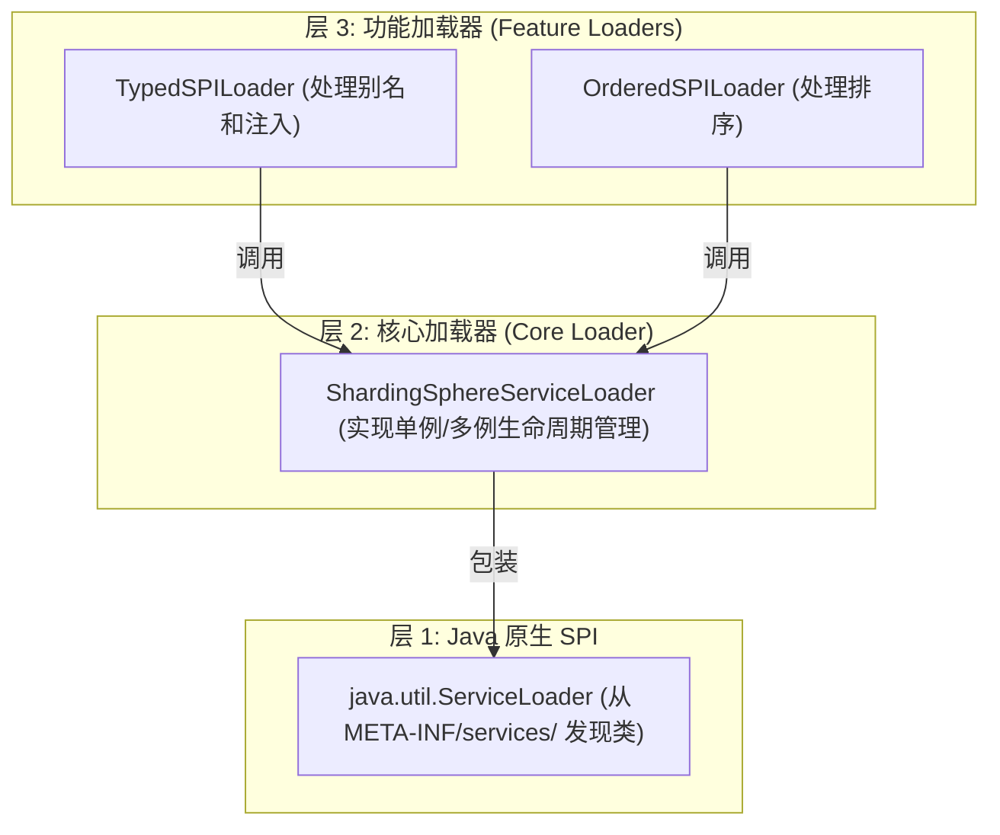
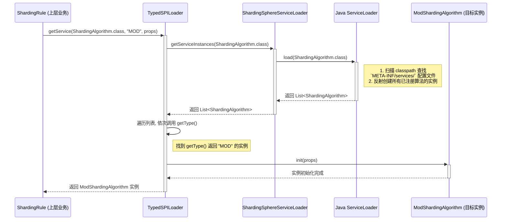

# ShardingSphere SPI 源码深度解析

## 摘要

本文旨在深入剖析 Apache ShardingSphere 的 SPI (Service Provider Interface) 机制。我们将从 Java 原生 SPI 的局限性出发，一步步探索 ShardingSphere 是如何构建其功能强大、高度可扩展的 SPI 体系的。通过对核心源码的分析和实例追踪，本文将揭示其设计哲学与实现细节。

## 阶段一：温故知新——Java SPI 的优势与不足

在深入 ShardingSphere 的世界之前，我们必须先理解它所依赖的基础——Java SPI。

### 什么是 Java SPI？

SPI，全称 Service Provider Interface，是 Java 提供的一套用于“服务提供者发现”的机制。它本质上是一种动态加载和解耦的编程范式，允许框架或应用程序动态地发现和装载实现了特定接口的插件或服务。

Java SPI 的核心由三部分组成：

1.  **服务接口（Service Interface）**：一个定义了服务功能的普通 Java 接口。
2.  **服务提供者（Service Provider）**：实现了服务接口的一个具体类。
3.  **ServiceLoader**：Java SPI 的核心工具类，负责在运行时从 Classpath 中查找并加载服务提供者。

它的工作方式遵循一个简单的约定：在 `META-INF/services/` 目录下，创建一个以“服务接口全限定名”命名的文件，文件内容则是“服务提供者实现类的全限定名”，每行一个。

**示例：**
```
// 1. 服务接口
public interface ILog {
    void log(String message);
}

// 2. 服务提供者实现
public class LogbackImpl implements ILog {
    public void log(String message) {
        System.out.println("Logback: " + message);
    }
}

// 3. 在 META-INF/services/com.example.ILog 文件中写入：
com.example.LogbackImpl
```

当 `ServiceLoader.load(ILog.class)` 被调用时，它会扫描 Classpath，找到对应的配置文件，并实例化 `LogbackImpl`。

### Java SPI 的优势

-   **高度解耦**：调用方只依赖于服务接口，完全不知道具体实现是谁，实现了“面向接口编程”的典范。
-   **可扩展性强**：新增一个功能实现，只需要添加一个新的 JAR 包（包含实现类和配置文件），无需修改任何调用方代码，符合开闭原则。

### Java SPI 的“硬伤”

尽管设计优雅，但原生 SPI 在复杂场景下却显得力不从心，这也是 ShardingSphere 等诸多框架选择“自立门户”的核心原因：

1.  **无法按需加载**：`ServiceLoader` 会一次性实例化所有找到的实现类，如果某个实现类的初始化非常耗时，会拖慢整个应用的启动速度。
2.  **构造函数限制**：只能实例化拥有**公共无参构造函数**的类。如果一个服务需要复杂的初始化参数或者依赖其他对象（即需要依赖注入），原生 SPI 无能为力。
3.  **缺少生命周期管理**：无法对服务的加载、初始化、销毁等生命周期进行精细化控制。
4.  **无排序和别名机制**：无法指定不同服务实现的加载顺序或优先级，也无法通过一个简单的别名来获取特定的实现。
5.  **不友好的异常处理**：如果某个实现类加载失败，`ServiceLoader` 只会抛出一个 `ServiceConfigurationError`，定位具体哪个实现出了问题比较困难。

正是为了解决这些“硬伤”，ShardingSphere 构建了一套更强大的 SPI 机制。在下一章节，我们将深入其源码，一探究竟。

## 阶段二：解密 ShardingSphere SPI 的三层架构

通过对 `infra/util/spi` 包下的源码进行分析，我们发现 ShardingSphere 的 SPI 并非单个类，而是一个分层的、职责清晰的精密组合。它通过三层设计，优雅地解决了原生 SPI 的所有痛点。



### 核心加载器：`ShardingSphereServiceLoader`

这是 ShardingSphere SPI 的基石，它直接包装了原生的 `ServiceLoader`，但为其赋予了核心的**生命周期管理**能力。

其关键代码位于 `getServiceInstances()` 方法：

```java
// ShardingSphereServiceLoader.java

private Collection<T> getServiceInstances() {
    // 关键点：检查 SPI 接口上是否存在 @SingletonSPI 注解
    return null == serviceInterface.getAnnotation(SingletonSPI.class) 
            ? createNewServiceInstances() // 如果没有，则每次都创建新实例
            : getSingletonServiceInstances(); // 如果有，则返回缓存的单例
}

@SneakyThrows(ReflectiveOperationException.class)
private Collection<T> createNewServiceInstances() {
    Collection<T> result = new LinkedList<>();
    for (Object each : services) {
        // 通过反射创建新实例
        result.add((T) each.getClass().getDeclaredConstructor().newInstance());
    }
    return result;
}

private Collection<T> getSingletonServiceInstances() {
    // `services` 在加载器首次构造时已生成并缓存，直接返回
    return services;
}
```

配套的 `@SingletonSPI` 注解定义非常简单，它只是一个标记注解：

```java
// infra/util/src/main/java/org/apache/shardingsphere/infra/util/spi/annotation/SingletonSPI.java

@Documented
@Retention(RetentionPolicy.RUNTIME)
@Target(ElementType.TYPE)
public @interface SingletonSPI {
}
```

**小结**：`ShardingSphereServiceLoader` 这一层解决了原生 SPI 的两大痛点：
1.  **单例支持**：通过 `@SingletonSPI` 注解，提供了优雅的单例模式支持。
2.  **按需加载**：虽然它本身在构造时会加载所有实现，但通过 `createNewServiceInstances` 方法，为上层按需创建实例提供了可能。

### 功能加载器：`TypedSPILoader` 与 `OrderedSPILoader`

如果说 `ShardingSphereServiceLoader` 是“地基”，那这两个加载器就是“上层建筑”，它们为 SPI 提供了强大的业务功能。

#### `TypedSPILoader`：实现别名与属性注入

这个类用于解决“如何通过别名找到特定实现”以及“如何为实例注入配置”的问题。

核心逻辑在 `findService` 方法中：

```java
// TypedSPILoader.java

public static <T extends TypedSPI> Optional<T> findService(final Class<T> spiClass, final String type, final Properties props) {
    // 1. 调用核心加载器，获取所有实例
    for (T each : ShardingSphereServiceLoader.getServiceInstances(spiClass)) {
        // 2. 检查别名是否匹配
        if (matchesType(type, each)) {
            // 3. 注入配置属性
            each.init(null == props ? new Properties() : convertToStringTypedProperties(props));
            return Optional.of(each);
        }
    }
    // ...
}

private static boolean matchesType(final String type, final TypedSPI instance) {
    // 匹配主别名(type)或次要别名(alias)
    return instance.getType().equalsIgnoreCase(type) || instance.getTypeAliases().contains(type);
}
```

为了配合 `TypedSPILoader`，需要实现的 SPI 必须实现 `TypedSPI` 接口：

```java
// infra/util/src/main/java/org/apache/shardingsphere/infra/util/spi/type/typed/TypedSPI.java

public interface TypedSPI {
    // 用于注入配置
    default void init(Properties props) {
    }
    
    // 返回主别名
    default String getType() {
        return "";
    }
    
    // 返回次要别名列表
    default Collection<String> getTypeAliases() {
        return Collections.emptyList();
    }
    
    // 标记是否为默认实现
    default boolean isDefault() {
        return false;
    }
}
```

#### `OrderedSPILoader`：实现排序

这个类用于解决“如何对多个 SPI 实现进行排序”的问题。

它的实现非常巧妙，利用了 `TreeMap` 的自动排序特性：

```java
// OrderedSPILoader.java

private static <T extends OrderedSPI<?>> Collection<T> getServices(final Class<T> spiClass, final Comparator<Integer> comparator) {
    // 1. 利用 TreeMap 的 Key 自动排序特性
    Map<Integer, T> result = new TreeMap<>(comparator);
    
    // 2. 调用核心加载器，获取所有实例
    for (T each : ShardingSphereServiceLoader.getServiceInstances(spiClass)) {
        
        // 3. 检查 order 是否重复
        Preconditions.checkArgument(!result.containsKey(each.getOrder()), "Found same order `%s` with `%s` and `%s`", each.getOrder(), result.get(each.getOrder()), each);
        
        // 4. 将 order 作为 key 放入 TreeMap
        result.put(each.getOrder(), each);
    }
    return result.values();
}
```

对应的 `OrderedSPI` 接口则要求实现类提供 `getOrder()` 方法：

```java
// infra/util/src/main/java/org/apache/shardingsphere/infra/util/spi/type/ordered/OrderedSPI.java

public interface OrderedSPI<T> {
    
    // 返回排序值
    int getOrder();
    
    // ...
}
```

**小结**：通过这优雅的三层架构，ShardingSphere 不仅弥补了原生 SPI 的所有短板，还提供了强大的缓存、生命周期管理和扩展功能，是其高度模块化设计的核心基石。

## 阶段三：实例追踪——`ModShardingAlgorithm` 的生命周期

理论结合实践是最好的学习方式。现在，我们以最常用的 `MOD`（取模分片）算法为例，完整地走一遍它从定义到被使用的全过程，将前面分析的三个层次串联起来。

### 1. 契约定义：`ShardingAlgorithm`

一切始于接口。`ModShardingAlgorithm` 首先需要遵循 `ShardingAlgorithm` 的契约。
我们在 `features/sharding/api` 模块中可以找到它的定义：

```java
// features/sharding/api/src/main/java/org/apache/shardingsphere/sharding/spi/ShardingAlgorithm.java

// 关键点：继承了 TypedSPI，意味着所有分片算法都必须是“有类型的”
public interface ShardingAlgorithm extends TypedSPI {
    // ...
}
```

### 2. 实现与别名：`ModShardingAlgorithm`

在 `features/sharding/core` 模块中，我们找到了 `ModShardingAlgorithm` 的源码。它没有直接实现 `ShardingAlgorithm`，而是实现了其子接口 `StandardShardingAlgorithm`。

```java
// features/sharding/core/src/main/java/org/apache/shardingsphere/sharding/algorithm/sharding/mod/ModShardingAlgorithm.java

// 继承链：ModShardingAlgorithm -> StandardShardingAlgorithm -> ShardingAlgorithm -> TypedSPI
public final class ModShardingAlgorithm implements StandardShardingAlgorithm<Comparable<?>>, ShardingAutoTableAlgorithm {
    
    // ... 核心分片逻辑 doSharding() ...

    @Override
    public void init(final Properties props) {
        // 读取 "sharding-count" 等配置，实现注入
        shardingCount = getShardingCount(props);
        // ...
    }

    @Override
    public String getType() {
        // 关键点：返回 "MOD"，这是它在系统中的唯一别名
        return "MOD";
    }
}
```

### 3. 服务注册

遵循 Java SPI 的约定，ShardingSphere 在 `features/sharding/core` 模块的 `resources` 目录下创建了注册文件：

**文件路径**：`features/sharding/core/src/main/resources/META-INF/services/org.apache.shardingsphere.sharding.spi.ShardingAlgorithm`

**文件内容**：
```
# ... 其他算法 ...
org.apache.shardingsphere.sharding.algorithm.sharding.mod.ModShardingAlgorithm
# ... 其他算法 ...
```
这一行代码，就是将 `MOD` 算法注册到了 SPI 体系中。

### 4. 加载与使用

当 ShardingSphere 启动并加载分片规则时，例如在 `ShardingRule` 类中，我们可以看到如下代码：

```java
// features/sharding/core/src/main/java/org/apache/shardingsphere/sharding/rule/ShardingRule.java

// `ruleConfig.getShardingAlgorithms()` 包含了从用户 YAML/Java 配置中读取的算法定义
// 假设其中一个算法的 type 是 "MOD"
ruleConfig.getShardingAlgorithms().forEach((key, value) -> 
    shardingAlgorithms.put(key, TypedSPILoader.getService(ShardingAlgorithm.class, value.getType(), value.getProps()))
);
```
当 `value.getType()` 的值为 `"MOD"` 时，`TypedSPILoader.getService(...)` 方法就会被调用。

### 5. 调用链路全景图

现在，我们可以画出从“使用”到“实现”的完整调用链路：




通过这个实例，我们生动地看到了 ShardingSphere SPI 三层架构如何协同工作，实现了服务的发现、加载、筛选、注入和排序，最终将一个具体的算法实现交付给业务逻辑。

## 阶段四：设计哲学——官方文档与社区洞见

源码告诉我们“如何实现”，而官方文档和社区则告诉我们“为何如此设计”。

根据 Apache ShardingSphere 的官方文档和社区分享，其设计的核心是**可插拔架构（Pluggable Architecture）**。目标是让开发者能够像搭建乐高积木一样，将各种功能（数据分片、读写分离、数据加密等）自由地组合，构建出最适合自己业务场景的独特系统。

为了实现这一宏伟目标，ShardingSphere 采用了“**微内核 + 三层可插拔模型**”：
1.  **内核层 (Kernel Layer)**: 提供了数据库的基本能力，如 SQL 解析、事务引擎、执行引擎等。
2.  **功能层 (Feature Layer)**: 提供增量功能，如数据分片、读写分离等。这些功能模块完全独立，可以任意插拔和组合。
3.  **生态层 (Ecosystem Layer)**: 负责融入现有数据库生态，如数据库协议、存储适配等。

而 **SPI 机制**，正是贯穿这三层模型、让“可插拔”成为现实的“粘合剂”和关键基石。ShardingSphere 提供了数十个 SPI 扩展点，允许用户在不修改内核代码的前提下，对系统的各个方面进行深度定制。社区普遍认为，ShardingSphere 自研的 SPI 框架，解决了 Java 原生 SPI 在按需加载、依赖注入、排序和异常处理等方面的诸多不足，实现得更为优雅和强大，是我们源码分析结论的有力佐证。

## 总结

本次对 ShardingSphere SPI 的学习是一次从理论到实践、再回归理论的完整旅程。

1.  我们从 **Java 原生 SPI 的痛点**出发，理解了 ShardingSphere “重复造轮子”的必要性。
2.  通过深入 **`infra/util/spi`** 包的源码，我们解密了其优雅的**三层架构**：`Java ServiceLoader` -> `ShardingSphereServiceLoader` -> `Typed/OrderedSPILoader`，见证了它如何通过分层设计，巧妙地实现生命周期管理、别名查找、属性注入和排序功能。
3.  以 **`ModShardingAlgorithm`** 为例，我们完整地追踪了其从接口定义、实现、`META-INF/services` 注册到最终被框架加载使用的**全过程**，将所有理论知识点串联成线。
4.  最后，结合**官方设计哲学**，我们确认了 SPI 机制是其“可插拔架构”的核心，是理解整个 ShardingSphere 体系的钥匙。

掌握了 ShardingSphere 的 SPI 机制，我们不仅能更好地使用其现有功能，更获得了深度定制和扩展 ShardingSphere 的能力，为解决未来更复杂的业务场景打下了坚实的基础。


