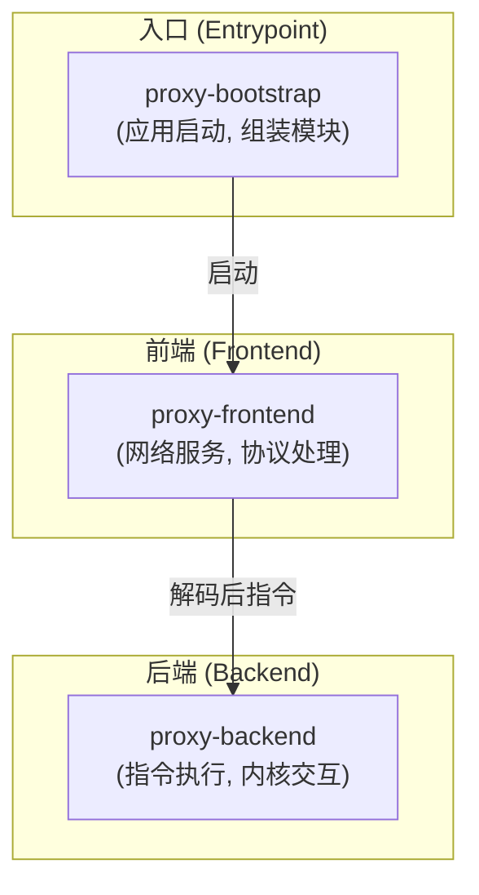
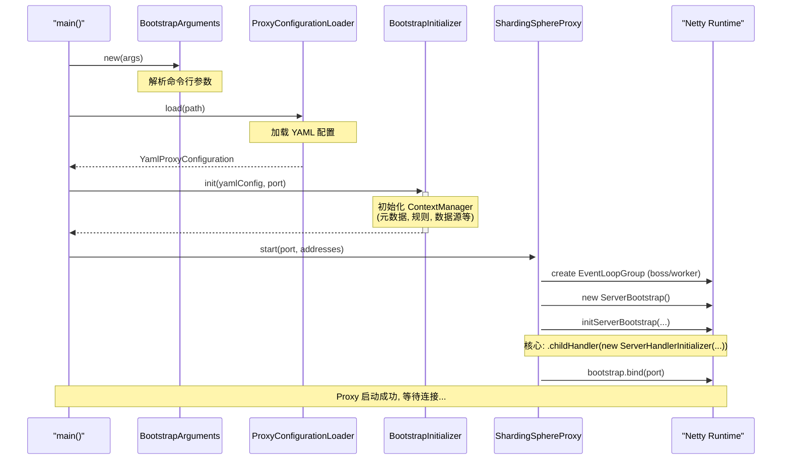
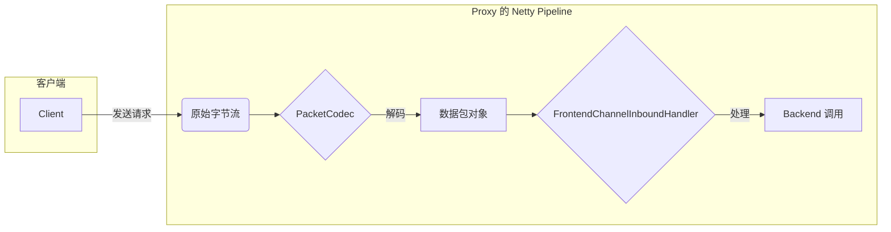
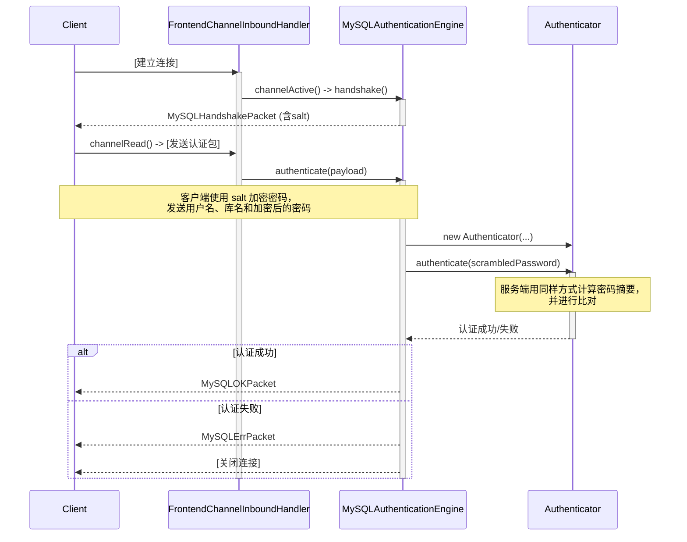
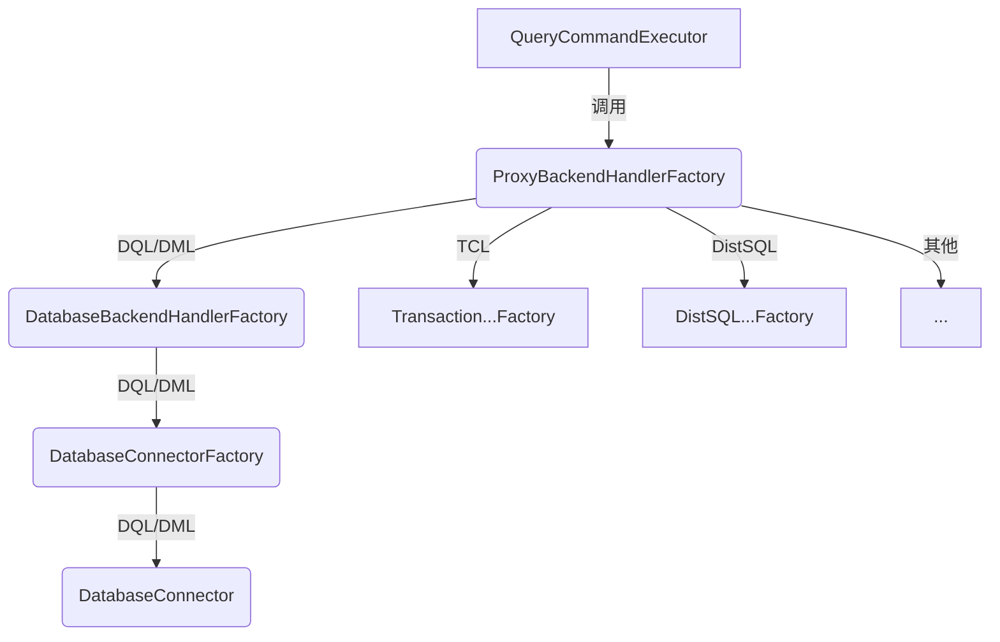
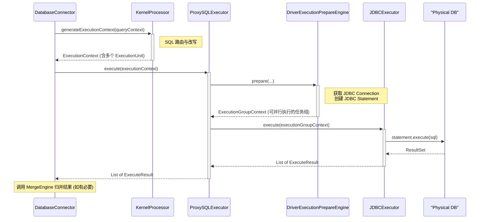

# ShardingSphere-Proxy 源码深度解析

## 摘要

本文旨在深入剖析 Apache ShardingSphere-Proxy 的内部工作机制。ShardingSphere-Proxy 是一个强大的数据库代理，它允许任何语言、任何平台的应用通过标准的数据库协议（如 MySQL/PostgreSQL）来访问 ShardingSphere 的所有功能。我们将从顶层架构入手，层层递进，分析其启动流程、网络处理、指令执行等核心环节，最终形成对 Proxy 模块的全面认知。

## 阶段一：Proxy 顶层架构分析

ShardingSphere-Proxy 的代码结构清晰，其核心逻辑主要由 `bootstrap`、`frontend` 和 `backend` 三大模块组成。要理解它们的职责，我们可以先熟悉一下每个模块中的“关键角色”（核心类/接口）：

-   **`proxy-bootstrap`**: **启动器模块**。
    -   **职责**：整个 Proxy 应用的入口，负责解析参数、加载配置、并按顺序组装和启动其他模块。
    -   **关键角色**：`Bootstrap` (包含 `main` 方法)。

-   **`proxy-frontend`**: **前端通信模块**。
    -   **职责**：Proxy 的“门面”，基于 Netty 构建网络服务，并负责处理与协议相关的一切事务，如连接管理、编解码、认证等。
    -   **关键角色**：
        -   `ShardingSphereProxy`: Netty 服务的启动和关闭入口。
        -   `ServerHandlerInitializer`: Netty `ChannelPipeline` 的构建器，负责为新连接组装“处理流水线”。
        -   `DatabaseProtocolFrontendEngine`: **SPI 接口**，定义了所有协议（MySQL, PostgreSQL等）都需要提供的能力，如获取编解码器、认证引擎等。
        -   `FrontendChannelInboundHandler`: 流水线上的核心处理器，负责管理连接状态（认证中/已认证）和分发指令。

-   **`proxy-backend`**: **后端执行模块**。
    -   **职责**：Proxy 的“内脏”，负责处理 `frontend` 解码后的指令，通过一系列工厂和分发，最终调用 ShardingSphere 内核完成 SQL 执行。
    -   **关键角色**：
        -   `ProxyBackendHandlerFactory`: 后端处理器的“总工厂”，根据 SQL 类型创建不同的 Handler。
        -   `ProxyBackendHandler`: **核心接口**，所有后端处理器的顶层抽象。
        -   `DatabaseConnector`: DQL/DML 语句的最终处理器，是连接 ShardingSphere 内核的“桥梁”。
        -   `ProxySQLExecutor`: 真正的 SQL 执行者，负责管理JDBC连接，并向物理数据库发送最终的 SQL。

它们之间的关系可以用下图来概括：



**小结**：Proxy 的顶层设计是一种经典的前后端分离模式。`frontend` 专注于网络和协议，`backend` 专注于业务逻辑，`bootstrap` 负责将它们粘合在一起。这个清晰的职责划分，是高效迭代和维护的基础。

## 阶段二：Proxy 启动流程分析

Proxy 的启动过程由 `proxy-bootstrap` 模块的 `Bootstrap.main()` 方法一手导演，整个过程可以概括为“**先准备内核，再启动服务**”。这个过程的脉络清晰，涉及了多个关键类，共同完成了从配置加载到网络监听的全部流程。

### `Bootstrap.main()`：启动总指挥

`Bootstrap.main` 方法是整个应用的总入口，其核心逻辑清晰地展示了启动步骤：
```java
// proxy/bootstrap/src/main/java/org/apache/shardingsphere/proxy/Bootstrap.java
public static void main(final String[] args) throws IOException, SQLException {
    // 1. 解析命令行参数
    BootstrapArguments bootstrapArgs = new BootstrapArguments(args);
    
    // 2. 加载 server.yaml 等配置文件
    YamlProxyConfiguration yamlConfig = ProxyConfigurationLoader.load(bootstrapArgs.getConfigurationPath());
    
    // 3. 初始化内核：创建并初始化 ContextManager，包含元数据、规则、数据源等
    new BootstrapInitializer().init(yamlConfig, port, bootstrapArgs.getForce());
    
    // 4. 启动网络服务：创建 ShardingSphereProxy 实例并启动 Netty Server
    new ShardingSphereProxy().start(port, addresses);
}
```

### `BootstrapInitializer`：内核上下文的奠基者

在启动网络服务之前，Proxy 必须先将自身运行所需的所有核心对象准备好，这个“准备”工作主要由 `BootstrapInitializer` 完成。它的核心使命是创建 `ContextManager`——ShardingSphere 运行时的“内核上下文”，它持有了包括所有数据库的元数据、所有已配置的规则（分片、读写分离等）、所有真实的数据源等在内的全部运行时信息。

其 `init` 方法的关键步骤如下：
```java
// proxy/bootstrap/src/main/java/org/apache/shardingsphere/proxy/initializer/BootstrapInitializer.java
public void init(final YamlProxyConfiguration yamlConfig, final int port, final boolean force) throws SQLException {
    // 1. 将 YAML 配置转换为内部配置对象
    ModeConfiguration modeConfig = ...
    ProxyConfiguration proxyConfig = new YamlProxyConfigurationSwapper().swap(yamlConfig);
    
    // 2. 创建 ContextManager
    ContextManager contextManager = createContextManager(proxyConfig, modeConfig, port, force);
    
    // 3. 将创建好的 ContextManager 存入一个全局可访问的 ProxyContext 单例中
    ProxyContext.init(contextManager);
    
    // ...
}

private ContextManager createContextManager(...) throws SQLException {
    // a. 准备一个包含所有配置的参数对象
    ContextManagerBuilderParameter param = new ContextManagerBuilderParameter(modeConfig, proxyConfig.getDatabaseConfigurations(), ...);
    
    // b. 通过 SPI 机制，根据运行模式（如 Standalone, Cluster）获取对应的 ContextManagerBuilder
    ContextManagerBuilder builder = TypedSPILoader.getService(ContextManagerBuilder.class, null == modeConfig ? null : modeConfig.getType());
    
    // c. 调用 builder，完成最复杂的构建工作（创建数据源、初始化规则等）
    return builder.build(param);
}
```
通过这一系列操作，ShardingSphere 的“内核”就已经准备就绪，并被放入了全局上下文 `ProxyContext` 中，等待 `backend` 模块随时取用。

### `ShardingSphereProxy`：Netty 服务的启动器

内核准备好后，`ShardingSphereProxy` 登场，负责启动网络服务，它的 `start()` 方法内部，通过一系列经典的 Netty `ServerBootstrap` API 调用，完成了服务器的配置和启动，其最核心的一行是：
```java
// proxy/frontend/core/src/main/java/org/apache/shardingsphere/proxy/frontend/ShardingSphereProxy.java
private void initServerBootstrap(final ServerBootstrap bootstrap) {
    // ... 其他配置，如 SO_BACKLOG, SO_REUSEADDR 等
    bootstrap.childHandler(new ServerHandlerInitializer(FrontDatabaseProtocolTypeFactory.getDatabaseType()));
}
```
这行代码为每一个新接入的客户端连接，都设置了一个 `ServerHandlerInitializer` 作为“管道工”，后续所有的数据读写处理，都由这个 Initializer 来定义。

### 启动时序图

整个启动过程可以用下面的时序图来清晰地表示：


**小结**：通过对启动流程的分析，我们明确了 Proxy 的初始化分为“内核准备”和“网络启动”两大步。并且，我们成功找到了网络处理的真正入口——`ServerHandlerInitializer`。下一阶段，我们将深入其中，解密网络数据包是如何被加工成数据库指令的。

## 阶段三：Frontend 前端深度解析

Frontend 模块是 Proxy 的“门面”，它负责网络通信和协议处理。本阶段，我们将以 MySQL 协议为例，追踪一个网络连接建立后，其数据在 Netty 的 Channel Pipeline（管道）上所经历的完整“加工”流程。

### 1. Channel Pipeline：流水线式的处理

`ServerHandlerInitializer` 为每个新连接都定义了一条由多个 `ChannelInboundHandler` 组成的“流水线”。一个请求的数据流经这条流水线，被层层处理：


- **`PacketCodec`**: 协议编解码器，负责二进制字节流与结构化的 `DatabasePacket` 对象之间的相互转换。
- **`FrontendChannelInboundHandler`**: 连接的“总指挥”，负责管理连接状态（认证、指令执行），并调用相应的引擎来处理数据包。

这个过程的核心，是通过 SPI 加载的 `DatabaseProtocolFrontendEngine` (具体实现为 `MySQLFrontendEngine`)，它为 `PacketCodec` 和 `FrontendChannelInboundHandler` 提供了协议相关的“三套引擎”：**编解码引擎**、**认证引擎**和**指令执行引擎**。

### 2. 认证流程深度解析 (`MySQLAuthenticationEngine`)

认证是建立连接后的第一件大事。`FrontendChannelInboundHandler` 将这个过程完全委托给了 `MySQLAuthenticationEngine`。

#### 认证时序图


#### 源码解读
1.  **`handshake()`**: 当连接建立时，`FrontendChannelInboundHandler` 调用此方法。
    ```java
    // .../mysql/authentication/MySQLAuthenticationEngine.java
    @Override
    public int handshake(final ChannelHandlerContext context) {
        // ...
        // 创建并发送一个握手包，其中包含了一个随机生成的盐值 authPluginData
        context.writeAndFlush(new MySQLHandshakePacket(result, authPluginData));
        // ...
    }
    ```
2.  **`authenticate()`**: 当收到客户端的登录响应包后，`FrontendChannelInboundHandler` 调用此方法。
    ```java
    // .../mysql/authentication/MySQLAuthenticationEngine.java
    @Override
    public AuthenticationResult authenticate(final ChannelHandlerContext context, final PacketPayload payload) {
        // 1. 解析客户端发来的、包含用户名和加密后密码的响应包
        MySQLHandshakeResponse41Packet handshakeResponsePacket = new MySQLHandshakeResponse41Packet((MySQLPacketPayload) payload);
        authResponse = handshakeResponsePacket.getAuthResponse();
        // ...
        // 2. 根据用户名找到对应的用户配置和认证方法，创建认证器
        ShardingSphereUser user = rule.findUser(...).orElse(...);
        Authenticator authenticator = new AuthenticatorFactory<>(MySQLAuthenticatorType.class, rule).newInstance(user);
        // ...
        // 3. 调用认证器的 authenticate 方法，进行密码摘要比对
        if (!login(rule, grantee, authResponse)) {
            // 登录失败，写错误包
            return AuthenticationResultBuilder.continued();
        }
        // 4. 检查用户对目标数据库的访问权限
        if (!authorizeDatabase(rule, grantee, currentAuthResult.getDatabase())) {
            // 授权失败，写错误包
            return AuthenticationResultBuilder.continued();
        }
        // 5. 全部成功，写 OK 包，返回最终成功结果
        writeOKPacket(context);
        return AuthenticationResultBuilder.finished(...);
    }
    ```

### 3. 指令分发深度解析 (`MySQLCommandExecuteEngine`)

认证成功后，后续的所有数据包都将被视为指令。`CommandExecutorTask` 会调用 `MySQLCommandExecuteEngine` 来解析和分发这些指令。它本身是一个“门面”，将工作委托给下级工厂。

#### 指令处理三部曲
1.  **获取指令类型 (`getCommandPacketType`)**:
    - **作用**: 从数据包中识别出指令类型。
    - **实现**: 调用 `MySQLCommandPacketTypeLoader`，它会读取数据包 payload 的第一个字节，这个字节就是 MySQL 的指令类型码（如 `0x03` 代表 `COM_QUERY`）。
2.  **创建指令包对象 (`getCommandPacket`)**:
    - **作用**: 将二进制的数据包，解析成结构化的 Java 对象。
    - **实现**: 调用 `MySQLCommandPacketFactory`，该工厂内是一个 `switch` 语句，根据指令类型，`new` 一个具体的指令包对象（如 `new MySQLComQueryPacket(payload)`)，并从 payload 中读取 SQL 字符串等信息填充进去。
3.  **创建指令执行器 (`getCommandExecutor`)**:
    - **作用**: 为结构化的指令包对象，匹配一个对应的处理器。
    - **实现**: 调用 `MySQLCommandExecutorFactory`，这同样是一个 `switch` 工厂，根据指令类型，`new` 一个具体的 `CommandExecutor` 实现（如 `new MySQLComQueryPacketExecutor(packet, ...)`）。

这个三部曲清晰地展示了 ShardingSphere 如何从一堆二进制数据中，精准地识别、解析并分派出对应的业务处理器，最终将 `FrontendChannelInboundHandler` 接收到的 `Object message` 演化为了我们下一阶段要分析的 `ProxyBackendHandler`。

## 阶段四：Backend 后端“粘合层”分析

当 `QueryCommandExecutor.execute()` 被调用时，请求的接力棒就从 Frontend 交到了 Backend。Backend 模块并不急于立即执行 SQL，而是通过一个精密的**工厂分发体系**，为请求寻找最合适的处理器，并最终调用 ShardingSphere 的内核（Kernel）来完成核心工作。

### 1. 工厂的“责任链”

从 `QueryCommandExecutor` 开始，创建一个最终的 SQL 执行器需要经过一条由多个工厂组成的“责任链”，每一层工厂都会处理一类特定的 SQL，并将无法处理的 SQL 交给下一层。


对于标准的 DQL/DML 语句，这个链条是：
`ProxyBackendHandlerFactory` -> `DatabaseBackendHandlerFactory` -> `DatabaseConnectorFactory` -> **`DatabaseConnector`**

`DatabaseConnector` 就是经过层层筛选后，最终被创建出来用于执行 DQL/DML 语句的“终极处理器”。

### 2. `DatabaseConnector`：总指挥与执行者

`DatabaseConnector` 是 `backend` 模块的终点，也是与 `kernel` 模块交互的起点。它的 `execute()` 方法是划分两个世界的边界，它完美地扮演了“总指挥”的角色：先调用内核进行“战略规划”，再调用执行器完成“物理执行”。

#### 后端执行时序图



#### 源码解读
`DatabaseConnector.execute()` 的流程与上图完美对应：

1.  **调用内核 (`generateExecutionContexts`)**:
    - **边界点**: `new KernelProcessor().generateExecutionContext(...)`。
    - **调用前 (Proxy 职责)**: `DatabaseConnector` 之前的全部逻辑，都属于 Proxy 的“粘合层”，负责创建和分发 Handler，管理会话，但**不关心 SQL 如何路由和改写**。
    - **调用中 (Kernel 职责)**: `KernelProcessor` 及其内部调用的 `ShardingSphereRouter`、`SQLRewriter` 等，是 ShardingSphere 的核心引擎。它们负责完成 SQL 解析、路由、改写等与具体业务（分片、读写分离等）紧密相关的复杂工作。这部分逻辑是 **Proxy 和 JDBC 模式所共享的**。
    - **调用后**: 内核返回一个 `ExecutionContext`，它包含了所有需要被执行的“物理 SQL”单元（`ExecutionUnit`），每个单元都清晰地标明了目标数据源和改写后的 SQL。

2.  **调用执行器 (`doExecute`)**:
    - `DatabaseConnector` 拿到 `ExecutionContext`（施工计划）后，再次回到 Proxy 的职责范围。它调用 `proxySQLExecutor.execute(executionContext)`，将计划交给“执行工头” `ProxySQLExecutor`。

3.  **物理执行 (`ProxySQLExecutor`)**:
    - `ProxySQLExecutor` 内部通过 `DriverExecutionPrepareEngine`，为每个 `ExecutionUnit` 获取真实的 JDBC 连接、创建 `Statement`，并将它们打包成可以并发执行的 `ExecutionGroupContext`。
    - 随后，它调用 `JDBCExecutor`，后者利用线程池，将所有 `Statement` 的执行请求**并发地**发送到各个物理数据库。

4.  **结果归并 (`mergeQuery`)**:
    - `DatabaseConnector` 在收到 `ProxySQLExecutor` 返回的多个 `ExecuteResult`（可能来自不同的分片库）后，会调用 `MergeEngine`（归并引擎），将这些来自不同数据源的结果集合并成一个对客户端透明的、统一的结果集。

**小结**：Backend 模块通过一系列工厂，将 Frontend 的请求精准分发。其核心类 `DatabaseConnector` 扮演了“项目经理”的角色：它将具体的 SQL 优化工作外包给“内核专家”（`KernelProcessor`），拿到“施工计划”（`ExecutionContext`）后，再指挥手下的“工头”（`ProxySQLExecutor`）去执行，最后还负责“验收成果”（`MergeEngine`）。我们成功地在 `KernelProcessor` 这里找到了 Proxy 专有逻辑与通用核心逻辑的清晰分界线。

## 总结：一次 SQL 的 Proxy 之旅

本次对 ShardingSphere-Proxy 的深度探索，我们如同一个数据包，完整地体验了它从被客户端发出，到最终获取结果的全过程。

**我们的旅程如下：**

1.  从 **`Bootstrap`** 开始，见证了 Proxy 的“内核准备”和“网络启动”。
2.  进入 **`Frontend`**，在 Netty 的 `ChannelPipeline` 上，我们被 `PacketCodec` 从字节流解码成数据包，由 `FrontendChannelInboundHandler` 完成认证，最终被封装成一个 `CommandExecutorTask` 异步执行。
3.  在 **`CommandExecutorTask`** 中，我们被解析成一个结构化的 `SQLStatement`，并在此处与 **`Backend`** 世界握手。
4.  进入 **`Backend`**，我们经历了一系列工厂的“分诊”，从 `ProxyBackendHandlerFactory` 到 `DatabaseConnectorFactory`，最终被交由 `DatabaseConnector` 处理。
5.  在 **`DatabaseConnector`** 中，我们遇到了本次旅程的**核心边界**——`KernelProcessor`。在这里，我们的 SQL 被路由、被改写，完成了最复杂的“大脑手术”。这是 Proxy 专有逻辑与 ShardingSphere 通用核心逻辑的交汇点。
6.  “手术”完成后，`DatabaseConnector` 拿着 `ExecutionContext`（手术方案），指挥 `ProxySQLExecutor` 在真实的数据库上执行了我们，并将结果通过 `MergeEngine` 归并。
7.  最终，我们的执行结果被层层包装，沿着来时的路，由 `PacketCodec` 编码成字节流，通过 Netty 返回给了客户端。

**核心设计思想回顾：**

*   **前后端分离**：`Frontend` 专注网络与协议，`Backend` 专注业务与执行，职责清晰。
*   **SPI 与可插拔**：协议处理 (`DatabaseProtocolFrontendEngine`)、特殊指令处理 (`ExtraProxyBackendHandler`) 等，都通过 SPI 实现，高度可扩展。
*   **工厂与分发**：从 `CommandExecuteEngine` 到 `ProxyBackendHandlerFactory`，工厂模式被广泛用于根据不同指令类型，创建和分发对应的处理器。
*   **边界与复用**：Proxy 通过 `KernelProcessor` 调用核心引擎，清晰地划分了“连接器”与“内核”的职责，使得 ShardingSphere 的核心能力（分片、读写分离等）能够被 Proxy 和 JDBC 两种模式无缝复用。

通过本次学习，我们对 ShardingSphere-Proxy 的整体架构、执行流程和设计精髓有了系统性的认知。这不仅能帮助我们更好地使用和配置 Proxy，也为我们后续深入 ShardingSphere 内核做好了充分的准备。
