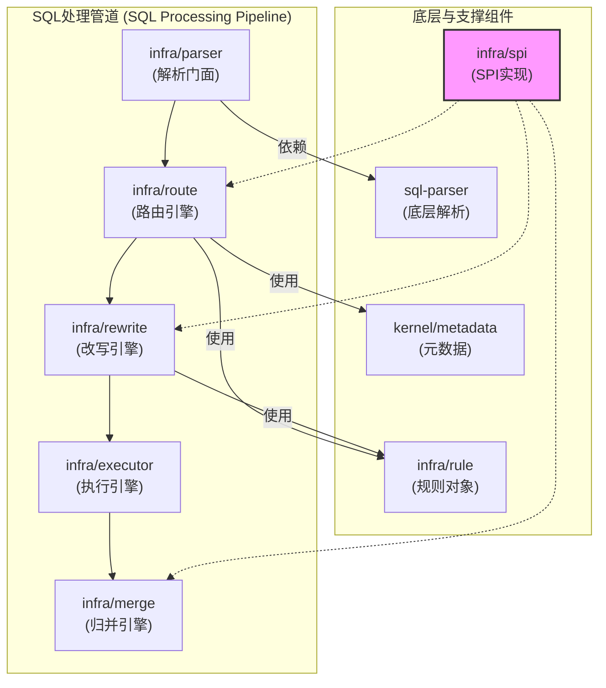
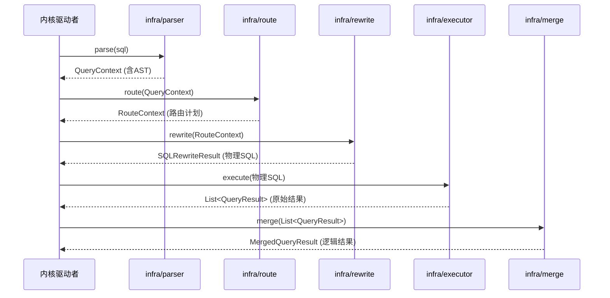

# ShardingSphere 内核核心工作原理白皮书 (v5)

> **目标**：本文档遵从“只关注内核”的要求，深入剖析 ShardingSphere 纯粹的内核数据处理链路。它将彻底剥离 `Proxy`、`JDBC` 等外围概念，专注于 SQL 在内核中经历的**解析、路由、改写、执行、归并**的完整生命周期，并深度揭示其背后的设计哲学与技术实现。

## 1. 内核设计哲学：面向流程的“可插拔管道”

ShardingSphere 内核设计的核心，可以概括为一套**面向 SQL 处理流程的“可插拔管道” (Pluggable Pipeline)**。

这个“管道”模型，将一条 SQL 的处理过程，定义为 `Parse -> Route -> Rewrite -> Execute -> Merge` 五个标准的、 последовательными的阶段。内核本身不包含任何具体的业务功能（如分片），它只定义和编排这个标准流程。

**“可插拔”** 是这个设计的灵魂，它体现在：
1.  **阶段的独立性与可扩展性**：管道的每个阶段都定义了清晰的输入和输出，并通过 SPI (Service Provider Interface) 机制，允许各种“功能插件”（如分片、读写分离、加密等）将自己的逻辑“挂载”到特定的阶段。
2.  **功能的正交性**：例如，`sharding`（分片）插件主要在 `Route` 和 `Rewrite` 阶段工作，而 `encrypt`（加密）插件主要在 `Rewrite` 阶段工作。它们可以独立开发、任意组合，内核的管道设计保证了它们能协同工作而互不干扰。

这种设计的最终目的，是实现一个**稳定、开放、高扩展**的内核。内核足够稳定，因为它只负责流程编排；生态足够开放，因为它允许任何人通过 SPI 开发新的功能插件来增强管道能力。

---

## 2. 内核架构与核心组件

下图展示了构成内核处理管道的核心组件及其依赖关系，它们绝大部分位于 `infra` 和 `sql-parser` 模块中。

### 2.1. 内核组件依赖图



### 2.2. 核心组件职责

-   `infra/parser`: 解析能力的统一**门面 (Facade)**，负责接收 SQL 字符串，调用底层解析器，并提供缓存。
-   `sql-parser`: **底层解析引擎**，基于 ANTLR 实现，负责将 SQL 文本转化为结构化的 AST。
-   `infra/route`: **路由引擎**，根据 AST 和 `infra/rule` 提供的规则，生成路由计划 (`RouteContext`)。
-   `infra/rewrite`: **改写引擎**，根据路由计划，将逻辑 SQL 改写为物理 SQL。
-   `infra/executor`: **执行引擎**，负责管理连接资源，并并发、安全地执行物理 SQL。
-   `infra/merge`: **归并引擎**，负责将来自多数据源的结果集，通过流式计算，合并为统一的逻辑结果集。
-   `infra/rule` & `kernel/metadata`: **决策依据**。它们为路由、改写等阶段提供所需的规则配置和数据库元数据。
-   `infra/spi`: **可插拔的基石**，为上述所有引擎提供加载具体功能实现的能力。

---

## 3. 内核 SQL 处理生命周期

### 3.1. 内核工作时序图

此图去除了外围调用者，直接展示内核内部的核心组件交互。



### 3.2. 生命周期阶段深度解析

#### 阶段一：SQL 解析 (Parse)
-   **目标**：`String -> AST` (抽象语法树)。
-   **设计思想**：采用**访问者模式 (Visitor Pattern)**，将纯粹的语法分析与业务的 AST 构建解耦，保证了语法的独立性和业务构建的灵活性。
-   **核心实现**：
    1.  `SQLParserEngineFacade` (`infra/parser`) 作为入口，提供缓存。
    2.  `SQLParserEngine` (`sql-parser`) 调用 ANTLR 生成通用的**解析树 (Parse Tree)**。
    3.  `SQLStatementVisitor` 的实现类（如 `MySQLStatementVisitor`）遍历解析树，在 `visit` 方法中创建出 ShardingSphere 自定义的 `SQLStatement` 对象，完成 **Parse Tree -> AST** 的转换。

#### 阶段二：SQL 路由 (Route)
-   **目标**：根据 AST 和规则，生成路由计划 `RouteContext`。
-   **设计思想**：基于 **SPI 的责任链模式**，实现了路由能力的可插拔和功能叠加。
-   **核心实现**：
    1.  `SQLRouteEngine` (`infra/route`) 通过 SPI 加载所有 `SQLRouter` 接口的实现。
    2.  以分片为例，`ShardingSQLRouter` 是核心实现。它会从 `ShardingRule` (`infra/rule`) 中获取逻辑表、分片键等信息。
    3.  然后，它会调用 `ShardingRule` 中配置的 `ShardingAlgorithm`（如 `ModuloShardingAlgorithm` 等）接口的实现，传入从 AST 中提取的分片值，计算出目标物理库和表的名称。
    4.  最终结果被封装进 `RouteContext` 对象。

#### 阶段三：SQL 改写 (Rewrite)
-   **目标**：`逻辑 SQL + RouteContext -> 物理 SQL`。
-   **设计思想**：同样是基于 **SPI 的责任链模式**，保证了改写功能的正交性。
-   **核心实现**：
    1.  `SQLRewriteEntry` (`infra/rewrite`) 加载所有 `SQLRewriter` 的实现。
    2.  `ShardingSQLRewriter` 负责将逻辑表名 `t_order` 改为物理表名 `t_order_0`。
    3.  `EncryptSQLRewriter` 负责将 `WHERE name = 'plain_text'` 改写为 `WHERE name = 'cipher_text'`。
    4.  `PaginationSQLRewriter` 负责将 `LIMIT 100, 10` 这样的逻辑分页，改写为 `LIMIT 0, 110` 或 `LIMIT 110` 等物理分页。

#### 阶段四：SQL 执行 (Execute)
-   **目标**：高效、安全地执行物理 SQL。
-   **设计思想**：提供**两种可自适应的连接模式**，在性能和资源间取得平衡，体现了作为基础组件的健壮性。
-   **核心实现**：
    1.  `SQLExecutor` (`infra/executor`) 接收到待执行的物理 SQL 组。
    2.  `ExecutorEngine` 会根据 SQL 类型和执行策略，在 `MEMORY_STRICTLY` (内存优先) 和 `CONNECTION_STRICTLY` (连接优先) 两种模式中选择其一。
    3.  通过内部的线程池，对发往不同数据源的请求进行并发执行，最大化吞吐。

#### 阶段五：结果归并 (Merge)
-   **目标**：将多个 `QueryResult` 列表，合并成一个统一的逻辑结果集。
-   **设计思想**：采用**流式处理的装饰器模式 (Decorator Pattern)**，以时间换空间，实现极致的内存效率。
-   **核心实现**：
    1.  `ResultMergeEngine` (`infra/merge`) 根据 AST 判断需要哪些归并能力（排序、分组、分页等）。
    2.  通过 SPI 创建 `ResultMerger` 的具体实现，并层层嵌套。
    3.  **核心 Merger 实现**：
        -   `IteratorStreamResultMerger`: 最基础的归并器，仅负责按顺序迭代多个结果集。
        -   `OrderByStreamResultMerger`: 内部维护一个优先级队列，对多个有序的结果集进行外排序，保证全局有序。
        -   `GroupByStreamResultMerger`: 在迭代过程中，对数据进行分组，并对聚合函数（如 `SUM`, `AVG`）进行二次计算。
        -   `PaginationStreamResultMerger`: 根据分页参数，在流式处理中“丢弃”掉不需要的数据。
    4.  上层应用从最外层的 `ResultMerger` 拉取数据，实现了对用户透明的、仿佛在单库操作的体验。

---

## 4. 补充内容：来自 "ShardingSphere 内核源码剖析圣经 (v6)"

### 4.1. 决策大脑: 规则 (Rule) 体系

内核管道是“执行引擎”，而 **规则 (Rule) 对象** 则是提供配置和算法的“决策大脑”。

-   **核心理念**：ShardingSphere 在启动时，会根据用户的配置（如 YAML），为每个 `database` 创建并持有一系列的 `ShardingSphereRule` 对象（如 `ShardingRule`, `EncryptRule` 等）。
-   **无状态与共享**：这些 Rule 对象在加载后是**无状态**的，被该 `database` 下的所有请求线程共享。
-   **决策来源**：当 SQL 处理管道运转时，各个阶段的引擎（如 `ShardingSQLRouter`）会从上下文中获取这些 Rule 对象，查询它们以获得决策所需的信息（分片键、分片算法、加密列、密钥等）。

#### 核心源码片段 (`ShardingRule.java`)
`ShardingRule` 是分片功能对应的规则对象，其内部持有所有与分片相关的配置和算法实例。
```java
// features/sharding/core/src/main/java/org/apache/shardingsphere/sharding/rule/ShardingRule.java

@Getter
public final class ShardingRule implements DatabaseRule, DataNodeContainedRule, TableContainedRule {
    
    // 持有用户配置的算法实例
    private final Map<String, ShardingAlgorithm> shardingAlgorithms = new LinkedHashMap<>();
    
    // 持有用户配置的表规则
    private final Map<String, TableRule> tableRules = new LinkedHashMap<>();
    
    // 持有广播表
    private final Collection<String> broadcastTables;
    
    // 持有默认分片策略
    private final ShardingStrategyConfiguration defaultDatabaseShardingStrategyConfig;
    private final ShardingStrategyConfiguration defaultTableShardingStrategyConfig;
    
    // ... 构造函数中会根据 ShardingRuleConfiguration 初始化以上所有字段
}
```

### 4.2. 流动的血液: 核心数据结构

SQL 在内核管道中每流经一个阶段，其上下文信息就会被封装、变形，并记录在不同的“上下文”对象中。理解这些数据结构是理解整个流程的关键。

1.  **`QueryContext`**: **查询上下文**
    -   **产生阶段**：`Parse` 阶段的输出。
    -   **核心字段**:
        -   `sql`: String - 原始 SQL 文本。
        -   `sqlStatementContext`: `SQLStatementContext` - **最重要的字段**，内部持有 AST (抽象语法树) 以及对 AST 的各种便捷访问器。
        -   `parameters`: `List<Object>` - SQL 的参数。
    -   **作用**：封装了一次查询最原始的信息，是整个管道输入端的“原材料”。

2.  **`RouteContext`**: **路由上下文**
    -   **产生阶段**：`Route` 阶段的输出。
    -   **核心字段**:
        -   `routeUnits`: `Collection<RouteUnit>` - **最重要的字段**，一个 `RouteUnit` 对象代表一个路由目的地，它内部包含了：
            -   `dataSourceMapper`: `RouteMapper` - 数据源的路由映射（逻辑名 -> 物理名）。
            -   `tableMappers`: `Set<RouteMapper>` - 表的路由映射集合（逻辑名 -> 物理名）。
    -   **作用**：精确地描述了逻辑 SQL 应该被发往哪些**物理数据源**的哪些**物理表**。

3.  **`ExecutionContext`**: **执行上下文**
    -   **产生阶段**：`Rewrite` 阶段之后，`Execute` 阶段之前。
    -   **核心字段**:
        -   `queryContext`: `QueryContext` - 包含原始 SQL 和 AST。
        -   `routeContext`: `RouteContext` - 包含路由信息。
        -   `executionUnits`: `Collection<ExecutionUnit>` - **最重要的字段**，一个 `ExecutionUnit` 对象代表一个可执行的原子任务，它内部包含了：
            -   `dataSourceName`: String - 待执行的**物理数据源**名称。
            -   `sqlUnit`: `SQLUnit` - 待执行的**物理 SQL** 和其对应的参数。
    -   **作用**：最终的“可执行包”，执行引擎根据它就可以拿到连接，执行物理 SQL。

### 4.3. 执行管道: SQL 的完整生命周期

#### 阶段一：SQL 解析 (Parse)
-   **目标**：`String -> QueryContext`。
-   **设计思想**：采用**访问者模式 (Visitor Pattern)**，将纯粹的语法分析与业务的 AST 构建解耦。
-   **核心源码片段 (伪代码)**: `MySQLStatementVisitor.java`
    > (由于工具限制无法直接读取生成的源码，此处使用逻辑等价的伪代码展示核心思想)
    ```java
    // sql-parser/dialect/mysql/target/.../MySQLStatementVisitor.java
    
    // 当 ANTLR 遍历到一个 "select" 语法节点时，会回调此方法
    @Override
    public ASTNode visitSelect(final SelectContext ctx) {
        // 1. 创建 ShardingSphere 自定义的 SelectStatement 对象
        MySQLSelectStatement result = new MySQLSelectStatement();
        
        // 2. 访问 "select" 的子节点，如 "from"、"where" 等
        //    在访问子节点的过程中，会递归地构建出 WhereSegment, OrderBySegment 等对象
        if (null != ctx.fromClause()) {
            result.setFrom((FromSegment) visit(ctx.fromClause()));
        }
        if (null != ctx.whereClause()) {
            result.setWhere((WhereSegment) visit(ctx.whereClause()));
        }
        
        // 3. 返回构建好的、携带业务含义的 AST 节点
        return result;
    }
    ```

#### 阶段二：SQL 路由 (Route)
-   **目标**：`QueryContext -> RouteContext`。
-   **设计思想**：基于 **SPI 的责任链模式**，实现了路由能力的可插拔和功能叠加。
-   **核心源码片段**: `ShardingSQLRouter.java`
    ```java
    // features/sharding/core/src/main/java/org/apache/shardingsphere/sharding/route/engine/ShardingSQLRouter.java

    public RouteContext createRouteContext(...) {
        // ...
        // 1. 创建分片条件
        ShardingConditions shardingConditions = new ShardingConditionEngine(...).createShardingConditions(...);
        
        // 2. 如果需要，对分片条件进行合并优化
        if (sqlStatement instanceof DMLStatement && shardingConditions.isNeedMerge()) {
            shardingConditions.merge();
        }
        
        // 3. 获取路由引擎（标准、广播、单播等），并执行路由
        //    内部会调用 ShardingAlgorithm.doSharding() 等算法进行计算
        RouteContext result = ShardingRouteEngineFactory.newInstance(...).route(rule);
        
        return result;
    }
    ```

#### 阶段三：SQL 改写 (Rewrite)
-   **目标**：`逻辑 SQL + RouteContext -> 物理 SQL`。
-   **设计思想**：同样是基于 **SPI 的责任链模式**，保证了改写功能的正交性。
-   **核心源码片段**: `ShardingSQLRewriter.java` (逻辑示意)
    > 改写器的实现较为分散，此处展示其核心工作模式。
    ```java
    // 逻辑示意
    public class ShardingSQLRewriter implements SQLRewriter<ShardingRule> {
        @Override
        public SQLRewriteContext rewrite(final SQLRewriteContext context) {
            // 遍历所有 SQL token
            for (SQLToken each : context.getSqlTokens()) {
                // 如果是表名 token
                if (each instanceof TableToken) {
                    String logicTableName = ((TableToken) each).getTableName();
                    // 根据 RouteContext 找到它路由后的物理表名
                    String physicalTableName = findPhysicalTableName(context.getRouteContext(), logicTableName);
                    // 将 token 中的逻辑表名替换为物理表名
                    ((TableToken) each).setTableName(physicalTableName);
                }
            }
            // 返回被修改后的上下文
            return context;
        }
    }
    ```

#### 阶段四：SQL 执行 (Execute)
-   **目标**：根据 `ExecutionContext` 高效、安全地执行物理 SQL。
-   **设计思想**：提供**两种可自适应的连接模式**，在性能和资源间取得平衡。
-   **核心源码片段**: `RawSQLExecutorCallback.java`
    ```java
    // infra/executor/src/main/java/.../raw/callback/RawSQLExecutorCallback.java
    
    // 这是执行引擎最底层的回调，它被并发调用
    public final class RawSQLExecutorCallback implements ExecutorCallback<RawSQLExecutionUnit, ExecuteResult> {
        
        @Override
        public Collection<ExecuteResult> execute(final Collection<RawSQLExecutionUnit> inputs, ...) throws SQLException {
            // 1. 通过 SPI 加载底层的 JDBC/Vert.x 执行器
            Collection<ExecuteResult> result = callbacks.iterator().next().execute(inputs, isTrunkThread);
            
            // 2. （可选）上报执行状态
            if (!ExecuteIDContext.isEmpty()) {
                new ExecuteProcessEngine().finishExecution(...);
            }
            return result;
        }
    }
    ```

#### 阶段五：结果归并 (Merge)
-   **目标**：将多个 `QueryResult` 列表，合并成一个统一的逻辑结果集。
-   **设计思想**：采用**流式处理的装饰器模式 (Decorator Pattern)**，以时间换空间，实现极致的内存效率。
-   **核心源码片段**: `ShardingDQLResultMerger.java`
    ```java
    // features/sharding/core/src/main/java/org/apache/shardingsphere/sharding/merge/dql/ShardingDQLResultMerger.java

    public MergedResult merge(...) throws SQLException {
        // ...
        // 1. 先根据是否含 GroupBy/Distinct/OrderBy，构建一个基础的 MergedResult
        MergedResult mergedResult = build(queryResults, selectStatementContext, ...);
        // 2. 再根据是否需要分页，用分页装饰器包裹它
        return decorate(queryResults, selectStatementContext, mergedResult);
    }
    
    private MergedResult build(...) throws SQLException {
        // ...
        if (isNeedProcessGroupBy(selectStatementContext)) {
            // 如果分组和排序键一致，使用流式归并；否则使用内存归并
            return selectStatementContext.isSameGroupByAndOrderByItems()
                    ? new GroupByStreamMergedResult(...)
                    : new GroupByMemoryMergedResult(...);
        }
        if (isNeedProcessOrderBy(selectStatementContext)) {
            // 创建排序归并器
            return new OrderByStreamMergedResult(queryResults, selectStatementContext, schema);
        }
        // 默认只做简单的迭代
        return new IteratorStreamMergedResult(queryResults);
    }
    
    private MergedResult decorate(...) throws SQLException {
        // ...
        if ("MySQL".equals(trunkDatabaseName)) {
            // 如果是 MySQL，就用 Limit 装饰器包裹
            return new LimitDecoratorMergedResult(mergedResult, paginationContext);
        }
        // ... 其他数据库的分页装饰器
        return mergedResult;
    }
    ```