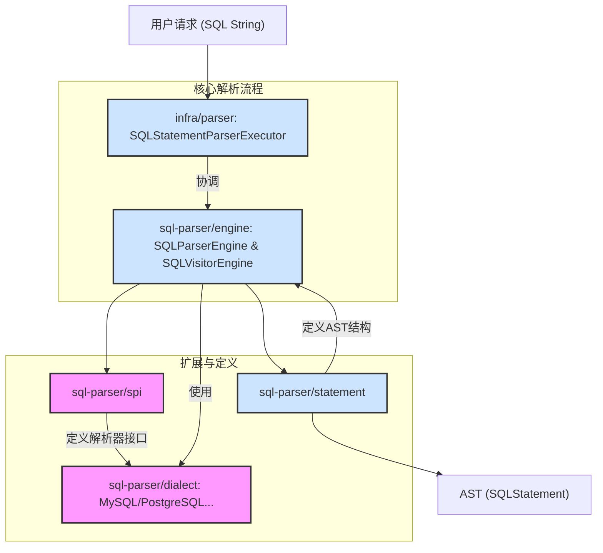
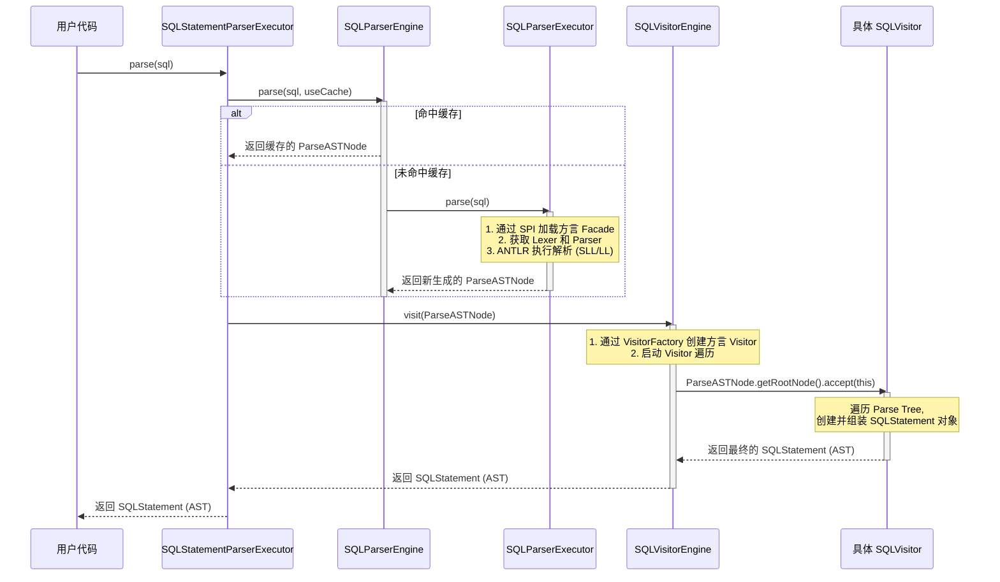
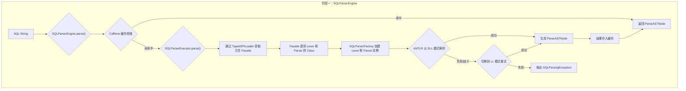
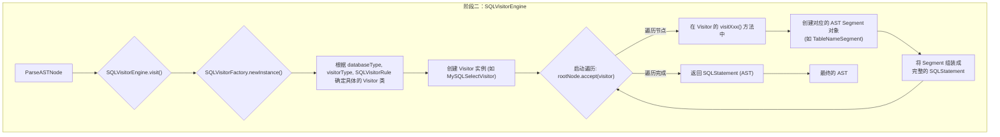
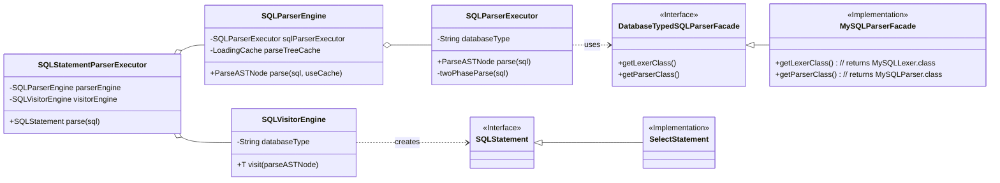

# ShardingSphere SQL Parser 深度解析

## 1. 概述 (Overview)

ShardingSphere 的 `sql-parser` 是整个项目的基石。无论是数据分片、读写分离、数据加密还是分布式治理，所有高级功能的第一步都是精确理解用户输入的 SQL。`sql-parser` 模块的核心职责就是将原始的 SQL 文本字符串，转换成一个结构化、易于程序理解和处理的**抽象语法树（Abstract Syntax Tree, AST）**。

其设计遵循两大核心原则：

*   **高性能与高兼容性**：采用业界标准的 ANTLR v4 作为语法解析生成器，并实现了巧妙的两阶段预测模式（SLL/LL），在保证绝大多数场景下高性能解析的同时，也能兼容复杂的 SQL 语法。
*   **高度可扩展性**：基于 ShardingSphere 自有的 SPI (Service Provider Interface) 机制，可以轻松地为新的数据库方言（如 OceanBase, TiDB）扩展其词法和语法解析能力，而无需修改核心引擎代码。

本文档将从整体架构、核心流程、关键类设计等多个维度，深入剖析 `sql-parser` 模块的内部工作原理。

## 2. 整体架构 (Overall Architecture)

`sql-parser` 的功能由多个模块协同完成，形成了一个清晰的、高内聚、低耦合的架构。



*   **`infra/parser`**: 解析功能的总入口和门面。`SQLStatementParserExecutor` 类作为外部模块的直接交互点，负责协调整个解析过程。
*   **`sql-parser/engine`**: 解析引擎的核心。它包含了驱动两阶段解析流程的 `SQLParserEngine` (第一阶段) 和 `SQLVisitorEngine` (第二阶段)，是整个模块的“CPU”。
*   **`sql-parser/spi`**: 服务提供接口模块。定义了 `DatabaseTypedSQLParserFacade` 接口，这是实现数据库方言扩展的关键契约。
*   **`sql-parser/dialect`**: 具体的数据库方言实现。每个子模块（如 `mysql`, `postgresql`）都包含针对特定数据库的 ANTLR v4 的 `.g4` 语法文件，并提供了 `DatabaseTypedSQLParserFacade` 接口的实现，用于向引擎提供该方言的 `Lexer` 和 `Parser`。
*   **`sql-parser/statement`**: 抽象语法树（AST）的定义。它包含了所有 SQL 语句（`SelectStatement`, `InsertStatement`...）及其组成部分（`TableNameSegment`, `ColumnSegment`...）的 Java 类定义。

## 3. 核心流程分析 (Core Process Analysis)

SQL 解析的核心是一个**两阶段过程**：
1.  **阶段一**: 使用 ANTLR 将 SQL 文本转换成通用的**解析树 (Parse Tree)**。
2.  **阶段二**: 遍历 Parse Tree，构建成 ShardingSphere 自定义的、更结构化的**抽象语法树 (AST)**。

### 3.1 时序图 (Sequence Diagram)

下图完整地展示了从 SQL 字符串到 AST 的完整调用链路。



### 3.2 两阶段解析详解

#### **阶段一：SQL -> 解析树 (Parse Tree)**

这个阶段的目标是进行纯粹的语法分析，生成一个忠实于原文法规则的树形结构。

**流程图:**


**关键机制 - SPI 方言加载:**

ShardingSphere 如何知道对 "MySQL" 类型的 SQL 调用 `MySQLLexer` 和 `MySQLParser`？答案就在 `SQLParserExecutor` 的这段代码中：

```java
// 1. 根据 "databaseType" (如 "MySQL") 查找服务
DatabaseTypedSQLParserFacade sqlParserFacade = TypedSPILoader.getService(DatabaseTypedSQLParserFacade.class, databaseType);
// 2. 从 Facade 获取具体的 Lexer 和 Parser 类
SQLParser sqlParser = SQLParserFactory.newInstance(sql, sqlParserFacade.getLexerClass(), sqlParserFacade.getParserClass());
// 3. 执行解析
sqlParser.parse();
```
每个 `dialect` 模块都会在 `META-INF/services/` 目录下提供一个 `org.apache.shardingsphere.sql.parser.spi.DatabaseTypedSQLParserFacade` 文件，指定其实现类（如 `org.apache.shardingsphere.sql.parser.mysql.parser.MySQLParserFacade`），`TypedSPILoader` 正是依据这个标准的 Java SPI 机制来动态加载服务的。


#### **阶段二：解析树 (Parse Tree) -> 抽象语法树 (AST)**

这个阶段的目标是将通用的、与 ANTLR 紧耦合的 Parse Tree，转换成 ShardingSphere 自定义的、面向对象的、易于操作的 AST。

**流程图:**

**关键机制 - Visitor 工厂:**

`SQLVisitorEngine` 通过 `SQLVisitorFactory` 来获取正确的 Visitor。工厂的决策依据是：
*   **`databaseType`**: 确保获取的是特定方言的 Visitor (如 `MySQL...` vs `PostgreSQL...`)。
*   **`visitorType`**: 用于区分不同用途的 Visitor，对于 SQL 解析，固定为 `STATEMENT`。
*   **`SQLVisitorRule`**: 一个智能的枚举，它能根据 Parse Tree 根节点的类型 (`SelectContext`, `InsertContext` 等) 直接映射出应该使用哪个具体的 Visitor (如 `DMLVisitor`, `DDLVisitor` 等)。这避免了巨大的 `if-else` 或 `switch` 判断，使得代码更加优雅和易于扩展。


## 4. 核心类图 (Core Class Diagram)



## 5. 总结 (Summary)

ShardingSphere 的 `sql-parser` 模块是一个精心设计的典范。它通过 **ANTLR + Visitor 模式** 奠定了坚实的解析基础，通过 **SPI 机制** 解决了多数据库方言的扩展性难题，并通过 **两阶段解析** 和 **缓存机制** 在灵活性、准确性和性能之间取得了出色的平衡。

理解了 `sql-parser` 的工作原理，就等于拿到了打开 ShardingSphere 内核宝库的钥匙。后续所有关于 SQL 路由、改写、归并等高级功能的学习，都将建立在对这份 AST 结构化数据的理解之上。