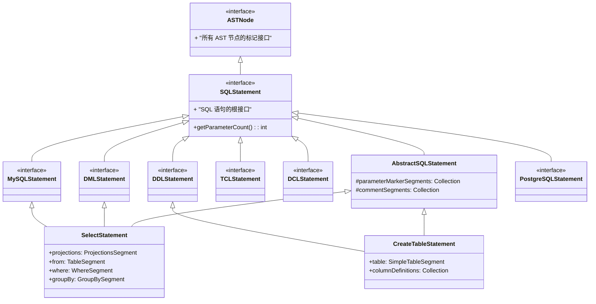
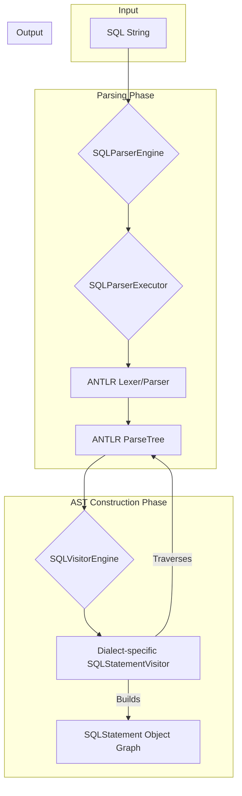
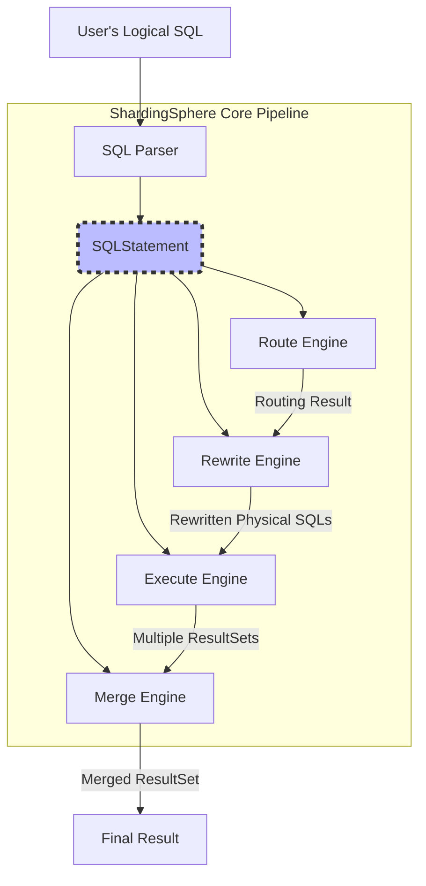

# ShardingSphere 源码深度解析：`SQLStatement` 的设计与实现

## 1. 引言：SQLStatement 的核心地位

在任何数据库中间件或数据库内核中，SQL 解析模块都扮演着“咽喉”般的关键角色。所有 SQL 的生命周期都始于此，后续的优化、路由、改写、执行、归并等一系列操作，都高度依赖于 SQL 解析的结果。

在 ShardingSphere 中，`org.apache.shardingsphere.sql.parser.sql.common.statement.SQLStatement` 接口及其实现类，正是这个“咽喉”的产物。它并非简单地对 SQL 字符串进行封装，而是将其解析为一个结构化、面向对象、且易于遍历和操作的**抽象语法树（Abstract Syntax Tree, AST）**。

理解 `SQLStatement`，是理解 ShardingSphere 所有核心功能（如数据分片、读写分离、数据加密、影子库等）的**钥匙**。本文档将从其**体系结构**、**构建过程**和**应用场景**三个方面，深入剖-析 `SQLStatement` 的设计哲学与实现细节。

## 2. 体系结构：`SQLStatement` 的家族 (`The What`)

`SQLStatement` 并非一个单一的类，而是一个庞大且设计精巧的类型体系。它通过接口、抽象类和具体实现类的组合，优雅地描述了千变万化的 SQL 语句。

### 2.1 核心设计

其核心设计可以概括为：**“根接口 + 抽象基类 + 分类接口 + 方言接口”**。



上图清晰地展示了 `SQLStatement` 家族的层次结构：

1.  **根接口 (`SQLStatement`)**
    *   它继承自 `ASTNode`，表明其 AST 根节点的身份。
    *   定义了所有 SQL 语句都必须具备的 `getParameterCount()` 方法，用于获取 SQL 中的参数占位符（`?`）数量，这对于处理 `PreparedStatement` 至关重要。

2.  **抽象基类 (`AbstractSQLStatement`)**
    *   实现了 `SQLStatement` 接口，并为所有具体的语句实现提供通用能力。
    *   它内置了 `parameterMarkerSegments` 和 `commentSegments` 两个集合，分别用于存放**参数标记**和**注释**的 AST 片段（Segment），体现了设计的通用性。

3.  **分类接口 (DML, DDL, DCL, TCL...)**
    *   这些接口（如 `DMLStatement`, `DDLStatement`）同样继承自 `SQLStatement`。
    *   它们是**行为标记接口**，本身不定义额外方法，但作用巨大。通过 `instanceof DMLStatement` 这样的判断，ShardingSphere 内核可以轻易地区分 SQL 的类型，从而应用不同的处理逻辑。例如，只有 DML 语句才可能需要进行数据分片路由。

4.  **方言接口 (`MySQLStatement`, `PostgreSQLStatement`...)**
    *   用于标记特定数据库方言的 SQL 语句，为处理不同数据库的特有语法提供了扩展点。

### 2.2 具体实现与 `Segment`

`SQLStatement` 的具体实现类（如 `SelectStatement`, `CreateTableStatement`）是整个体系的血肉。它们继承自 `AbstractSQLStatement` 并实现对应的分类和方言接口。

其设计的精髓在于**组合优于继承**：一个 `SQLStatement` 对象由多个更细粒度的 `Segment` 对象组合而成。每个 `Segment` 代表了 SQL 语法中的一个独立部分。

以 `SelectStatement` 为例：

```java
// Simplified code
public abstract class SelectStatement extends AbstractSQLStatement implements DMLStatement {
    private ProjectionsSegment projections; // SELECT a, b, ...
    private TableSegment from;              // FROM t_order ...
    private WhereSegment where;             // WHERE ...
    private GroupBySegment groupBy;         // GROUP BY ...
    private OrderBySegment orderBy;         // ORDER BY ...
    // ...
}
```

一条复杂的 `SELECT` 语句被清晰地解构为 `ProjectionsSegment`（投影）、`TableSegment`（表）、`WhereSegment`（条件）等多个 `Segment` 对象的组合。这种设计带来了极大的好处：

*   **结构清晰**：SQL 的语法结构直接映射为对象的属性，易于理解和访问。
*   **高度复用**：`TableSegment`、`WhereSegment` 等可以在不同的 `SQLStatement` 实现中（如 `UpdateStatement`, `DeleteStatement`）被复用。
*   **易于扩展**：增加对新 SQL 子句的支持，往往只需要增加一个新的 `Segment` 类型和相应的解析逻辑即可。

## 3. 构建过程：从 SQL 字符串到 `SQLStatement` 对象 (`The How`)

`SQLStatement` 对象并非凭空创建，而是通过一个严谨的、分阶段的流程从原始 SQL 字符串构建而来。这个过程的核心是**使用 ANTLR 作为解析器引擎，并通过访问者模式（Visitor Pattern）将解析树转换为 `SQLStatement` 对象**。



整个构建流程可以分解为以下几个关键步骤：

1.  **入口 (`SQLParserEngine`)**：作为顶层 API，负责接收 SQL 字符串，并管理解析结果的缓存（Cache），避免对相同 SQL 的重复解析。

2.  **执行解析 (`SQLParserExecutor`)**：
    *   通过 SPI 机制加载与指定数据库方言（如 MySQL）匹配的 `DatabaseTypedSQLParserFacade`。
    *   `Facade` 提供了该方言对应的 ANTLR `Lexer`（词法分析器）和 `Parser`（语法分析器）的类。
    *   `SQLParserExecutor` 采用巧妙的**两阶段解析策略（Two-Phase Parsing）**：
        *   **Phase 1: SLL 模式**。首先使用速度更快但能力稍弱的 `SLL` 模式进行预测。对于大部分常见 SQL，`SLL` 模式足以快速完成解析。
        *   **Phase 2: LL 模式**。如果 `SLL` 模式失败（遇到复杂的或有歧义的语法），它会回退到 `LL` 模式。`LL` 模式更强大，能处理所有语法，但性能开销更高。
    *   此阶段的产物是 ANTLR 原生的 `ParseTree`。

3.  **AST 构建 (`SQLVisitorEngine`)**：
    *   这是从 `ParseTree` 到 `SQLStatement` 的“最后一公里”，也是设计的点睛之笔。
    *   `SQLVisitorEngine` 同样通过工厂模式 (`SQLVisitorFactory`) 创建一个与方言和 SQL 类型匹配的 `Visitor` 对象（例如 `MySQLDMLStatementVisitor`）。
    *   `Visitor` 对象会**遍历**前一步生成的 `ParseTree`。在遍历过程中，`Visitor` 会根据不同的语法节点（Context），实例化对应的 `SQLStatement` 和 `Segment` 对象，并将从 `ParseTree` 节点中提取出的信息（如表名、列名、操作符等）填充进去。
    *   最终，当 `Visitor` 完成对整个 `ParseTree` 的遍历后，一个完整、结构化的 `SQLStatement` 对象图就构建完成了。

## 4. 应用场景：`SQLStatement` 的旅程 (`The Why`)

`SQLStatement` 一旦构建完成，就成为了 ShardingSphere 内核中流动的“血液”。它作为信息载体，驱动着后续所有核心功能的运转。



`SQLStatement` 在这条核心管道中的旅程如下：

1.  **数据分片 (`Route Engine`)**
    *   **输入**：`SQLStatement`。
    *   **过程**：路由引擎会深入 `SQLStatement` 的内部。例如，对于 `SELECT` 语句，它会：
        *   访问 `TableSegment` 获取所有逻辑表名。
        *   访问 `WhereSegment` 提取分片键（Sharding Key）的值。
        *   结合分片配置和分片算法，计算出这条 SQL 应该路由到哪些具体的物理数据源和物理表。
    *   **输出**：路由结果（`RouteContext`），包含了目标数据源和物理 SQL 的映射关系。

2.  **SQL 改写 (`Rewrite Engine`)**
    *   **输入**：`SQLStatement` 和路由结果。
    *   **过程**：改写引擎会再次利用 `SQLStatement`：
        *   将 `TableSegment` 中的逻辑表名改写为物理表名。
        *   如果分库分表导致了分页等查询需要修正（例如，`LIMIT 10` 改为 `LIMIT 0, 10`），也会在这里进行。
        *   对于数据加密、数据脱敏等功能，也会在此时对 `SQLStatement` 中的字面量或参数进行改写。
    *   **输出**：真实的、可以在物理数据库上执行的 SQL 语句。

3.  **结果归并 (`Merge Engine`)**
    *   **输入**：来自多个物理数据源的 `ResultSet` 和原始的 `SQLStatement`。
    *   **过程**：当从多个数据源获取到结果集后，需要将它们合并成一个对用户透明的单一结果集。归并引擎需要 `SQLStatement` 提供蓝图：
        *   访问 `OrderBySegment` 来确定正确的排序顺序。
        *   访问 `GroupBySegment` 和 `ProjectionsSegment` 中的聚合函数（如 `COUNT`, `SUM`）来执行流式归并或内存归并。
        *   访问 `ProjectionsSegment` 来处理列的映射关系。
    *   **输出**：一个统一的、符合用户预期的最终结果集。

## 5. 总结

`SQLStatement` 是 ShardingSphere SQL 解析模块的基石，其设计与实现体现了优秀的设计原则：

*   **面向对象**：将 SQL 语句的语法结构映射为清晰的对象模型。
*   **组合复用**：通过 `Segment` 的设计，实现了语法片段的高度复用和灵活性。
*   **关注点分离**：解析（Parser）和 AST 构建（Visitor）分离，使得代码更清晰，易于维护和扩展。
*   **SPI 扩展**：通过 SPI 轻松支持新的数据库方言。

深入理解 `SQLStatement`，不仅仅是理解一个数据结构，更是洞悉 ShardingSphere 如何解构 SQL、理解 SQL、并在此基础上构建其强大功能矩阵的开始。它是连接用户意图（SQL）和系统执行（路由、改写、归并）之间最核心的桥梁。
