# ShardingSphere 源码深度解析：路由引擎的设计与实现

## 1. 引言：路由引擎的战略地位

在 ShardingSphere 的整个架构中，**路由引擎（Routing Engine）**是承接 SQL 解析结果与后续 SQL 改写、执行之间的“中枢神经”。它就好比一个智能交通系统，根据解析后的 SQL 意图和预设的交通规则（分片规则、读写分离规则等），精确地规划出 SQL 语句的最终目的地——一个或多个物理数据源及物理表。

理解路由引擎，是掌握 ShardingSphere 如何将逻辑视图转换为物理操作的关键。本文档将从其**体系结构**、**核心流程**和**关键组件**三个方面，深入剖析路由引擎的设计哲学与实现细节，并配以图表辅助理解。

## 2. 体系结构：路由引擎的宏观视图 (`The What`)

ShardingSphere 的路由模块设计精巧，通过接口、抽象类和 SPI（Service Provider Interface）机制，实现了高度的扩展性和灵活性。其核心在于一个**责任链模式**的路由框架。

### 2.1 整体架构图

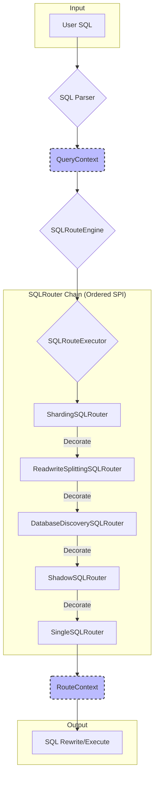

#### 整体时序图

为了更直观地展示各组件之间的交互，下面的时序图描绘了从接收用户 SQL 到最终生成路由上下文的完整流程。

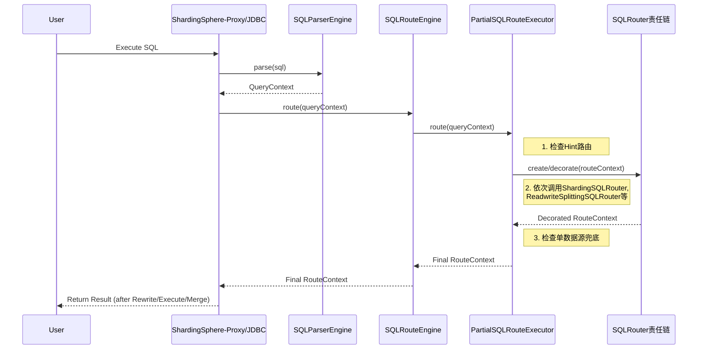

上图展示了路由引擎的整体工作流：

1.  **`QueryContext`**：SQL 解析器（`SQL Parser`）的产物，封装了 `SQLStatement` 和 SQL 参数，是路由引擎的输入。
2.  **`SQLRouteEngine`**：路由的顶层入口，负责根据 SQL 类型选择合适的 `SQLRouteExecutor`。
3.  **`SQLRouteExecutor`**：执行路由的核心，它会编排一系列 `SQLRouter`，形成一个**责任链**。
4.  **`SQLRouter` 链**：通过 SPI 机制加载，并按照 `OrderedSPI` 定义的顺序依次执行。每个 `SQLRouter` 处理一种特定类型的规则，并对 `RouteContext` 进行创建或装饰。链中的核心成员包括：
    *   **`ShardingSQLRouter`**：处理核心的分片逻辑。
    *   **`ReadwriteSplittingSQLRouter`**：在分片后，决定SQL应路由到主库还是从库。
    *   **`DatabaseDiscoverySQLRouter`**：用于数据库高可用和自动发现。
    *   **`ShadowSQLRouter`**：用于影子库压测场景的路由。
    *   **`SingleSQLRouter`**：作为兜底路由，处理访问单表的SQL。
5.  **`RouteContext`**：路由引擎的最终产物，详细描述了 SQL 语句应路由到的所有物理数据源和物理表。它是后续 SQL 改写和执行的指导。

### 2.2 核心数据结构：`RouteContext`、`RouteUnit`、`RouteMapper`

路由引擎的输出是结构化的 `RouteContext` 对象，它由 `RouteUnit` 和 `RouteMapper` 组成，清晰地定义了路由结果。

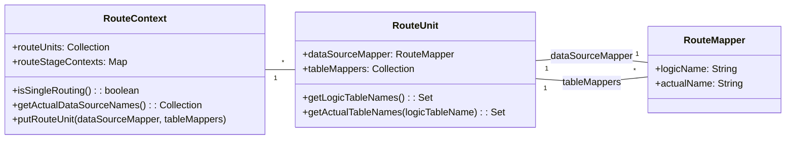

*   **`RouteMapper`**：最基础的映射单元，定义了**一个逻辑名称到实际名称的映射**。例如，逻辑数据源名 `ds_0` 映射到物理数据源名 `actual_ds_0`，或逻辑表名 `t_order` 映射到物理表名 `t_order_0`。
*   **`RouteUnit`**：一个**独立的执行单元**，它包含：
    *   一个 `dataSourceMapper`，明确了 SQL 语句将要发送到的物理数据源。
    *   一个 `Collection<RouteMapper>`，明确了在该物理数据源下，SQL 语句涉及的所有物理表。
*   **`RouteContext`**：路由引擎的最终输出，它包含**一组 `RouteUnit`**。这意味着一条逻辑 SQL 语句可能被路由到多个物理数据源和物理表上执行，每个 `RouteUnit` 代表一个子 SQL 的执行路径。

## 3. 核心流程：路由的执行逻辑 (`The How`)

路由的执行是分层且有序的，从顶层的调度到细致的规则应用。

### 3.1 `SQLRouteEngine`：路由调度中心

`org.apache.shardingsphere.infra.route.engine.SQLRouteEngine` 是路由的顶层协调者。它的 `route` 方法是整个路由过程的入口。

```java
public final class SQLRouteEngine {
    private final Collection<ShardingSphereRule> rules;
    private final ConfigurationProperties props;

    public RouteContext route(final ConnectionContext connectionContext, final QueryContext queryContext, ... /* other metadata */) {
        // 根据SQL类型选择不同的执行器
        SQLRouteExecutor executor = isNeedAllSchemas(queryContext.getSqlStatementContext().getSqlStatement())
                ? new AllSQLRouteExecutor() 
                : new PartialSQLRouteExecutor(rules, props);
        return executor.route(connectionContext, queryContext, ...);
    }
    
    private boolean isNeedAllSchemas(final SQLStatement sqlStatement) {
        // 例如：MySQL 的 SHOW TABLES / SHOW TABLE STATUS 会路由所有 schema
        return sqlStatement instanceof MySQLShowTablesStatement || sqlStatement instanceof MySQLShowTableStatusStatement;
    }
}
```

*   `SQLRouteEngine` 根据 `SQLStatement` 的类型判断是否需要路由所有 Schema（例如 `SHOW TABLES` 语句）。
*   如果需要路由所有 Schema，则使用 `AllSQLRouteExecutor`。
*   否则，使用 `PartialSQLRouteExecutor`。
*   最终将路由职责委托给选定的 `SQLRouteExecutor`。

### 3.2 `SQLRouteExecutor`：路由执行器

`org.apache.shardingsphere.infra.route.engine.SQLRouteExecutor` 接口定义了实际执行路由的契约。它主要有两个实现类，分别处理不同的路由场景。

#### 3.2.1 核心执行器：`PartialSQLRouteExecutor`

`PartialSQLRouteExecutor` 是处理大部分复杂路由的核心执行器。它实现了**优先级 + 责任链**模式，是路由功能的主要承载者。

##### 流程图

下面的流程图清晰地展示了 `PartialSQLRouteExecutor` 的内部工作逻辑。

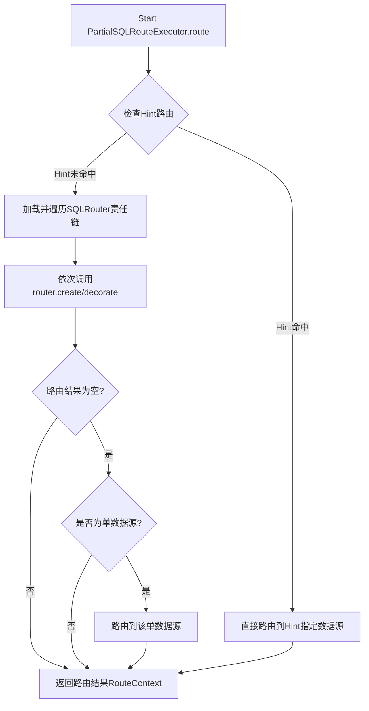

##### 时序图

下面的时序图则展示了 `PartialSQLRouteExecutor` 与其他组件之间的动态交互。

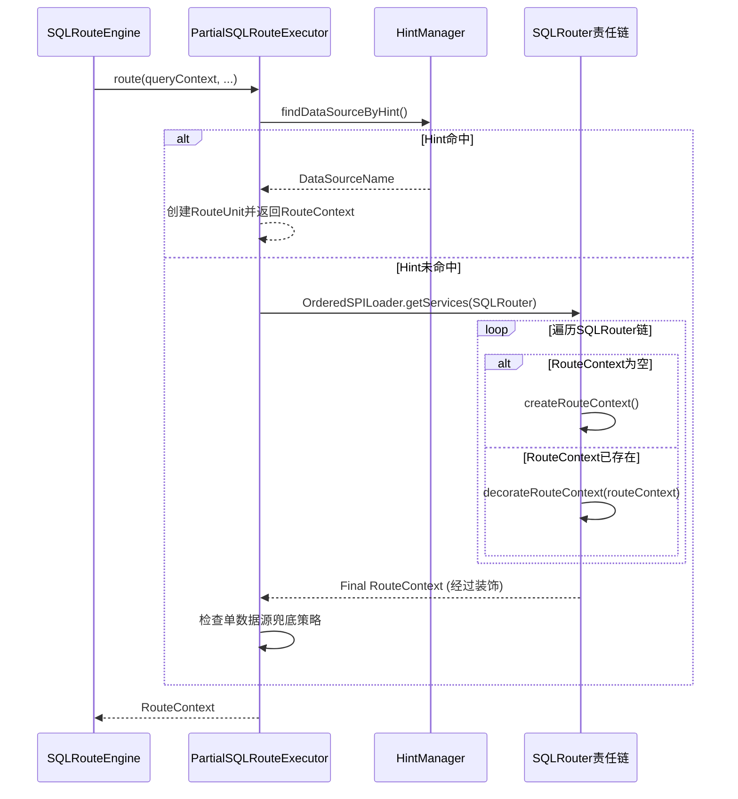

其核心逻辑可以总结为以下三点：

1.  **Hint 路由（高优先级）**：首先检查 SQL Hint。如果 SQL 中通过 `HintManager` 或注释指定了数据源，则直接路由到该数据源，并立即返回 `RouteContext`。
    
    例如，通过 SQL 注释指定路由到 `ds_1` 数据源：
    ```sql
    /* ShardingSphere hint: dataSourceName=ds_1 */ SELECT * FROM t_order;
    ```
2.  **`SQLRouter` 责任链**：通过 `OrderedSPILoader` 加载所有 `SQLRouter` 实现类并按序遍历。
    *   链中第一个 `SQLRouter` 负责调用 `createRouteContext` 初始化 `RouteContext`。
    *   后续的 `SQLRouter` 则调用 `decorateRouteContext` 对已有的 `RouteContext` 进行修改和增强（例如，分片路由完成后，读写分离路由再进行读写库选择）。
3.  **单数据源兜底**：如果所有 `SQLRouter` 处理后 `RouteContext` 仍为空，且只配置了一个数据源，则默认路由到该数据源。

#### 3.2.2 广播执行器：`AllSQLRouteExecutor`

`AllSQLRouteExecutor` 适用于不需要精细路由，而是需要将 SQL 广播到所有数据源的特定场景。例如，执行 `SHOW TABLES` 或 `SHOW TABLE STATUS` 这样的数据管理命令时，用户通常期望看到所有库中的表信息。

在这种情况下，`AllSQLRouteExecutor` 的逻辑非常直接：它会为 `ShardingSphereRule` 中配置的每一个数据源都创建一个 `RouteUnit`，从而确保该 SQL 语句被发送到所有目标库执行。这些 `RouteUnit` 中的 `tableMappers` 集合通常为空，因为这类广播命令不针对具体的表。

### 3.3 SQLRouter 链的核心成员

`SQLRouter` 是责任链模式的具体实现者，不同的 `SQLRouter` 负责处理不同类型的路由规则。其中，分片路由和读写分离路由是最为核心的两个。

#### 3.3.1 分片路由：`ShardingSQLRouter`

`org.apache.shardingsphere.sharding.route.engine.ShardingSQLRouter` 是路由链中至关重要的一个环节，它专门负责处理数据分片规则。

##### 流程图

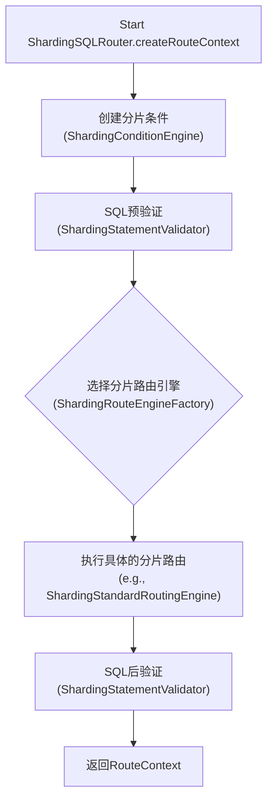

##### 时序图

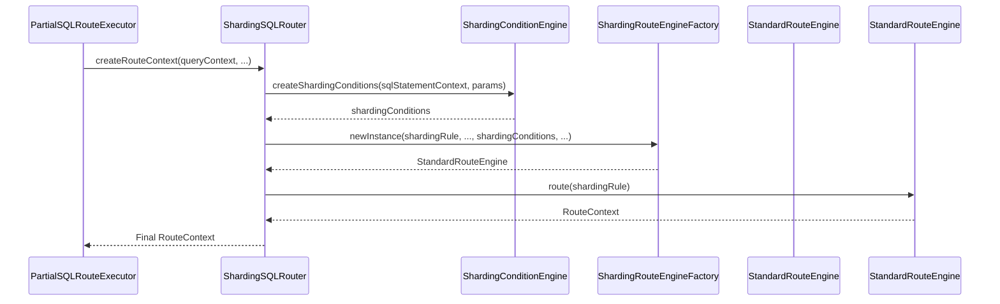

其核心流程如下：

1.  **提取分片条件**：`ShardingConditionEngine` 会从 `QueryContext` (包含 `SQLStatement` 和参数) 中解析出分片键和分片值，生成 `ShardingConditions` 对象。
    *   对于 `INSERT` 语句，`InsertClauseShardingConditionEngine` 从 `VALUES` 子句和生成键中提取条件。
    *   对于 `SELECT`/`UPDATE`/`DELETE` 语句，`WhereClauseShardingConditionEngine` 从 `WHERE` 子句中递归解析、提取谓词，并生成分片条件值（`ListShardingConditionValue`, `RangeShardingConditionValue` 等）。
2.  **SQL 语句验证**：`ShardingStatementValidator` 在路由前后对 SQL 语句进行校验。
3.  **选择分片路由引擎**：`ShardingRouteEngineFactory` 根据 `SQLStatement` 类型和 `ShardingConditions` 的复杂程度，选择最合适的分片路由引擎。
4.  **执行路由计算**：由选定的具体 `ShardingRouteEngine`（如 `ShardingStandardRoutingEngine`）执行实际的分片计算。

##### `ShardingRouteEngineFactory`：路由策略选择器

`org.apache.shardingsphere.sharding.route.engine.type.ShardingRouteEngineFactory` 扮演着路由策略选择器的角色，它根据 SQL 语句的类型和特征，动态地创建不同的 `ShardingRouteEngine` 实例。

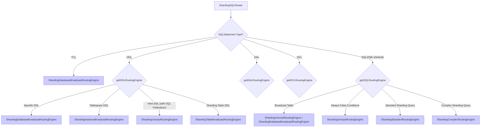

主要的分片路由引擎类型包括：

*   **广播路由 (`ShardingDatabaseBroadcastRoutingEngine`, `ShardingInstanceBroadcastRoutingEngine`, `ShardingTableBroadcastRoutingEngine` 等)**：将 SQL 广播到所有数据库、实例或表，适用于全局 DDL、某些 DAL 语句等场景。
*   **单播路由 (`ShardingUnicastRoutingEngine`)**：将 SQL 路由到单个数据源，适用于广播表查询、或明确指定单数据源的场景。
*   **忽略路由 (`ShardingIgnoreRoutingEngine`)**：对于不需要分片的 SQL 语句（如 `USE database`），直接忽略路由。
*   **标准路由 (`ShardingStandardRoutingEngine`)**：最常见的分片路由，基于精确分片键或范围分片键进行路由。
*   **复杂路由 (`ShardingComplexRoutingEngine`)**：处理多表关联、子查询等复杂场景下的路由，可能涉及笛卡尔积路由。

##### `ShardingStandardRoutingEngine`：分库分表的核心

`org.apache.shardingsphere.sharding.route.engine.type.standard.ShardingStandardRoutingEngine` 是 ShardingSphere 中最基础也是最重要的分片路由实现，它负责根据分片规则和分片值计算出最终的物理数据源和物理表。

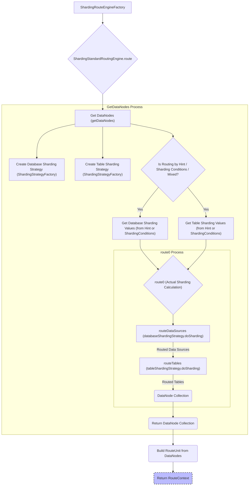

其核心原理如下：

1.  **实例化分片策略**：根据 `ShardingRule` 中配置的数据库分片策略和表分片策略，使用 `ShardingStrategyFactory` 实例化出具体的 `ShardingStrategy` 对象（如 `StandardShardingStrategy`、`HintShardingStrategy`）。
2.  **获取分片值**：根据 Hint 机制或 `ShardingConditions` 中提取的分片键值，获取数据库分片值和表分片值。
3.  **分库计算**：调用数据库 `ShardingStrategy` 的 `doSharding` 方法。`doSharding` 方法会利用底层配置的**分片算法（ShardingAlgorithm）**，根据分片值计算出 SQL 应该路由到的一个或多个物理数据源名称。常见的分片算法包括：
    *   **`ModShardingAlgorithm`**：基于取模的分片。
    *   **`HashModShardingAlgorithm`**：先计算哈希值再取模，适用于分片键值为字符串的场景。
    *   **`RangeShardingAlgorithm`**：基于范围的分片。
    *   **`TimeShardingAlgorithm`**：基于时间的分片。
4.  **分表计算**：对于每个分库的结果，调用表 `ShardingStrategy` 的 `doSharding` 方法。同样，它会利用分片算法和分片值，计算出在该物理数据源下，SQL 应该路由到的一个或多个物理表名称。
5.  **构建 `DataNode`**：将分库分表结果组合成 `DataNode` 对象（包含物理数据源名和物理表名）。
6.  **封装 `RouteContext`**：将 `DataNode` 集合进一步封装成 `RouteUnit` 集合，最终构建出完整的 `RouteContext`。

#### 3.3.2 读写分离路由：`ReadwriteSplittingSQLRouter`

`org.apache.shardingsphere.readwritesplitting.route.ReadwriteSplittingSQLRouter` 通常在 `ShardingSQLRouter` 之后执行，它负责将 `RouteContext` 中已经确定好的逻辑数据源，进一步路由到真实的物理主库或从库。

##### 流程图

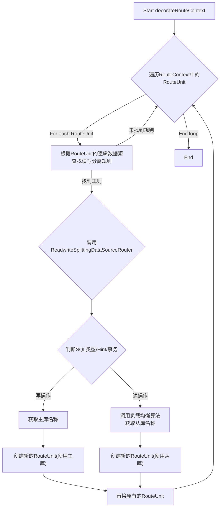

##### 时序图

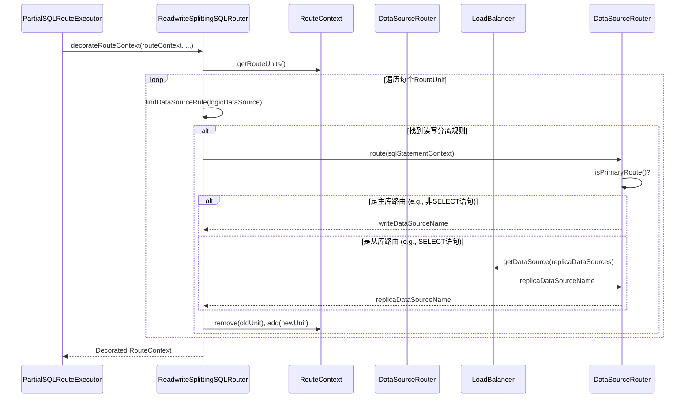

其核心逻辑在 `decorateRouteContext` 方法中实现：

1.  **遍历 `RouteUnit`**：对于 `ShardingSQLRouter` 生成的每个 `RouteUnit`，获取其逻辑数据源名称。
2.  **查找读写分离规则**：根据逻辑数据源名称，查找是否存在对应的读写分离规则。
3.  **执行读写分离路由**：如果存在读写分离规则，则调用 `ReadwriteSplittingDataSourceRouter` 进行路由。
    *   `ReadwriteSplittingDataSourceRouter` 会根据 `SQLStatement` 的类型（`SELECT` 且不含锁或 `LAST_INSERT_ID()`）、Hint 信息以及事务状态来判断是读操作还是写操作。
    *   **写操作**：直接返回主库（`writeDataSource`）名称。
    *   **读操作**：调用配置的负载均衡算法（`LoadBalancer`），从可用的从库（`enabledReplicaDataSources`）中选择一个。
4.  **更新 `RouteContext`**：用包含真实主/从库名称的新 `RouteUnit` 替换原有的 `RouteUnit`，完成对 `RouteContext` 的“装饰”。

这个过程体现了责任链模式的精髓：`ShardingSQLRouter` 负责确定分片，`ReadwriteSplittingSQLRouter` 在其基础上进一步细化，确定主从。

### 3.4 详细调用链分析

为了更直观地理解整个路由过程，下面的序列图展示了一个典型的分片+读写分离场景下的详细调用链路。

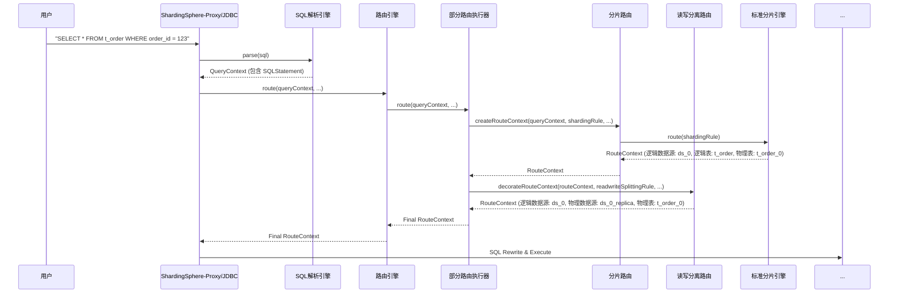

## 4. 总结

ShardingSphere 的路由引擎是一个高度模块化、可扩展的复杂系统。它通过以下关键设计实现了其强大功能：

*   **分层设计**：从 `SQLRouteEngine` 到 `SQLRouteExecutor` 再到 `SQLRouter` 链，职责清晰。
*   **责任链模式**：通过 `OrderedSPI` 机制，不同的路由规则可以独立地对路由结果进行处理和装饰。
*   **策略模式与工厂模式**：`ShardingRouteEngineFactory` 动态选择最佳路由策略，而 `ShardingStrategy` 和 `ShardingAlgorithm` 则提供了可插拔的分片计算逻辑。
*   **`SQLStatement` 驱动**：路由引擎高度依赖于 `SQLStatement` 中结构化的 SQL 信息，使得路由决策能够精确而灵活。
*   **数据结构优化**：`RouteContext`、`RouteUnit`、`RouteMapper` 精确表达了路由结果，为后续的 SQL 改写和执行提供了明确的指导。

深入理解路由引擎，是理解 ShardingSphere 如何实现其核心功能的基石。它是连接逻辑世界（用户 SQL）与物理世界（真实数据库）之间最核心的桥梁，也是 ShardingSphere 弹性伸缩、透明访问能力的核心体现。
