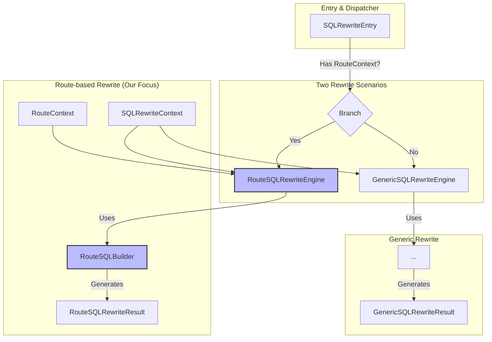
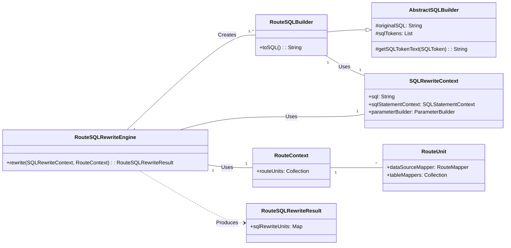
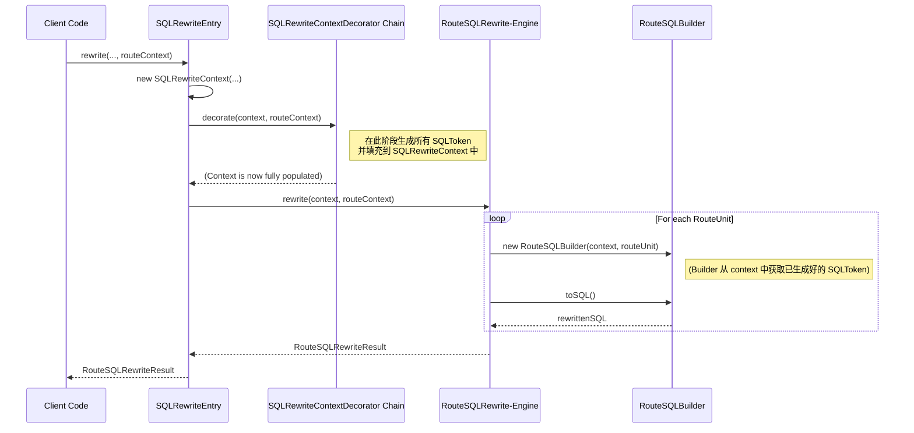
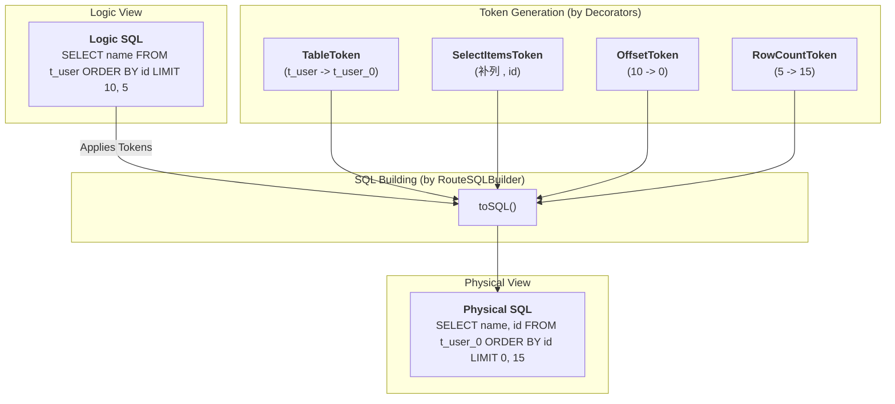

# ShardingSphere 源码深度解析：SQL 改写引擎的设计与实现 (V3 - Final Revised)

## 1. 引言：从逻辑到物理的“精准翻译官”

在深入理解了 ShardingSphere **路由引擎**如何为一条逻辑 SQL 精心规划出“执行蓝图”——`RouteContext` 之后，我们迎来了数据操作链路中承前启后的关键一环：**SQL 改写**。

`RouteContext` 告诉我们 SQL *应该*去哪里，但它并没有改变 SQL 本身。用户输入的 SQL 仍然是面向逻辑表（如 `t_order`）的，而底层的物理数据库只认识物理表（如 `t_order_0`）。更重要的是，在分库分表的分布式环境下，分页、排序等操作若不经特殊“翻译”，便会产生谬以千里的结果。

**SQL 改写引擎（SQL Rewrite Engine）**，正是承担这一关键职责的“精准翻译官”。它位于路由引擎之后、执行引擎之前，其核心使命是：**依据 `RouteContext` 提供的精确路由信息，将一条逻辑 SQL，严谨地翻译成一组（一个或多个）可以在物理数据库上正确执行的物理 SQL。**

本文档基于对您本地代码库（包括核心集成测试 `SQLRewriterIT`）的深度分析，摒弃先前所有不符之处，将从**体系结构**、**基于测试的真实流程**和**关键场景实现**三个层面，为您精准、深度地剖析当前版本 SQL 改写引擎的设计哲学与实现细节。

## 2. 体系结构：职责分离的改写双引擎 (`The What`)

在您当前的项目版本中，ShardingSphere 对改写引擎进行了精心的重构，将其职责一分为二，形成了**双引擎**的结构，使得不同场景的改写逻辑更加内聚和清晰。

### 2.1 整体架构图



从 `SQLRewriteEntry` 这个统一入口开始，系统会根据是否存在 `RouteContext`（即是否经过了分片路由）来决定使用哪个引擎。我们的核心焦点，正是处理复杂分片场景的 `RouteSQLRewriteEngine`。

### 2.2 核心组件与数据流

在路由改写这个分支下，核心组件和数据流如下：



*   **`RouteSQLRewriteEngine`**: 顶层协调器，为每个 `RouteUnit` 编排改写过程。
*   **`RouteSQLBuilder`**: **新架构下的核心执行者**。封装了将单个 `RouteUnit` 的路由信息应用到原始 SQL 上，并生成最终物理 SQL 的所有逻辑。
*   **`AbstractSQLBuilder`**: 抽离了通用的 SQL 拼接能力，内部维护了 `SQLToken` 列表和基于“排序+拼接”的 `toSQL()` 核心算法。
*   **`RouteSQLRewriteResult`**: 最终的改写产物，清晰地表达了每个路由单元与它对应的物理 SQL 之间的关系。

### 2.3 设计思想剖析：为何采用“双引擎”？

ShardingSphere 将改写场景一分为二，形成了`RouteSQLRewriteEngine` 和 `GenericSQLRewriteEngine` 的双引擎结构。这种设计的背后，是对**单一职责原则 (Single Responsibility Principle)** 的深刻践行。

*   **`RouteSQLRewriteEngine`**: 其职责高度聚焦于处理**与数据分片相关的、复杂的路由后改写**。所有逻辑都围绕 `RouteContext` 展开，例如将逻辑表名替换为物理表名、根据分片情况补列、改写分页等。
*   **`GenericSQLRewriteEngine`**: 其职责是处理**与数据分片无关的通用改写需求**，最典型的例子就是数据加密。加密改写只关心字段的加密规则，不关心这条SQL最终会路由到哪个库、哪个表。

通过这种清晰的划分：
1.  **降低了复杂性**：避免了将两种完全不同性质的改写逻辑耦合在一起。试想一下，如果在一个类中，既要处理分片又要处理加密，那么这个类的逻辑将会变得异常臃肿和复杂，难以维护。
2.  **提高了内聚性**：每个引擎内部的逻辑都高度相关，专注解决一个核心问题，使得代码更容易理解和扩展。
3.  **增强了灵活性**：未来如果需要引入一种新的、与路由无关的改写功能（例如数据水印），只需新增一个`Decorator`并让`GenericSQLRewriteEngine`处理即可，对核心的分片改写逻辑**零侵入**。

这种职责分离的设计，是ShardingSphere架构优雅性的一个重要体现。

## 3. 核心流程：装饰器模式驱动的“两阶段”改写 (`The How`)

本章节将以 `SQLRewriterIT.java` 集成测试中揭示的真实调用链为蓝本，深入剖析改写过程。整个流程可以清晰地划分为两个核心阶段：首先是利用装饰器模式生成所有SQL改写指令（Tokens），然后是根据路由结果执行最终的SQL拼接。

### 3.1 改写阶段核心调用链

下面的时序图清晰地展示了从 `RouteContext` 输入到 `SQLRewriteResult` 输出的核心调用链路，它完美地体现了“先装饰、后执行”的两阶段思想：



### 3.2 第一阶段：上下文装饰与令牌生成

所有改写指令（`SQLToken`）的生命起点，都在于对 `SQLRewriteContext` 的“装饰”过程，这由上层入口 `SQLRewriteEntry` 统一调度。

```java
// File: infra/rewrite/src/main/java/org/apache/shardingsphere/infra/rewrite/SQLRewriteEntry.java (概念简化)

public class SQLRewriteEntry {
    
    public SQLRewriteResult rewrite(String sql, List<Object> params, SQLStatementContext<?> sqlStatementContext, RouteContext routeContext, ...) {
        // 1. 创建一个“裸”的 SQLRewriteContext
        SQLRewriteContext sqlRewriteContext = new SQLRewriteContext(database.getName(), sqlStatementContext, sql, params);
        
        // 2.【核心】通过 SPI 加载一系列 Decorator，依次调用它们的 decorate 方法
        decorate(database.getRuleMetaData().getRules(), props, sqlRewriteContext, routeContext);
        
        // 3. 此时，Context 中就已经包含了所有 SQLToken
        
        // 4. 将“全信息”的 Context 传递给下游引擎
        if (null == routeContext || routeContext.getRouteUnits().isEmpty()) {
            return new GenericSQLRewriteEngine(...).rewrite(sqlRewriteContext);
        }
        return new RouteSQLRewriteEngine(...).rewrite(sqlRewriteContext, routeContext);
    }
    
    private void decorate(...) {
        // 通过 SPI 加载所有 SQLRewriteContextDecorator 的实现
        for (SQLRewriteContextDecorator each : OrderedSPILoader.getServices(SQLRewriteContextDecorator.class, rules)) {
            // 每个 Decorator 负责一种功能的令牌生成，并将令牌添加到 Context 中
            each.decorate(rule, props, sqlRewriteContext, routeContext);
        }
    }
}
```

**核心思想是“装饰器模式”**：
1.  `SQLRewriteEntry` 首先创建了一个基础的、空白的 `SQLRewriteContext`。
2.  然后，它通过Java的SPI机制，加载了所有 `SQLRewriteContextDecorator` 接口的实现类（如 `ShardingSQLRewriteContextDecorator`, `EncryptSQLRewriteContextDecorator` 等）。
3.  它遍历这些 `Decorator`，并调用其 `decorate()` 方法。**正是这些 `decorate()` 方法，负责执行真正的令牌生成逻辑，并将生成的 `SQLToken` 添加到 `sqlRewriteContext.getSqlTokens()` 列表中**。
4.  当所有 `Decorator` 执行完毕，`sqlRewriteContext` 就成了一个包含所有改写指令的“完整版”上下文，为第二阶段的执行做好了全部准备。

#### 3.2.1 架构优势剖析

当前版本采用“装饰器模式”重构令牌生成逻辑，是其架构上的一大进步，带来了诸多好处：

1.  **准备与执行的解耦**：此模式将“令牌生成”（由 `Decorator` 负责）与“SQL拼接”（由 `Builder` 负责）彻底分离。`RouteSQLRewriteEngine` 作为执行者，无需关心 `Token` 是如何以及为何生成的，它只消费一个“全信息”的 `SQLRewriteContext` 即可，职责非常单一，使得核心流程更加稳固和清晰。
2.  **强大的可扩展性**：这是该模式带来的最大优势。得益于SPI机制，任何新的改写需求（例如，增加一种全新的“数据水印”规则），都只需要开发一个新的 `SQLRewriteContextDecorator` 接口实现，并按照SPI规范进行注册即可。这种方式对现有的改写核心流程**零侵入**，完美体现了“对修改关闭，对扩展开放”的设计原则。

### 3.3 第二阶段：SQL拼接与物理SQL构建

当“全信息”的 `SQLRewriteContext` 准备好后，`RouteSQLRewriteEngine` 和 `RouteSQLBuilder` 便登场执行最终的拼接工作。

#### 3.3.1 `RouteSQLRewriteEngine` 的调度
`RouteSQLRewriteEngine` 的角色非常纯粹，它是一个调度器，负责遍历路由结果。

```java
// File: infra/rewrite/src/main/java/org/apache/shardingsphere/infra/rewrite/engine/RouteSQLRewriteEngine.java

public final class RouteSQLRewriteEngine {
    // ...
    public RouteSQLRewriteResult rewrite(final SQLRewriteContext sqlRewriteContext, final RouteContext routeContext) {
        Map<RouteUnit, SQLRewriteUnit> result = new LinkedHashMap<>();
        // 核心：为每个 RouteUnit 创建一个 RouteSQLBuilder，并调用 toSQL() 生成物理 SQL
        for (RouteUnit each : routeContext.getRouteUnits()) {
            result.put(each, new SQLRewriteUnit(new RouteSQLBuilder(sqlRewriteContext, each).toSQL(), getParameters(...)));
        }
        return new RouteSQLRewriteResult(...);
    }
}
```
其核心逻辑就是：遍历 `RouteContext` 中的每一个 `RouteUnit`，然后为之创建一个 `RouteSQLBuilder` 实例并立即调用其 `toSQL()` 方法，生成最终的物理 SQL。

#### 3.3.2 `AbstractSQLBuilder` 与 `RouteSQLBuilder` 的实现
`AbstractSQLBuilder` 提供了通用的SQL拼接能力，而 `RouteSQLBuilder` 则在其基础上增加了处理路由信息的逻辑。

```java
// File: infra/rewrite/src/main/java/org/apache/shardingsphere/infra/rewrite/sql/AbstractSQLBuilder.java

public abstract class AbstractSQLBuilder {
    
    private final String originalSQL;
    private final List<SQLToken> sqlTokens;
    
    public AbstractSQLBuilder(final SQLRewriteContext context, final RouteUnit routeUnit) {
        originalSQL = context.getSql();
        // 关键：构造函数只是“获取”令牌，并不“生产”令牌
        sqlTokens = context.getSqlTokens();
    }
    
    public final String toSQL() {
        if (sqlTokens.isEmpty()) {
            return originalSQL;
        }
        // 1. 对所有令牌按起始位置排序
        sqlTokens.sort(Comparator.comparingInt(SQLToken::getStartIndex));
        StringBuilder result = new StringBuilder();
        int lastIndex = 0;
        // 2. 遍历令牌，拼接SQL
        for (SQLToken each : sqlTokens) {
            if (each.getStartIndex() > lastIndex) {
                result.append(originalSQL, lastIndex, each.getStartIndex());
            }
            result.append(getSQLTokenText(each));
            lastIndex = each.getStopIndex() + 1;
        }
        if (lastIndex < originalSQL.length()) {
            result.append(originalSQL.substring(lastIndex));
        }
        return result.toString();
    }
    
    protected abstract String getSQLTokenText(SQLToken sqlToken);
}
```
`AbstractSQLBuilder` 揭示了两个核心事实：
1.  **职责分离**：它的构造函数是 `SQLToken` 的**消费者**，而非生产者。它从第一阶段准备好的 `SQLRewriteContext` 中获取令牌。
2.  **核心算法**：`toSQL()` 方法是改写的“最后一公里”，它通过“**排序+分段拼接**”的算法，将原始SQL和`SQLToken`代表的改动部分，严谨地组合成最终的物理SQL。

而 `RouteSQLBuilder` 的职责则是在此基础上，处理需要根据路由单元动态变化的特殊令牌：
```java
// File: infra/rewrite/src/main/java/org/apache/shardingsphere/infra/rewrite/sql/impl/RouteSQLBuilder.java

public final class RouteSQLBuilder extends AbstractSQLBuilder {
    // ...
    @Override
    protected String getSQLTokenText(final SQLToken sqlToken) {
        // 如果 Token 实现了 RouteUnitAware 接口（如 TableToken）
        // 则调用其带 RouteUnit 参数的 toString 方法，以获取与当前路由单元匹配的文本
        if (sqlToken instanceof RouteUnitAware) {
            return ((RouteUnitAware) sqlToken).toString(routeUnit);
        }
        return sqlToken.toString();
    }
}
```
至此，整个改写流程形成了一个完美的闭环：`Decorator` 生产元数据（Tokens），`Engine` 调度流程，`Builder` 消费元数据并产出最终的物理SQL。

## 4. 关键实现：深入分片改写的核心场景

现在，我们将以一个贯穿始终的实例，来演示上述流程在真实场景中是如何工作的。

### 4.1 实例跟踪：一条 SQL 的改写之旅

为了更直观地理解这个过程，我们可以通过下面的图例来演示一条包含多种改写场景的 SQL 的“变形记”：



现在，让我们以一个真实的代码执行流程来详细追踪这个过程。

*   **场景**:
    *   **逻辑 SQL**: `SELECT user_id, status FROM t_order WHERE order_id = ?`
    *   **路由结果**: SQL 被路由到 `ds_0.t_order_0` 和 `ds_1.t_order_1`。

我们将追踪发往 `ds_0.t_order_0` 的那个 `RouteUnit` 的改写过程：

1.  **`SQLRewriteEntry.decorate()`** 阶段：
    *   一系列 `Decorator` 被调用。其中，`ShardingSQLRewriteContextDecorator` 会开始工作。
    *   它内部的 `TableNameTokenGenerator` 被触发，因为它检测到了 `t_order` 是一个需要改写的逻辑表。
    *   该 `Generator` 从 AST 中获得了 `t_order` 的位置（例如 `startIndex=28, stopIndex=34`）。
    *   **关键**：`decorate` 方法此时**并不知道** `t_order` 应该被改写成 `t_order_0` 还是 `t_order_1`。因此，它创建的 `TableToken` 是一个**包含了所有可能性**的“模板令牌”。
    *   这个 `TableToken` 和其他可能生成的令牌（例如，用于加密的令牌）被添加到 `SQLRewriteContext` 中。

2.  **`RouteSQLRewriteEngine.rewrite()`** 阶段：
    *   引擎遍历到代表 `ds_0.t_order_0` 的 `RouteUnit`。
    *   它执行: `new RouteSQLBuilder(context, routeUnitFor_ds0_t_order0)`。

3.  **`AbstractSQLBuilder` 构造** 阶段：
    *   `Builder` 从 `context` 中获取了在第 1 步中生成的所有 `SQLToken`。

4.  **`builder.toSQL()`** 阶段：
    *   `AbstractSQLBuilder.toSQL()` 开始对 `sqlTokens` 列表进行排序和拼接。
    *   当它遇到 `TableToken` 时，会回调 `RouteSQLBuilder.getSQLTokenText(tableToken)`。
    *   **关键**：`RouteSQLBuilder` 的 `getSQLTokenText` 方法会执行 `tableToken.toString(routeUnitFor_ds0_t_order0)`。`TableToken` 的 `toString` 方法会利用传入的 `routeUnitFor_ds0_t_order0`，从自身的“所有可能性”中，**精确地找出**与当前 `RouteUnit` 匹配的物理表名 `t_order_0` 并返回。
    *   拼接算法使用返回的 `"t_order_0"` 替换原始 SQL 中的 `t_order`。

5.  **产出**: 第一个 `SQLRewriteUnit` 的 SQL 为 `SELECT user_id, status FROM t_order_0 WHERE order_id = ?`。

`RouteSQLRewriteEngine` 会对 `RouteUnit(ds_1.t_order_1)` 重复上述过程，当 `getSQLTokenText` 被回调时，`TableToken` 会根据这个新的 `RouteUnit` 返回 `"t_order_1"`，从而生成第二个 `SQLRewriteUnit`。这两个 `SQLRewriteUnit` 会被封装在 `RouteSQLRewriteResult` 中，交付给下游的执行引擎。

这份基于真实调用链和图例的分析，希望能为您提供一份清晰、准确、深入的源码学习指南。

