# ShardingSphere 执行引擎深度解析

## 1. 核心定位：平衡的艺术

Apache ShardingSphere 作为一个强大的分布式数据库中间件，其内核由一个高度解耦、可插拔的微内核架构组成。在这个架构中，执行引擎（Execution Engine）扮演着至关重要的角色——它是连接“前端 SQL 解析、路由、改写”与“后端结果归并”的核心桥梁，负责将改写后的物理 SQL 高效、安全地分发到真实的数据库实例上执行。

### 1.1 执行引擎在 ShardingSphere 内核中的位置

一条 SQL 进入 ShardingSphere 后，会依次经历 **解析 -> 路由 -> 改写 -> 执行 -> 归并** 五个核心阶段。执行引擎正处在第四个环节，它承上启下，是整个链路中真正与底层数据源交互的模块。

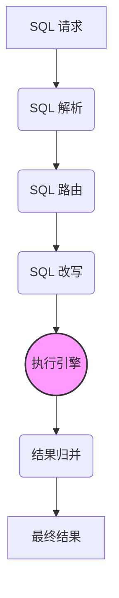
*   **上游**：执行引擎接收来自“SQL 改写”模块的输出，这份输出是 `ExecutionGroupContext`，它包含了分组好的、待执行的物理 SQL 单元（`ExecutionGroup`）。
*   **下游**：执行引擎将物理 SQL 在底层数据库中执行后得到的结果集（`QueryResult`）或更新计数，传递给“结果归并”模块，由归并引擎将来自多个数据源的结果聚合成一个逻辑上完整的结果集。

### 1.2 核心挑战：效率与资源的平衡

在分布式环境下，一条逻辑 SQL 往往需要路由到多个物理数据库实例、甚至多张物理表上执行。这就引出了执行引擎面临的核心挑战：**如何在最大化执行效率与最小化资源消耗之间取得最佳平衡？**

-   **追求效率**：为了尽快得到结果，最直观的方式是为每一个物理 SQL 执行单元都创建一个独立的数据库连接，然后通过多线程并行执行。当分片数量巨大时（例如，一次查询涉及 100 个分片），这种方式能极大地缩短响应时间。
-   **控制资源**：然而，数据库连接是非常宝贵的资源。如果无限制地为每个分片创建连接，不仅会迅速耗尽中间件自身的连接池，更会给底层数据库带来巨大的连接压力，甚至可能导致数据库因连接数超限而拒绝服务。

如何动态决策、何时并行、何时串行、何时应该限制连接数，正是 ShardingSphere 执行引擎设计的精髓所在。它旨在通过一套自动化的机制，将用户从复杂的选择中解放出来，智能地选择最优执行方案。

## 2. 架构设计：自动化执行引擎的演进

为了应对上述挑战，ShardingSphere 的执行引擎经历了一个从“手动精细控制”到“自动化智能决策”的演进过程。

### 2.1 历史回顾：从手动到自动

在早期版本中，ShardingSphere 提供了两种泾渭分明的连接模式（`Connection Mode`），让用户根据自己的业务场景进行手动配置：

-   `MEMORY_STRICTLY`（内存限制模式）：此模式**效率优先**。它对一次查询所使用的数据库连接数不做限制。如果一条 SQL 需要查询 100 张分片表，它会创建 100 个数据库连接并行执行，以求最快的响应速度。这种模式适用于高并发、低延迟的 OLTP 场景，但有耗尽连接池的风险。
-   `CONNECTION_STRICTLY`（连接限制模式）：此模式**资源优先**。它严格限制一次查询在每个物理库上只使用一个数据库连接。如果一条 SQL 需要查询同一个库上的 100 张分片表，它只会在该库上创建一个连接，然后串行地执行这 100 次查询。这种模式能有效保护数据库资源，适用于并发度不高、但单次查询涉及分片极多的 OLAP 场景。

手动选择模式虽然给了用户最大的控制权，但也带来了较高的使用门槛。用户需要深度理解自己的业务和底层资源状况，才能做出最优选择，这违背了 ShardingSphere 让分布式数据库使用变简单的初衷。

### 2.2 现代核心：自动化执行引擎

因此，现代的 ShardingSphere（5.x 以后）进化到了**自动化执行引擎**。它在内部“消化”了连接模式的概念，转而为用户提供一个更简单、更有效的控制参数：

-   `max_connections_size_per_query`：**每个查询允许的最大连接数**。

用户不再需要关心底层是“内存优先”还是“连接优先”，只需设定一个应用所能容忍的、一次查询最多可以消耗的数据库连接数。执行引擎会根据这个阈值和当前的路由结果，**在运行时动态地、智能地决策出最佳的执行方案**。

自动化执行引擎的决策流程可以简化为下图：

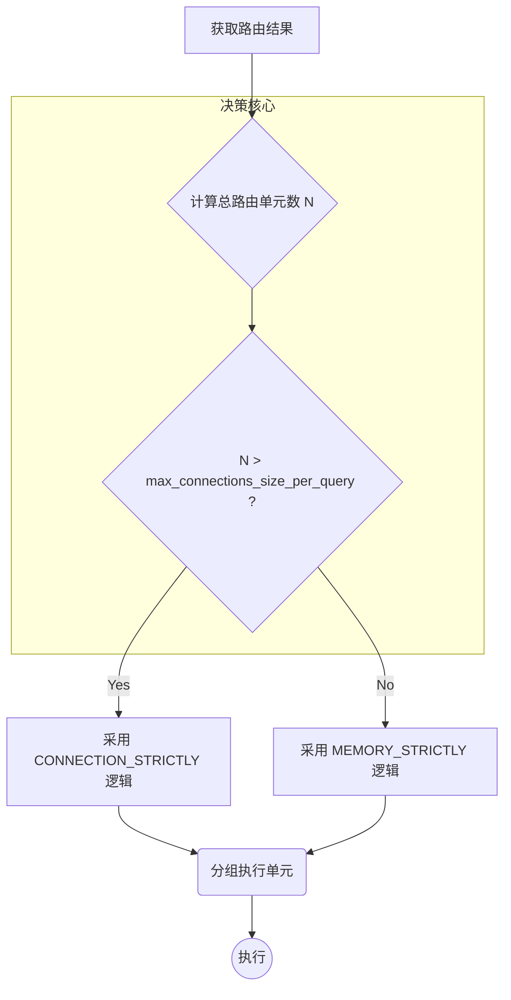

这种设计，将复杂性留给了 ShardingSphere 内部，将简单性留给了用户，是其架构演进过程中的一次巨大飞跃。执行引擎的核心职责也因此进一步清晰化，即分为两个核心阶段：

1.  **准备阶段 (Preparation)**：此阶段的核心是**分组（Group）**。它会遍历所有路由到物理库的 SQL 单元，根据 `max_connections_size_per_query` 的设定，将这些单元智能地划分成不同的执行组（`ExecutionGroup`）。目标是在不超过连接数限制的前提下，尽可能地让能够并行的 SQL 分组到一起。
2.  **执行阶段 (Execution)**：此阶段则负责消费准备阶段生成的执行组。它会根据分组结果，为每个执行组获取连接，并通过底层的线程池（`ExecutorService`）真正地提交执行任务。在此阶段，它还会发出 `SQLExecutionEvent` 事件，供事务、链路追踪等其他模块订阅，实现功能的扩展。

通过“准备”与“执行”的分离，执行引擎实现了逻辑决策与物理执行的解耦，使其架构更加清晰和富有弹性。

## 3. 源码深潜：关键组件与数据结构

理论的理解最终需要落到源码的实现上。执行引擎的代码主要分布在 `infra/executor` 和 `jdbc/core` 两个模块中。在深入具体实现之前，我们先通过几张概览图来建立宏观认知。

#### 整体架构图

此图展示了执行引擎内部各核心组件的逻辑分层与协作关系。

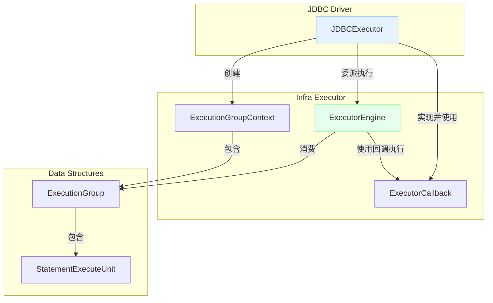

#### 核心类图

此图描绘了关键类与接口之间的静态关系，如继承、实现和组合。

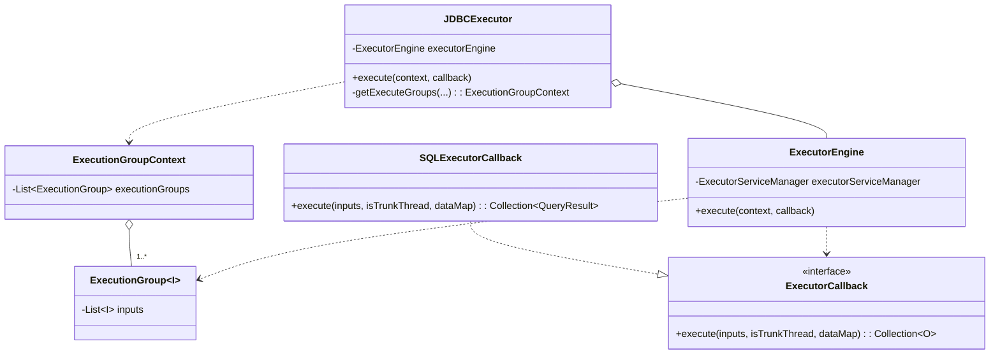

#### 高级时序图

此图通过一次典型的请求，动态地展示了各组件之间消息传递和交互的顺序。

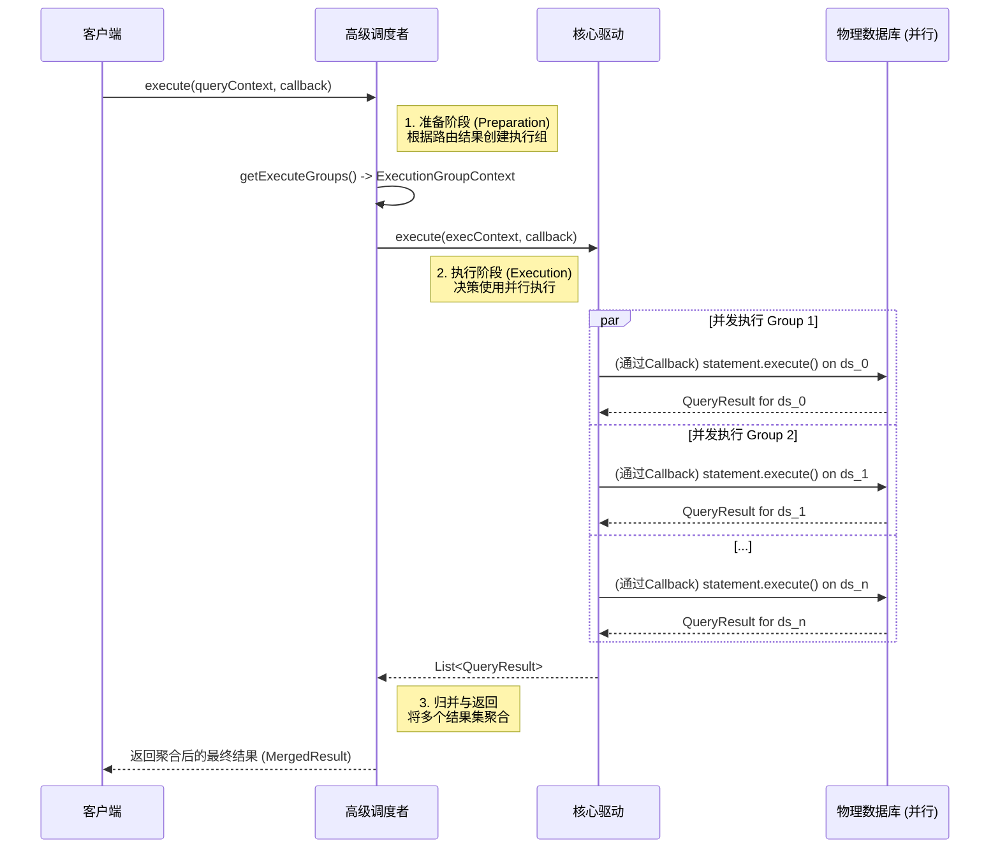

接下来，我们将逐一深入这些组件的内部实现。

---

其核心设计围绕着以下几个关键类和接口展开。

### 3.1 入口与调度：`JDBCExecutor`

`JDBCExecutor`（位于 `org.apache.shardingsphere.driver.executor` 包下）是 ShardingSphere JDBC Driver 中执行逻辑的**总入口**。它不负责真正的并发执行，而是扮演一个**高级调度者(Orchestrator)**的角色，负责执行前的所有准备工作，并将最终的执行任务委派给底层的 `ExecutorEngine`。

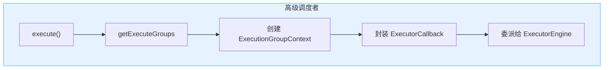

它的核心职责包括：

1.  **持有执行上下文**：在其成员变量中保存了 `ExecutorEngine` 实例、`ShardingSphereConnection` 等，贯穿整个执行过程。

2.  **执行准备**：在 `execute` 方法中，调用 `getExecuteGroups` 方法，这正是“自动化执行引擎”中**准备阶段（Preparation）**的核心所在。此方法会根据路由结果（`ExecutionUnit`）和 `max_connections_size_per_query` 配置，智能地决定采用 `MEMORY_STRICTLY` 还是 `CONNECTION_STRICTLY` 的逻辑来创建执行组（`ExecutionGroup`）。

3.  **委派执行**：将准备阶段生成的 `ExecutionGroupContext`（包含了所有的 `ExecutionGroup`），连同 `ExecutorCallback` 一起，传递给 `ExecutorEngine` 的 `execute` 方法，触发真正的物理 SQL 执行。

### 3.2 核心驱动：`ExecutorEngine`

`ExecutorEngine`（位于 `org.apache.shardingsphere.infra.executor.kernel` 包下）是执行引擎的**“心脏”**，是真正负责任务并发执行的组件。它是一个通用的、与上层业务（如 JDBC）无关的执行引擎。

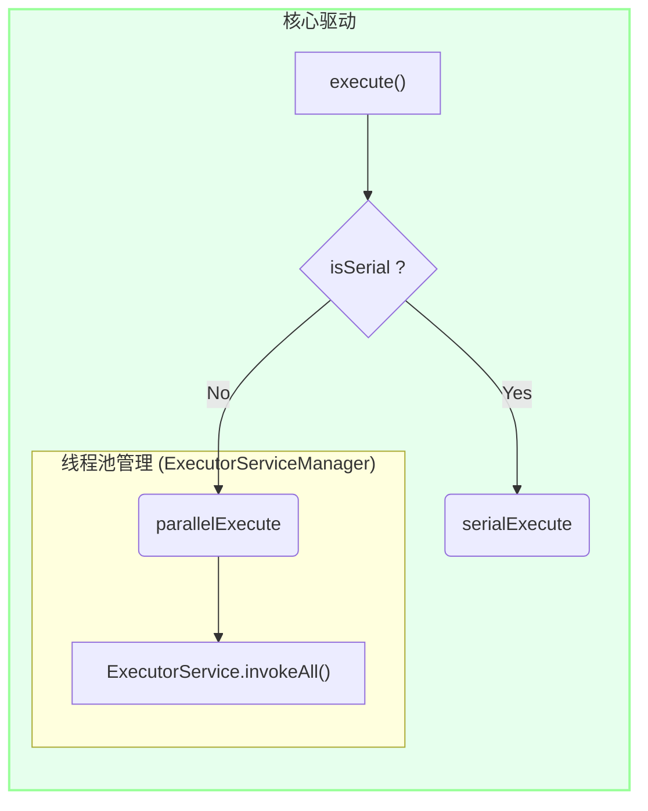

其设计亮点和核心职责如下：

1.  **线程池管理**：内部持有并管理一个 `ExecutorService`（Java 并发包中的线程池）。通过 `ExecutorServiceManager` 进行线程池的创建和生命周期管理，实现了对执行资源的统一控制。

2.  **串/并行执行**：对外暴露了 `execute`, `serialExecute` 和 `parallelExecute` 三个核心方法。`execute` 方法会根据输入的一组 `ExecutionGroup` 是否需要串行执行（`isSerial()`）来自动选择调用 `serialExecute` 还是 `parallelExecute`。
	- `parallelExecute`: 使用 `java.util.concurrent.Future` 和 `ExecutorService.invokeAll()` 实现并行执行，等待所有组的任务完成后统一返回结果。
	- `serialExecute`: 在当前线程中，简单地通过循环来依次执行每一个 `ExecutionGroup`。

3.  **通用性**：`ExecutorEngine` 的所有执行方法都是围绕一个泛型 `ExecutorCallback` 接口来工作的。它不关心具体要执行的是什么操作（是执行 SQL，还是调用某个 RPC），只负责“执行”这个动作本身，这使其具备了高度的可重用性。

### 3.3 执行单元：`ExecutionGroup` 与 `ExecutionGroupContext`

这两个类是执行引擎工作时所依赖的核心数据结构，定义了执行任务的组织形式。

-   **`ExecutionGroupContext`**: 代表了一次**完整的查询请求**的执行上下文。其最核心的成员是 `List<ExecutionGroup<?>> executionGroups`，保存了本次查询被划分出的所有执行组。

-   **`ExecutionGroup`**: 代表了一组**可以被共同执行**的输入单元。这里的“共同执行”通常意味着它们可以在**同一个数据库连接**上执行。它的核心成员是 `List<I> inputs` (其中 `I` 是输入单元的类型，在 JDBC 场景下就是 `StatementExecuteUnit`)。`ExecutionGroup` 是 `ExecutorEngine` 进行任务调度的**最小单位**。

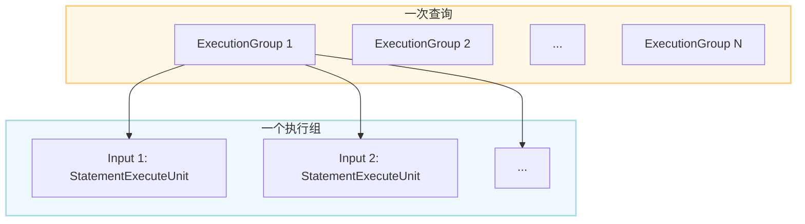

**举例理解**：假设一个查询路由到了2个库（ds_0, ds_1），ds_0 上有3个分片表，ds_1 上有2个分片表。

-   如果采用 `MEMORY_STRICTLY` 逻辑，会产生 5 (3+2) 个 `ExecutionGroup`，每个 `ExecutionGroup` 内部只有一个 `StatementExecuteUnit`。这 5 个组会被并行执行。

-   如果采用 `CONNECTION_STRICTLY` 逻辑，会产生 2 个 `ExecutionGroup`。一个组包含 ds_0 的 3 个 `StatementExecuteUnit`，另一个组包含 ds_1 的 2 个 `StatementExecuteUnit`。这两个组也会被并行执行，但在每个组内部，那多个 `StatementExecuteUnit` 会被串行执行。

### 3.4 回调机制：`ExecutorCallback`

`ExecutorCallback`（位于 `org.apache.shardingsphere.infra.executor.kernel.model` 包下）是一个函数式接口，它是 `ExecutorEngine` 实现通用性的**关键**。它定义了在一个 `ExecutionGroup` 中，对一组输入（`inputs`）和一个数据库连接（如果需要的话）进行具体操作的逻辑。

```java
public interface ExecutorCallback<I, O> {
    Collection<O> execute(Collection<I> inputs, boolean isTrunkThread, Map<String, Object> dataMap) throws SQLException;
}
```

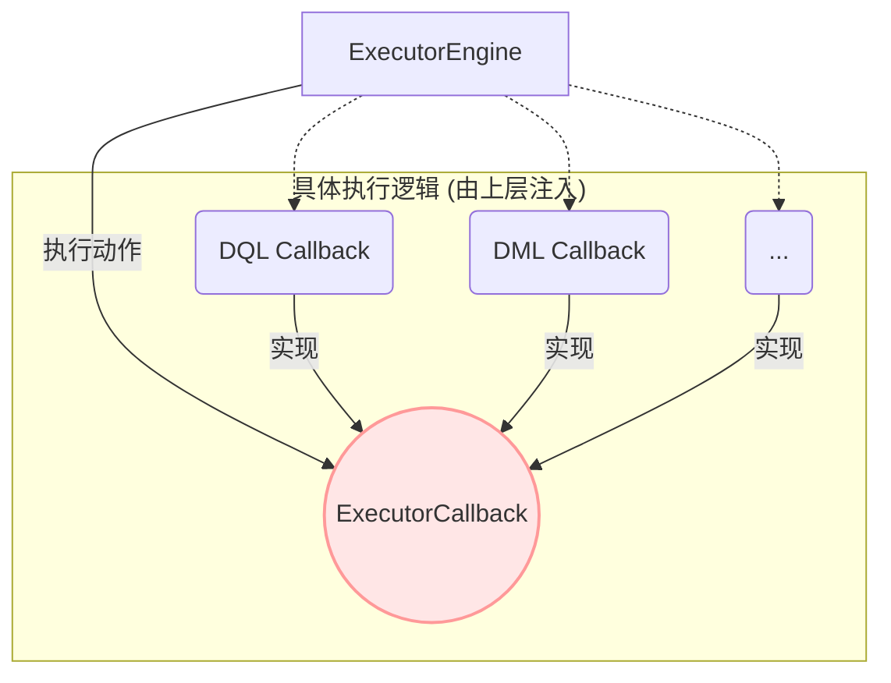

通过 `ExecutorCallback`，上层调用者（如 `JDBCExecutor`）可以向通用的 `ExecutorEngine` 注入具体的执行逻辑。

-   **DQL 场景**：`JDBCExecutor` 会传入一个 `SQLExecutorCallback` 的实现，其 `execute` 方法内部会调用 `statement.execute()` 来执行查询，并返回 `QueryResult`。

-   **DML/DDL 场景**：`JDBCExecutor` 同样会传入一个 `SQLExecutorCallback` 实现，但其 `execute` 方法会调用 `statement.executeUpdate()`，并返回受影响的行数。

这种**策略模式**的应用，使得 `ExecutorEngine` 能够处理各种不同类型的执行任务，而无需关心任务内部的细节，实现了框架底层的高度解耦和可扩展性。

## 4. 工作流程：一条 SQL 的执行之旅

理论和组件的分析最终要通过一个完整的流程串联起来。下面我们将通过序列图的形式，具体展示一条 DQL (SELECT) 和一条 DML (UPDATE) 语句在执行引擎中的完整生命周期。

### 4.1 DQL 查询流程

假设用户通过 `ShardingSpherePreparedStatement` 执行一条 `executeQuery()`，该查询将路由到2个不同的数据库实例。

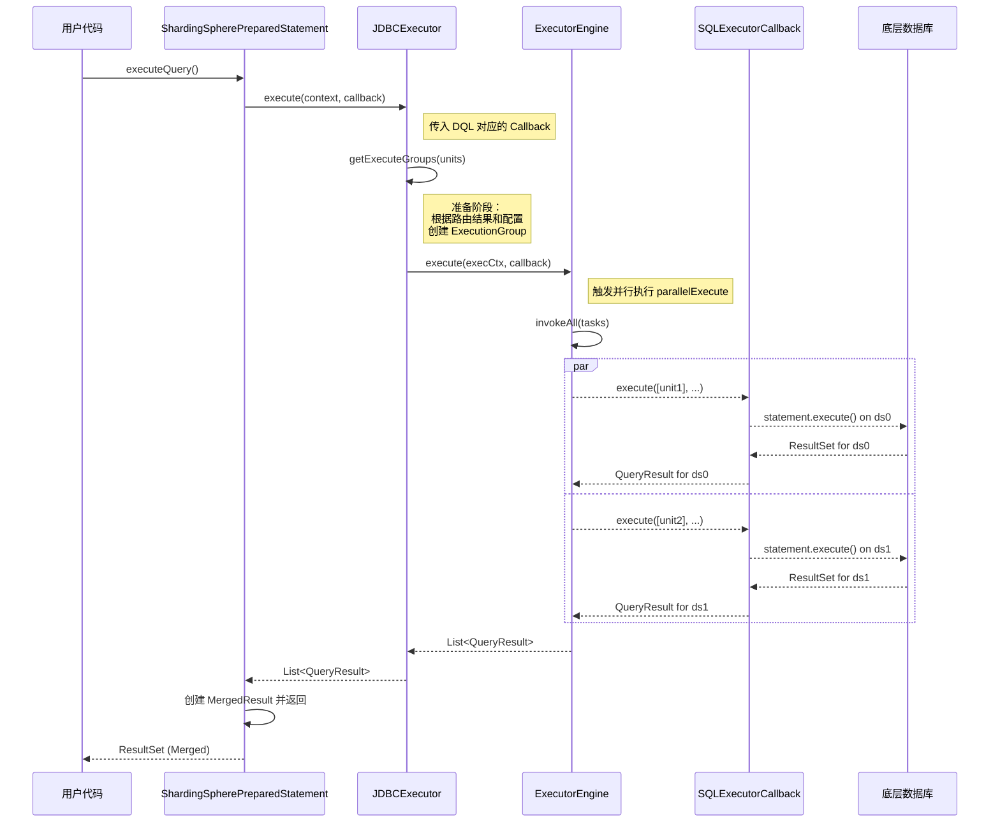

**流程解读**:
1.  **入口**: `ShardingSpherePreparedStatement.executeQuery()` 是所有逻辑的起点。
2.  **准备**: `JDBCExecutor` 首先进入**准备阶段**，调用 `getExecuteGroups` 方法。在这个例子中，由于是跨库查询，很可能会创建两个 `ExecutionGroup`，每个组包含发往一个库的所有 SQL 单元。
3.  **委派**: `JDBCExecutor` 将准备好的 `ExecutionGroupContext` 和一个专门用于执行查询的 `SQLExecutorCallback` 实例，一同交给 `ExecutorEngine`。
4.  **并发执行**: `ExecutorEngine` 看到有两个 `ExecutionGroup` 并且需要并行，于是调用 `parallelExecute`。它从内部线程池中为每个 `ExecutionGroup` 分配一个线程，并异步调用 `SQLExecutorCallback` 的 `execute` 方法。
5.  **物理执行**: `SQLExecutorCallback` 在每个线程中被执行，它负责获取数据库连接，并调用 JDBC `Statement` 的 `execute()` 方法，与真实的数据库进行交互。
6.  **结果收集**: `ExecutorEngine` 等待所有线程（`Future`）执行完毕，收集每一个 `ExecutionGroup` 返回的 `QueryResult` 对象，并将这个列表返回给 `JDBCExecutor`。
7.  **归并与返回**: `JDBCExecutor` 将结果列表返回给 `SSPs`，`SSPs` 会用这些结果初始化一个 `MergedResult`（归并结果集），最终向用户代码返回一个逻辑上统一的 `ResultSet`。

### 4.2 DML/DDL 更新流程

假设用户执行一条 `executeUpdate()`，该语句会路由到同一个库 ds_0 的 3 张分片表。

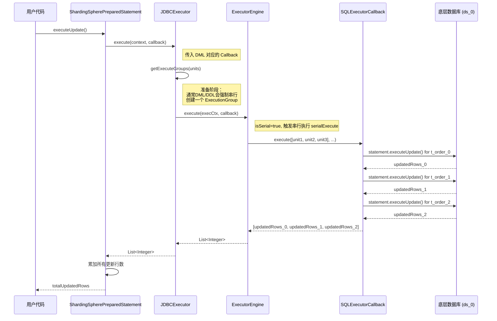

**流程解读**:
1.  **入口与准备**: 与 DQL 类似，但 `JDBCExecutor` 在 `getExecuteGroups` 时，会识别出这是 DML/DDL 操作。为了保证数据的一致性和避免死锁，**通常会强制选择串行执行**。因此，即使有3个 SQL 单元，也只会生成一个 `ExecutionGroup`，里面包含这3个单元。
2.  **串行委派**: `JDBCExecutor` 调用 `ExecutorEngine.execute()`。`ExecutorEngine` 检查到 `ExecutionGroup` 的 `isSerial()` 标志为 true，于是选择调用 `serialExecute`。
3.  **循环执行**: `serialExecute` 不会使用线程池，而是在**当前线程**中，直接循环调用 `SQLExecutorCallback.execute`。`Callback` 内部会依次执行发往 `t_order_0`, `t_order_1`, `t_order_2` 的 `executeUpdate()`。
4.  **结果累加**: `Callback` 每执行完一次更新，就收集受影响的行数。最终将一个包含所有行数的列表返回给 `ExecutorEngine`，并逐层返回给 `SSPs`。
5.  **最终返回**: `SSPs` 将列表中的所有更新行数累加，得到总的受影响行数，并将其返回给用户。

### 4.3 关键决策点：串行 vs. 并行

执行引擎的灵魂在于 `JDBCExecutor.getExecuteGroups` 方法中对串行和并行的决策。其核心逻辑可以归纳为：

1.  **类型判断**：首先判断 SQL 类型。对于 DML 和 DDL 语句，为了数据一致性，通常会倾向于或强制使用串行执行。
2.  **连接数计算**：对于 DQL 语句，会计算所有路由单元所需的总连接数。
3.  **阈值比较**：将计算出的连接数与 `max_connections_size_per_query` 进行比较。
    -   如果**未超过**阈值，则采用 `MEMORY_STRICTLY` 逻辑，为每个路由单元创建一个 `ExecutionGroup`，最大化并行度。
    -   如果**超过**了阈值，则采用 `CONNECTION_STRICTLY` 逻辑，将发往同一个数据库实例的路由单元合并到同一个 `ExecutionGroup` 中，以节省连接数。

这个决策过程完美体现了自动化执行引擎的设计哲学：在用户设定的资源约束下，尽可能地为查询提供最佳的执行效率。

## 5. 总结

ShardingSphere 的执行引擎是一个设计精良、高度优化的组件，其核心设计哲学在于**将复杂性内聚，将简单性外显**。

-   **对于用户而言**，它通过一个单一的 `max_connections_size_per_query` 参数，就实现了对资源和效率的宏观控制，极大地降低了在分布式环境下优化SQL执行的门槛。
-   **对于框架而言**，其内部的自动化决策机制、准备与执行的分离、以及基于回调的通用设计，使其在面对复杂路由结果时，总能智能地选择出一条兼顾资源与效率的最优路径。

从源码层面看，执行引擎的设计同样体现了优秀的软件工程实践：
1.  **分层解耦**：`JDBCExecutor` 作为高级调度层，与 `ExecutorEngine` 这类底层驱动层分离，使得各自职责清晰，易于维护和扩展。
2.  **面向接口**：通过 `ExecutorCallback` 接口，实现了执行逻辑与执行动作的解耦，是典型的策略模式应用，为功能扩展提供了极大的便利。
3.  **事件驱动**：在执行的关键节点（开始、成功、失败）发布事件，允许其他模块（如事务、APM）无侵入地接入，构建了一个可观测、可扩展的执行生态。

对于希望基于 ShardingSphere 进行二次开发或贡献代码的开发者，执行引擎模块提供了以下几个扩展点：
-   **自定义 `ExecutorCallback`**：可以实现自己的 `ExecutorCallback`，在SQL执行前后加入自定义逻辑，例如，详细的性能日志、特定的安全检查等。
-   **订阅 `SQLExecutionEvent`**：通过订阅执行事件，可以构建更为复杂的上层应用，比如实现一个自定义的分布式事务管理器，或者将执行信息集成到已有的监控平台。

总而言之，ShardingSphere 执行引擎不仅是其内核链路中的一个关键环节，更是其“可插拔”架构理念的优秀范例。深入理解其设计与实现，对于我们高效使用 ShardingSphere 以及参与其社区贡献，都具有重要的价值。
