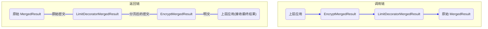
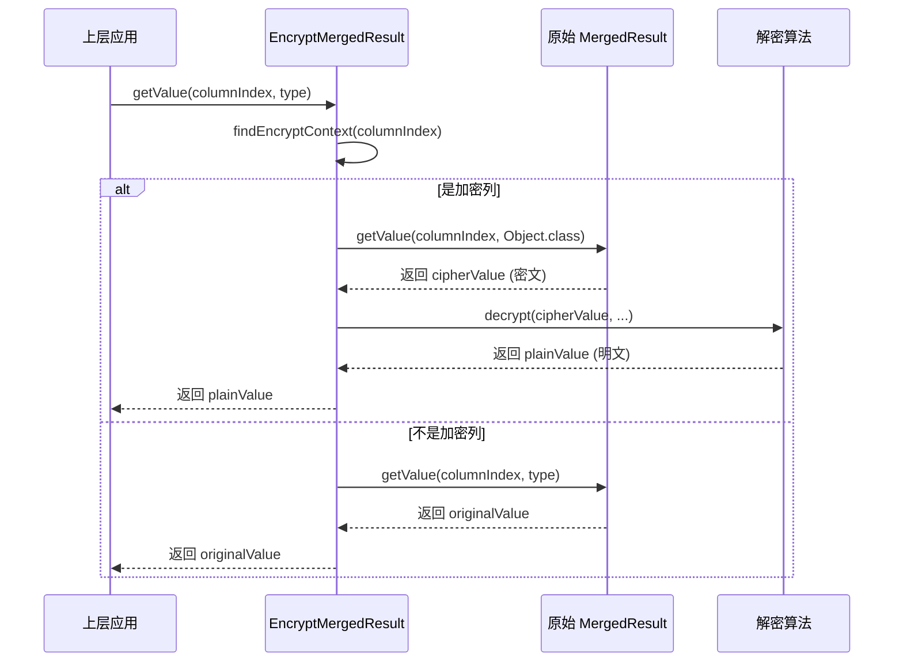

# ShardingSphere 归并引擎源码深度剖析

## 1. 概述

在 ShardingSphere 中，一条 `SELECT` 查询在被路由到多个分片（数据库或表）上执行后，会返回多个 `QueryResult` 结果集。**归并引擎 (Merge Engine)** 的核心职责，就是将这些来自不同数据节点的、零散的 `QueryResult`，合并（Merge）并处理（Decorate）成一个对上层应用透明的、统一的 `MergedResult`。

无论 SQL 中包含了多么复杂的 `ORDER BY`, `GROUP BY`, `LIMIT`, `AVG()` 等子句，归并引擎都能确保最终返回给用户的结果，在逻辑上与在单库上执行的结果完全一致。

其设计的核心思想，可以概括为：

-   **性能优先**: 尽可能地使用**流式归并**，以时间换空间，避免将大量数据一次性加载到内存中，从而保证系统的稳定性和高吞吐。
-   **功能完备**: 在必要时（如无法进行流式处理的 `GROUP BY`），自动降级为**内存归并**，以保证查询功能的正确性。
-   **高度可扩展**: 通过**策略模式**和**装饰器模式**，将核心归并流程与具体的功能（排序、分组、分页、加密等）完全解耦，使得引擎的功能易于扩展和维护。

## 2. 架构与设计模式

ShardingSphere 的官方文档为我们提供了一张非常清晰的归并引擎架构图：


这张图完美地诠释了归并引擎的两大核心设计模式：

1.  **策略模式 (Strategy Pattern)**: 图中的“遍历归并”、“排序归并”和“分组归并”是三种互斥的**基础归并策略**。`ShardingDQLResultMerger` 会根据当前 SQL 的语义，从这三种策略中选择一个最合适的来处理底层的 `QueryResult`。
2.  **装饰器模式 (Decorator Pattern)**: 在选定了基础归并策略之后，“聚合归并”和“分页归并”会作为**装饰器**，被动态地“包装”在基础归并策略之上，以添加额外的功能。

这种“**先选择基础策略，再应用可选装饰**”的设计，使得整个归并流程既灵活又清晰。

## 3. 核心接口与源码解读

归并引擎的核心逻辑主要位于 `shardingsphere-infra-merge` 模块中。

### 3.1. `MergeEngine`: 归并流程的 orchestrator

`MergeEngine` 是整个归并流程的“编排者”。它本身不包含具体的归并或装饰逻辑，而是通过 SPI 机制动态地加载 `ResultProcessEngine`（即 `ResultMergerEngine` 和 `ResultDecoratorEngine`），并将它们像积木一样组合起来，完成整个归并任务。

```java
// in MergeEngine.java

public MergedResult merge(final List<QueryResult> queryResults, final SQLStatementContext<?> sqlStatementContext) throws SQLException {
    // 1. 执行合并 (策略模式)
    Optional<MergedResult> mergedResult = executeMerge(queryResults, sqlStatementContext);
    
    // 2. 执行装饰 (装饰器模式)
    Optional<MergedResult> result = mergedResult.isPresent() 
        ? Optional.of(decorate(mergedResult.get(), sqlStatementContext)) 
        : decorate(queryResults.get(0), sqlStatementContext);
        
    return result.orElseGet(() -> new TransparentMergedResult(queryResults.get(0)));
}

// executeMerge 会根据规则（如 ShardingRule），找到对应的 ResultMergerEngine，并创建 ResultMerger 来执行合并
private Optional<MergedResult> executeMerge(...) throws SQLException {
    for (Entry<ShardingSphereRule, ResultProcessEngine> entry : engines.entrySet()) {
        if (entry.getValue() instanceof ResultMergerEngine) {
            ResultMerger resultMerger = ((ResultMergerEngine) entry.getValue()).newInstance(...);
            return Optional.of(resultMerger.merge(queryResults, ...));
        }
    }
    return Optional.empty();
}

// decorate 会找到所有的 ResultDecoratorEngine，并创建 ResultDecorator 来对结果进行层层包装
private MergedResult decorate(final MergedResult mergedResult, ...) throws SQLException {
    MergedResult result = null;
    for (Entry<ShardingSphereRule, ResultProcessEngine> entry : engines.entrySet()) {
        if (entry.getValue() instanceof ResultDecoratorEngine) {
            ResultDecorator resultDecorator = ((ResultDecoratorEngine) entry.getValue()).newInstance(...);
            result = null == result 
                ? resultDecorator.decorate(mergedResult, ...) 
                : resultDecorator.decorate(result, ...); // 链式装饰
        }
    }
    return null == result ? mergedResult : result;
}
```

从源码中我们可以看到，`MergeEngine` 通过遍历所有与当前 `ShardingSphereRule` 相关的 `ResultProcessEngine`，来动态地应用归并和装饰逻辑。这种设计完全将核心归并流程与具体的功能（如分片、加密、影子库等）解耦。

### 3.2. 核心接口

-   **`MergedResult`**: 对归并后结果集的抽象，提供了与 JDBC `ResultSet` 类似的 `next()`, `getValue()` 等接口。
-   **`ResultMerger`**: 归并策略的接口，其 `merge` 方法负责将 `List<QueryResult>` 转换成一个 `MergedResult`。
-   **`ResultDecorator`**: 装饰器的接口，其 `decorate` 方法负责接收一个 `MergedResult`（或 `QueryResult`），并返回一个被“包装”了新功能的 `MergedResult`。

## 4. 归并策略详解 (`ShardingDQLResultMerger`)

`ShardingDQLResultMerger` 是分片场景下，DQL 查询归并的核心实现。它完美地体现了归并引擎的策略选择机制。

```java
// in ShardingDQLResultMerger.java

private MergedResult build(...) throws SQLException {
    // 优先处理 GROUP BY 和 DISTINCT
    if (isNeedProcessGroupBy(selectStatementContext)) {
        return getGroupByMergedResult(...);
    }
    if (isNeedProcessDistinctRow(selectStatementContext)) {
        // ... 将 DISTINCT 转换为 GROUP BY
        return getGroupByMergedResult(...);
    }
    // 其次处理 ORDER BY
    if (isNeedProcessOrderBy(selectStatementContext)) {
        return new OrderByStreamMergedResult(...);
    }
    // 默认使用最简单的遍历归并
    return new IteratorStreamMergedResult(queryResults);
}
```

### 4.1. 流式归并 vs. 内存归并

-   **`StreamMergedResult` (流式)**: 这是一个抽象基类。它的特点是不在内存中存储实际的数据，而是持有一个 `currentQueryResult` 的引用。它的 `getValue()` 等方法，都是直接委托给 `currentQueryResult`。子类需要实现 `next()` 方法，来控制 `currentQueryResult` 的切换和迭代。**这是 ShardingSphere 的首选归并方式**。
-   **`MemoryMergedResult` (内存)**: 这也是一个抽象基类。它的特点是在构造时，就会调用 `init()` 方法，将所有 `QueryResult` 的数据一次性加载到 `List<MemoryQueryResultRow>` 中。后续的 `next()` 和 `getValue()` 都是对这个内存列表的直接操作。这种方式会消耗大量内存，只在**不得不**的场景下（如无序的 `GROUP BY`）才会被使用。

### 4.2. 排序归并 (`OrderByStreamMergedResult`)

当 SQL 包含 `ORDER BY` 时，ShardingSphere 能保证每个分片返回的 `QueryResult` 内部是有序的。`OrderByStreamMergedResult` 的任务，就是将这 N 个有序的 `QueryResult`，合并成一个全局有序的结果。

这本质上是一个经典的“**多路归并排序**”问题。`OrderByStreamMergedResult` 使用了**优先队列（`PriorityQueue`）**来高效地解决这个问题。

其 `next()` 方法的核心逻辑如下：
1.  **初始化**: 首次调用时，将每个 `QueryResult` 的第一行数据包装成一个 `QueryResultRow` 对象，并全部放入一个**最小堆**（`PriorityQueue`）中。
2.  **取最小值**: 每次调用 `next()` 时，从堆顶弹出一个元素。这个元素就是当前所有结果集中“最小”的行。
3.  **补充元素**: 从弹出的元素所属的 `QueryResult` 中，读取下一行数据，并将其再次放入堆中。
4.  **循环**: 重复 2 和 3，直到堆为空。


通过这种方式，`OrderByStreamMergedResult` 可以在不占用大量内存的情况下，高效地实现对海量有序数据的归并。

### 4.3. 分组归并 (`GROUP BY`)

分组归并是最复杂的一种情况，它分为流式和内存两种模式：

-   **`GroupByStreamMergedResult` (流式)**:
    -   **触发条件**: `GROUP BY` 的列和 `ORDER BY` 的列**必须完全一致**。
    -   **实现原理**: 在满足触发条件时，可以认为具有相同 `GROUP BY` key 的行，会从不同的 `QueryResult` 中“连续地”流出。因此，`GroupByStreamMergedResult` 可以在内部维护一个“当前分组 key”，然后持续地从底层 `MergedResult`（通常是一个 `OrderByStreamMergedResult`）中聚合数据，直到 key 发生变化，就输出当前分组的聚合结果。
-   **`GroupByMemoryMergedResult` (内存)**:
    -   **触发条件**: `GROUP BY` 和 `ORDER BY` 的列不一致。
    -   **实现原理**: 必须将所有 `QueryResult` 的数据都加载到内存的一个 `Map` 中（key 是分组的 key，value 是聚合的值），在所有数据都处理完毕后，再对这个 `Map` 的结果进行迭代输出。

## 5. 装饰器实现：为结果集“穿上”新功能

装饰器模式是归并引擎设计的点睛之笔。它允许在不修改基础归并逻辑（遍历、排序、分组）的前提下，为其动态地添加分页、聚合、加密/解密等正交的功能。`MergeEngine` 和 `ShardingDQLResultMerger` 都会在其流程的最后阶段，调用 `decorate` 方法，将一系列装饰器“套”在 `MergedResult` 上。

### 5.1. 通用装饰器调用流程

我们可以通过下面的流程图，来清晰地理解装饰器的调用链。当上层应用（如 JDBC Driver）调用最终 `MergedResult` 的方法时，这个调用会像穿透层层包装一样，从最外层的装饰器传递到最内层的装饰器，最后到达原始的 `MergedResult`。



在这个例子中，一个对 `EncryptMergedResult` 的 `getValue()` 调用，会先经过 `EncryptMergedResult` 的处理（判断是否需要解密），然后调用内层 `LimitDecoratorMergedResult` 的 `getValue()`，该方法又会调用最内层原始 `MergedResult` 的 `getValue()` 来获取真实数据。数据返回的路径则正好相反。

### 5.2. 分页归并 (`LimitDecoratorMergedResult`)

分页装饰器是流式归并思想的完美体现。它通过在 `next()` 方法中巧妙地运用计数和“空转”，实现了在不消耗大量内存的情况下，对海量结果集进行精确分页。

#### 核心源码

```java
// in LimitDecoratorMergedResult.java

public final class LimitDecoratorMergedResult extends DecoratorMergedResult {
    
    private final PaginationContext pagination;
    
    // 用于记录跳过 offset 的行数
    private int rowCount;
    
    // 标记是否已经跳过了 offset
    private boolean skipAll;
    
    public LimitDecoratorMergedResult(final MergedResult mergedResult, final PaginationContext pagination) {
        super(mergedResult);
        this.pagination = pagination;
    }
    
    @Override
    public boolean next() throws SQLException {
        // 如果还没有跳完 offset，则执行 skipAll()
        if (!skipAll) {
            skipAll = skipAll();
        }
        // 判断是否已经达到 limit，如果达到了，则不再继续
        if (pagination.getLimitValue().isPresent() && rowCount > pagination.getLimitValue().get()) {
            return false;
        }
        // 调用内层 MergedResult 的 next()
        return getMergedResult().next();
    }
    
    private boolean skipAll() throws SQLException {
        // 如果有 offset，循环调用内层 next()，直到跳过 offset 行
        if (pagination.getOffsetValue().isPresent()) {
            for (long i = 0; i < pagination.getOffsetValue().get(); i++) {
                if (!getMergedResult().next()) {
                    return true;
                }
            }
        }
        rowCount = pagination.getOffsetValue().orElse(0L) + 1;
        return true;
    }
}
```

#### 工作机制

1.  **首次调用 `next()`**: `skipAll` 标志位为 `false`，因此会先执行 `skipAll()` 方法。
2.  **`skipAll()`**: 在该方法内部，会有一个 `for` 循环，持续调用被包装的 `MergedResult` 的 `next()` 方法，但并不取出数据。这个过程就像让结果集的游标“空转”，直到跳过 `offset` 所指定的行数。
3.  **继续迭代**: 跳过 `offset` 之后，`next()` 方法会开始真正地让底层的 `MergedResult` 迭代，并同时对 `rowCount` 进行计数。
4.  **达到上限**: 每一次 `next()` 调用，都会检查 `rowCount` 是否已经超过了 `limit`。一旦超过，`next()` 就会直接返回 `false`，从而结束整个结果集的遍历。

通过这种方式，`LimitDecoratorMergedResult` 避免了将 `offset + limit` 条数据全部读入内存，极大地提升了深分页查询的性能和稳定性。

### 5.3. 加密归并 (`EncryptMergedResult`)

加密/解密是装饰器模式的另一个经典应用。它通过在 `getValue()` 方法中加入“判断-解密”的逻辑，实现了对数据处理的无缝增强。

#### 调用时序图

下面的时序图，清晰地展示了调用 `EncryptMergedResult.getValue()` 时的内部交互流程。



#### 工作机制

1.  **方法拦截**: 当上层应用调用 `getValue()` 时，请求首先被 `EncryptMergedResult` 拦截。
2.  **元数据判断**: `EncryptMergedResult` 会根据 `EncryptAlgorithmMetaData`（在构造时传入），来判断当前被请求的列，是否在加密规则中被配置为了加密列。
3.  **条件分支**:
    -   如果**不是**加密列，`EncryptMergedResult` 就会像一个透明代理一样，直接调用被包装的 `mergedResult.getValue()`，并将结果原样返回。
    -   如果**是**加密列，它会先从 `mergedResult` 中获取原始的、加密过的数据（密文），然后找到对应的解密算法（`StandardEncryptAlgorithm`），调用其 `decrypt` 方法，最后将解密后的结果（明文）返回给上层应用。

这个过程对上层应用是完全透明的。应用开发者只需要像操作普通 `ResultSet` 一样操作 `MergedResult`，而无需关心底层的加解密细节。这正是装饰器模式强大威力（对扩展开放，对修改关闭）的完美体现。

## 6. 总结

ShardingSphere 的归并引擎是一个将多种设计模式（策略、装饰器、工厂）运用得炉火纯青的典范。它通过：

-   **分层的、可组合的**设计，将复杂的归并逻辑分解成了一系列简单、内聚的组件。
-   **性能优先的**策略选择，在流式归并和内存归并之间取得了精妙的平衡。
-   **高度可扩展的** SPI 机制，使得添加新的归并和装饰功能变得轻而易举。

深入理解归并引擎的设计，不仅能帮助我们更好地使用 ShardingSphere，也能为我们自己在设计复杂数据处理系统时，提供宝贵的借鉴和启示。
