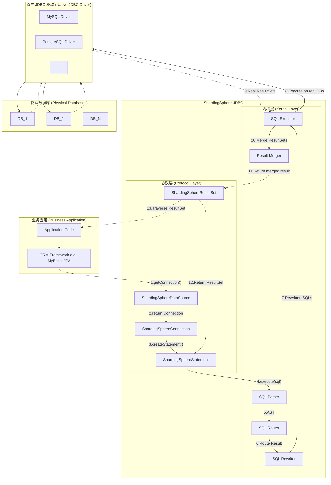
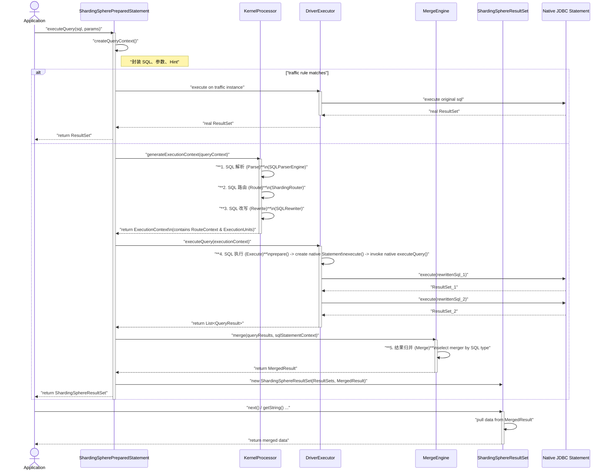

# ShardingSphere-JDBC 源码深度解析

## 一、前言

ShardingSphere-JDBC 是 Apache ShardingSphere 项目的两大核心引擎之一（另一个是 ShardingSphere-Proxy）。它定位为一个增强型的 JDBC 驱动，以 Jar 包的形式提供服务，使得开发者可以在不修改现有业务代码或仅做少量修改的情况下，透明地实现分库分表、读写分离、数据加密等复杂的数据治理功能。

本系列文档旨在通过对 ShardingSphere-JDBC 的源码进行全面、深入的分析，揭示其内部工作原理，帮助开发者更好地理解和使用这一强大的工具。我们将遵循从宏观架构到微观实现、从核心主线到功能扩展的路径，逐步探索其设计的精妙之处。

## 二、架构总览

在深入代码细节之前，建立一个高屋建瓴的架构视图至关重要。ShardingSphere-JDBC 的核心设计思想可以概括为 **“协议层封装 + 内核层驱动”**。

- **协议层封装 (Protocol Layer Wrapper)**: ShardingSphere 实现了一套完整的 JDBC 标准接口（如 `DataSource`, `Connection`, `Statement`, `ResultSet` 等）。当业务应用调用这些接口时，实际上是在与 ShardingSphere 的封装对象进行交互。这一层的主要职责是“拦截”应用的 JDBC 调用，然后将其转发给 ShardingSphere 的核心处理内核。
- **内核层驱动 (Kernel Layer Driver)**: 这是 ShardingSphere 功能实现的核心，包含了 SQL 解析、路由、改写、执行、归并等一系列复杂逻辑。内核层接收到协议层转发过来的请求后，会根据用户配置的规则（如分片规则）进行计算，将一个逻辑 SQL 拆解、改写成多个可以在真实物理数据库上执行的 SQL，然后调用原生的 JDBC 驱动去执行，并最终将多个执行结果合并成一个统一的结果集返回给应用。

下面是一张高阶的架构图，清晰地展示了 ShardingSphere-JDBC 如何融入到 Java 应用程序中，以及其内部各组件的交互关系。

从上图可以看出，ShardingSphere-JDBC 对于业务应用来说，扮演了一个“超级数据源”的角色。应用层代码只需面向标准的 JDBC 接口编程，而无需关心底层复杂的分库分表逻辑。这种设计的最大优势在于其**透明性**和**低侵入性**。

接下来，我们将从用户与 ShardingSphere-JDBC 交互的第一个入口——`ShardingSphereDataSource` 开始，深入探索其内部的实现机制。

## 三、协议层解析：JDBC Wrapper 的艺术

ShardingSphere-JDBC 能够“透明地”介入应用的数据访问层，其核心魔法在于对 JDBC 标准接口的巧妙封装。它遵循经典的**装饰者模式 (Decorator Pattern)**，创建了一套与原生 JDBC 接口完全兼容的“外壳”，但在内部实现了自己的增强逻辑。

当应用程序通过 `ShardingSphereDataSource` 获取连接，并进一步创建 `Statement`、执行 SQL、处理 `ResultSet` 时，它所接触到的整个对象链条 (`Connection` -> `Statement` -> `ResultSet`) 都是由 ShardingSphere 提供的“装饰对象”，而非原生驱动的实现。

下面这幅 UML 类图清晰地展示了这种封装关系：

```mermaid
classDiagram
    direction TB
    class `javax.sql.DataSource` {
        <<interface>>
    }
    class `java.sql.Connection` {
        <<interface>>
    }
    class `java.sql.Statement` {
        <<interface>>
    }
    class `java.sql.PreparedStatement` {
        <<interface>>
    }
    class `java.sql.ResultSet` {
        <<interface>>
    }
    class `org.apache.shardingsphere.driver.jdbc.core.datasource.ShardingSphereDataSource`
    class `org.apache.shardingsphere.driver.jdbc.core.connection.ShardingSphereConnection`
    class `org.apache.shardingsphere.driver.jdbc.core.statement.ShardingSphereStatement`
    class `org.apache.shardingsphere.driver.jdbc.core.statement.ShardingSpherePreparedStatement`
    class `org.apache.shardingsphere.driver.jdbc.adapter.AbstractResultSetAdapter`
    
    `javax.sql.DataSource` <|.. `org.apache.shardingsphere.driver.jdbc.core.datasource.ShardingSphereDataSource`
    `java.sql.Connection` <|.. `org.apache.shardingsphere.driver.jdbc.core.connection.ShardingSphereConnection`
    `java.sql.Statement` <|.. `org.apache.shardingsphere.driver.jdbc.core.statement.ShardingSphereStatement`
    `java.sql.PreparedStatement` <|.. `org.apache.shardingsphere.driver.jdbc.core.statement.ShardingSpherePreparedStatement`
    `java.sql.ResultSet` <|.. `org.apache.shardingsphere.driver.jdbc.adapter.AbstractResultSetAdapter`

    `org.apache.shardingsphere.driver.jdbc.core.datasource.ShardingSphereDataSource` o-- `org.apache.shardingsphere.mode.manager.ContextManager`
    `org.apache.shardingsphere.driver.jdbc.core.connection.ShardingSphereConnection` o-- `org.apache.shardingsphere.driver.jdbc.core.connection.ConnectionManager`
    `org.apache.shardingsphere.driver.jdbc.core.statement.ShardingSphereStatement` o-- `org.apache.shardingsphere.driver.jdbc.core.connection.ShardingSphereConnection`
    
    note for `org.apache.shardingsphere.driver.jdbc.core.datasource.ShardingSphereDataSource` "**入口 (Entry Point)**<br>用户配置的数据源。<br>核心职责是初始化 `ContextManager`<br>并创建 `ShardingSphereConnection`。"
    note for `org.apache.shardingsphere.driver.jdbc.core.connection.ShardingSphereConnection` "**连接封装 (Connection Wrapper)**<br>实现了 `java.sql.Connection` 接口。<br>内部通过 `ConnectionManager` 管理<br>到真实物理数据库的连接。<br>`createStatement()` 和 `prepareStatement()`<br>方法返回 ShardingSphere 自己的 Statement 对象。"
    note for `org.apache.shardingsphere.driver.jdbc.core.statement.ShardingSphereStatement` "**语句封装 (Statement Wrapper)**<br>实现了 `java.sql.Statement` 接口。<br>`execute()`, `executeQuery()` 等方法是<br>触发 ShardingSphere 核心逻辑的入口。"
```

让我们逐一解析这个装饰链条中的关键环节。

### 3.1 `ShardingSphereDataSource`：一切的起点

正如我们在 Phase 1 中分析的，`ShardingSphereDataSource` 是用户接触到的第一个 ShardingSphere 对象。它的核心职责有两个：

1.  **初始化上下文**：在构造函数中，它会解析用户的配置（无论是通过 API 传入还是从 YAML 文件加载），创建一个 `ContextManager` 实例。`ContextManager` 是 ShardingSphere 的“大脑”，掌管着元数据、规则配置、真实数据源等所有运行时信息。
2.  **创建连接**：当应用调用其 `getConnection()` 方法时，它并不直接返回一个物理数据库连接，而是实例化并返回一个 `ShardingSphereConnection` 对象，并将 `ContextManager` 等核心对象传递给它。

### 3.2 `ShardingSphereConnection`：连接的代理

`ShardingSphereConnection` 是对 `java.sql.Connection` 的封装。它接管了所有与连接相关的操作，其中最重要的是：

-   **语句对象的创建**：它重写了 `createStatement()` 和 `prepareStatement()` 方法。当业务代码调用这两个方法时，`ShardingSphereConnection` 会返回 ShardingSphere 自己实现的 `ShardingSphereStatement` 或 `ShardingSpherePreparedStatement` 对象。正是这一步，确保了后续的 SQL 执行能够被 ShardingSphere 拦截和处理，这是整个装饰链条得以延续的关键。
-   **事务管理**：它重写了 `setAutoCommit()`, `commit()`, `rollback()` 等事务控制方法。这使得 ShardingSphere 可以在这些方法中加入自己的逻辑，以支持本地事务、XA 两阶段提交、BASE 柔性事务等不同的分布式事务方案。其内部通过一个 `ConnectionManager` 来管理和调度对底层真实数据库连接的事务操作。

### 3.3 `ShardingSphereStatement` & `ShardingSpherePreparedStatement`：执行的入口

这是 JDBC Wrapper 中最核心的一环，是 ShardingSphere 内核功能被触发的真正入口。当应用代码拿到 `ShardingSphereStatement` 对象并调用其 `execute()`, `executeQuery()` 或 `executeUpdate()` 方法时，一场“偷梁-换柱”的好戏就正式上演了。

在这些 `execute` 方法内部，并不会直接将 SQL 发给数据库，而是会启动 ShardingSphere 的一整套标准流程：**SQL 解析 -> 路由 -> 改写 -> 执行 -> 结果归并**。这个流程我们将在下一章节详细拆解。

### 3.4 `ShardingSphereResultSet`：结果的伪装

对于 `SELECT` 查询，当 ShardingSphere 内核执行完毕后，可能会从多个物理数据分片获取到多个 `java.sql.ResultSet`。为了将这些分散的结果对上层应用表现得像一个单一、连续的结果集，ShardingSphere 创造了 `ShardingSphereResultSet`。

它同样实现了 `java.sql.ResultSet` 接口，内部持有一个或多个真实的 `ResultSet`。当应用调用 `next()`, `getString()`, `getInt()` 等方法遍历数据时，`ShardingSphereResultSet` 会通过内部的**归并引擎 (Merge Engine)**，按照特定的规则（如排序、分页、聚合）从底层的多个真实 `ResultSet` 中拉取数据、合并处理，然后返回给应用。这使得复杂的分片查询对应用层保持了绝对的透明。

通过以上分析可以看出，ShardingSphere-JDBC 的协议层封装是一套设计精巧、环环相扣的装饰链。正是这个链条，构成了 ShardingSphere 内核与应用程序之间的桥梁，实现了在不改变应用层代码的前提下，无缝增强其数据访问能力的宏伟目标。

## 四、内核主线：一条 SQL 的奇幻漂流

当应用程序调用 `ShardingSphereStatement.execute()` 方法时，就触发了 ShardingSphere 内核层的一系列复杂而有序的操作。一条看似普通的 SQL 语句，将经历一次“解析 -> 路由 -> 改写 -> 执行 -> 归并”的奇幻漂流。

下面这幅时序图（Sequence Diagram）详细描绘了这一完整过程：

接下来，我们对图中的五个核心阶段进行详细的源码级分析。

### 4.1 SQL 解析 (Parse)

-   **入口**: `KernelProcessor.generateExecutionContext()` -> `SQLParserEngine.parse()`
-   **功能**: 这是所有后续操作的基础。ShardingSphere 使用 ANTLR 作为其 SQL 解析器，将 SQL 文本字符串转换成一棵抽象语法树 (AST)。这棵 AST 精确地表达了 SQL 的语法结构。
-   **缓存**: 为了提升性能，SQL 解析的结果 (AST) 会被缓存。默认情况下，这个缓存位于 JVM 内存中。对于同一条 SQL，第二次执行时将直接从缓存中获取 AST，避免了重复解析的开销。`SQLParserRule` 中配置了相关缓存策略。

### 4.2 SQL 路由 (Route)

-   **入口**: `KernelProcessor.generateExecutionContext()` -> `ShardingRouter.createRouteContext()`
-   **功能**: 路由引擎是分库分表的核心。它会遍历解析阶段生成的 AST，提取出路由所需的关键信息，如表名、分片键 (Sharding Key) 及其对应的值。然后，根据用户在 `RuleConfiguration` 中配置的分片算法（如哈希、范围、取模等），计算出这条 SQL 应该被发送到哪些**物理数据源**的哪些**物理表**上。
-   **输出**: 路由的结果被封装成一个 `RouteContext` 对象。`RouteContext` 内部包含一个 `RouteUnit` 的列表，每个 `RouteUnit` 都清晰地指明了一个“逻辑数据源 -> 物理数据源”和“逻辑表 -> 物理表”的映射关系。例如，`SELECT * FROM t_order WHERE order_id = 123` 可能会被路由到 `ds_0` 实例的 `t_order_0` 表。

### 4.3 SQL 改写 (Rewrite)

-   **入口**: `KernelProcessor.generateExecutionContext()` -> `SQLRewriter.rewrite()`
-   **功能**: SQL 改写引擎会根据上一阶段生成的 `RouteContext`，对原始的逻辑 SQL 进行改写，生成可以真正在物理数据库上执行的 SQL。
-   **主要改写内容**:
    1.  **表名改写**: 将逻辑表名替换为路由结果中的物理表名。例如 `t_order` -> `t_order_0`。
    2.  **补列**: 如果分片键、`GROUP BY` 或 `ORDER BY` 的字段没有出现在原始 `SELECT` 列表中，改写引擎会自动将其添加到 `SELECT` 列表中，以便在后续的结果归并阶段使用。例如，`SELECT user_id FROM t_order ORDER BY order_id` 会被改写成 `SELECT user_id, order_id FROM t_order_0 ORDER BY order_id`。
    3.  **分页修正**: 对于需要跨分片进行 `LIMIT` 查询的场景，改写引擎会修正分页参数。例如，`LIMIT 10, 5` 可能会被改写成 `LIMIT 0, 15`，因为需要从每个分片都取出前 15 条数据，才能在内存中进行正确的排序和截取。
-   **输出**: 改写的结果是多条 SQL 字符串，每一条都将对应一个物理分片。

### 4.4 SQL 执行 (Execute)

-   **入口**: `DriverExecutor` -> `RegularExecutor.execute()`
-   **功能**: SQL 执行引擎负责将改写后的 SQL 高效地分发到各个物理数据库去执行。
-   **核心机制**:
    1.  **连接管理**: 执行前，`DriverExecutionPrepareEngine` 会根据路由结果，从 `ShardingSphereConnection` 内部维护的 `ConnectionManager` 中获取到目标物理数据源的数据库连接 (`java.sql.Connection`)。
    2.  **并发执行**: ShardingSphere 内部维护了一个线程池。当一条逻辑 SQL 被路由到多个物理库时，执行引擎会将这些物理 SQL 的执行请求作为独立的任务提交到线程池中，进行**并发执行**，以最大化地缩短整体响应时间。
    3.  **原生调用**: 在执行任务中，通过获取到的物理连接创建原生的 `PreparedStatement`，设置参数，并调用其 `execute...()` 方法，最终将 SQL 交给底层的原生 JDBC 驱动去完成网络通信和数据库操作。
-   **输出**: 执行完成后，会得到一个 `QueryResult` 列表，其中每个 `QueryResult` 都对应一个物理分片返回的 `ResultSet`。

### 4.5 结果归并 (Merge)

-   **入口**: `MergeEngine.merge()`
-   **功能**: 如果 SQL 的执行只涉及一个分片，那么直接将该分片的 `ResultSet` 封装后返回即可。但如果涉及多个分片，就需要结果归并引擎介入，将多个分散的 `ResultSet` “合并”成一个对用户透明的、统一的逻辑 `ResultSet`。
-   **归并策略**: `MergeEngine` 会根据 `SQLStatementContext`（包含了 SQL 类型、是否有 `ORDER BY`、`GROUP BY`、聚合函数、`LIMIT` 等信息）来选择合适的**归并器 (Merger)**。
    -   **流式归并 (Stream Merger)**: 对于不需要排序的简单查询，数据可以直接从底层 `ResultSet` 流式地返回。
    -   **排序归并 (Order By Merger)**: 对于带 `ORDER BY` 的查询，归并器会维护一个小顶堆（优先队列），每次从所有 `ResultSet` 的当前行中取出最小/最大的一个返回，以保证最终结果的全局有序性。
    -   **聚合归并 (Aggregation Merger)**: 对于带 `GROUP BY` 和聚合函数（如 `COUNT`, `SUM`, `AVG`）的查询，归并器会先从各个分片获取局部聚合结果，然后在内存中进行二次计算（如 `SUM` 的结果需要累加，`AVG` 需要重新计算 `SUM`/`COUNT`）。
    -   **分页归并 (Limit Merger)**: 在排序列或聚合列归并的基础上，跳过 `offset` 条记录，然后只取 `limit` 条记录。
-   **输出**: 归并引擎最终会输出一个 `MergedResult` 对象，`ShardingSphereResultSet` 会在内部持有这个对象，并在用户调用 `next()` 等方法时，通过它来拉取归并后的数据。

至此，一条 SQL 在 ShardingSphere-JDBC 内核中的完整旅程就走完了。这个过程虽然复杂，但设计上高度模块化，每个阶段各司其职，共同协作，最终为用户呈现了一个简单而强大的分布式数据库访问入口。

## 五、追根溯源：配置加载与内核引导

我们已经了解了 ShardingSphere-JDBC 在接收到 SQL 后的处理流程，但还有一个根本问题：ShardingSphere 是如何启动并完成自我初始化的？它如何将用户提供的 YAML 配置文件转换成内核能够理解并使用的内存对象？本章将追根溯源，揭示 ShardingSphere-JDBC 的引导过程。

整个引导过程的起点，通常是 `YamlShardingSphereDataSourceFactory` 这个工厂类。

### 5.1 `YamlShardingSphereDataSourceFactory`：从 YAML 到对象

这是推荐的用户入口，它负责解析 YAML 配置文件，并一步步构建出功能完备的 `ShardingSphereDataSource`。其核心 `createDataSource` 方法的内部逻辑如下：

1.  **YAML 解析**: 使用 `YamlEngine` (内部封装了 SnakeYAML) 将用户提供的 YAML 文件或字节流，反序列化成一个 `YamlRootConfiguration` POJO 对象。这个 POJO 类的结构与 YAML 配置文件的层级完全对应。
2.  **Swapper 机制**: ShardingSphere 设计了一套精巧的 **Swapper** 机制，用于将 YAML POJO 转换为内核使用的配置对象（`Configuration`）。每种配置（数据源、规则、模式等）都有其对应的 Swapper 实现：
    -   `YamlDataSourceConfigurationSwapper`: 负责将 `dataSources` 节点下的配置信息，转换为一个 `Map<String, DataSource>`。它会根据用户指定的 `type`（如 `com.zaxxer.hikari.HikariDataSource`）利用反射创建并初始化对应的数据源连接池。
    -   `YamlRuleConfigurationSwapperEngine`: 这是一个引擎类，它会遍历 `rules` 节点下的所有规则配置，并根据规则名称（如 `sharding`, `readwrite-splitting`）查找并调用对应的 `YamlXXXRuleConfigurationSwapper`，将 YAML 规则转换为强类型的 `RuleConfiguration` 对象（如 `ShardingRuleConfiguration`）。
    -   `YamlModeConfigurationSwapper`: 负责转换 `mode` 节点，将其转换为 `ModeConfiguration` 对象，用于决定 ShardingSphere 的工作模式（单机或集群）。
3.  **工厂创建**: 所有配置都从 YAML POJO 转换成 Java Configuration 对象后，会被统一传递给 `ShardingSphereDataSourceFactory.createDataSource()`，并最终进入 `ShardingSphereDataSource` 的构造函数，开始内核的构建。

这种基于 Swapper 的设计，优雅地将内核的配置模型与外部的 YAML 文本格式进行了解耦，为未来支持更多配置方式（如 TOML、JSON）提供了极佳的扩展性。

### 5.2 `ContextManager` & `MetaDataContexts`：内核的大脑

在 `ShardingSphereDataSource` 的构造函数中，最核心的动作就是创建 `ContextManager`。`ContextManager` 是 ShardingSphere 实例在运行时的“大脑”，它管理着所有工作所需的上下文信息。`ContextManager` 自身是一个管理者，其管理的真正核心数据，都存放在 `MetaDataContexts` 对象中。

`MetaDataContexts` 包含了三大块元数据：

1.  **`MetaDataPersistService` (元数据持久化服务)**
    -   **职责**: 在**集群模式**下，负责与注册中心（如 ZooKeeper, Etcd）交互，实现配置的持久化、订阅和动态更新。当注册中心的配置发生变更时，它能够监听到事件，并触发 ShardingSphere 内核的配置热加载。
    -   **实现**: 在**单机模式**下，这是一个空实现，所有配置都仅存在于内存中。

2.  **`ShardingSphereMetaData` (核心元数据)**
    -   这是 ShardingSphere **最重要**的元数据集合，是 SQL 路由、改写等所有核心功能的数据基础。它包含：
        -   **`databases: Map<String, ShardingSphereDatabase>`**: 管理着当前实例下的所有逻辑数据库。`ShardingSphereDatabase` 是一个关键的聚合对象，它又聚合了：
            -   **`ResourceMetaData`**: 描述物理资源，主要是 `Map<String, DataSource>`，即物理数据源的映射表。
            -   **`RuleMetaData`**: 描述规则，包含了当前数据库生效的所有 `RuleConfiguration` 转换后的内部规则对象（如 `ShardingRule`）。路由引擎等组件直接与这些规则对象交互。
            -   **`SchemaMetaData`**: 描述模式，即数据库中表、列、索引等元数据信息。这些信息可以帮助 ShardingSphere 在解析和改写 SQL 时获取更精准的语义。
        -   **`globalRuleMetaData`**: 全局规则元数据，如权限认证 (`AuthorityRule`)、SQL 解析配置 (`SQLParserRule`) 等。
        -   **`props`**: 全局属性，即 `sharding-sphere.yaml` 中 `props` 节点的配置，提供了对内核行为的微调能力。

3.  **`ShardingSphereData` (内置数据)**
    -   用于管理 ShardingSphere 系统自身的表数据，主要用于一些内置的系统功能，如数据迁移等。

综上所述，ShardingSphere-JDBC 的引导过程是一个**自底向上、层层构建**的过程：从解析最底层的 YAML 文本开始，通过 Swapper 机制将其转换为结构化的配置对象，再由这些配置对象构建出包含丰富资源、规则和 schema 信息的核心元数据模型 `ShardingSphereMetaData`，最后将这一切都交由 `ContextManager` 进行统一管理，为上层的 SQL 处理流程提供一个坚实、高效的数据基座。

## 六、总结与展望

通过对 ShardingSphere-JDBC 从内核引导到 SQL 执行的全链路源码分析，我们可以深刻地感受到其设计的精妙与优雅。在此，我们对其核心设计哲学进行总结，并为后续的深入学习提供一些展望。

### 6.1 核心设计哲学

-   **面向可插拔架构 (Pluggable Architecture)**: ShardingSphere 的内核设计处处体现着“可插拔”的思想。无论是分片算法、主键生成策略，还是SQL解析器、事务管理器，甚至是底层的数据库协议，都被设计成了可以通过 SPI (Service Provider Interface) 机制轻松扩展的独立组件。这使得 ShardingSphere 拥有极强的灵活性和生命力，能够快速适应不断变化的技术需求。
-   **分层与隔离 (Layering and Isolation)**: 项目的模块划分非常清晰。`driver` 层负责实现 JDBC 规范，充当“门面”；`infra` 层提供了通用的基础设施；`kernel` 层实现了核心的处理逻辑；`mode` 层处理不同工作模式下的配置和元数据管理。各层之间职责明确，依赖关系清晰，有效地降低了系统的复杂度。
-   **装饰者模式的极致应用**: JDBC Wrapper 层是装饰者模式的经典范本。通过对原生 JDBC 接口的“无感”封装，实现了在不侵入用户代码的前提下，附加分库分表等强大的数据治理能力，这是其能够被广泛、便捷地集成到现有系统中的关键。
-   **配置与内核分离**: 通过引入 Swapper 机制，ShardingSphere 成功地将用户侧的配置（如 YAML）与内核侧的领域模型（`RuleConfiguration` 等）进行了解耦。这使得内核可以独立演进，而不必关心外部配置格式的变化。

### 6.2 后续学习建议

ShardingSphere 是一个庞大而深邃的系统，本文档所覆盖的 JDBC 主线流程仅仅是其冰山一角。对于希望继续深入研究的开发者，以下是一些建议的学习方向：

1.  **深入特定功能插件**:
    -   **分布式事务**: 研究 `kernel/transaction` 模块，了解 ShardingSphere 是如何集成 Seata (BASE) 和 Narayana (XA) 来实现分布式事务的。
    -   **数据加密与脱敏**: 研究 `features/encrypt` 和 `features/mask` 模块，探究其如何通过改写 SQL 来实现字段级的加解密与数据脱敏。
    -   **影子库**: 研究 `features/shadow` 模块，学习它是如何实现全链路压测的。

2.  **探索 ShardingSphere-Proxy**:
    -   与 JDBC 不同，Proxy 以中间件的形式部署，实现了数据库协议（如 MySQL、PostgreSQL）的模拟。可以研究 `proxy` 和 `db-protocol` 模块，学习它是如何通过 Netty 进行网络通信和协议编解码的。对比 Proxy 和 JDBC，可以更深刻地理解 ShardingSphere 的两种不同接入形态的优劣和适用场景。

3.  **集群模式与治理**:
    -   研究 `mode/type/cluster` 模块，深入了解 ShardingSphere 如何借助注册中心（如 ZooKeeper）实现配置的动态分发、状态的协调同步，以及高可用等集群治理能力。

4.  **SQL 联邦查询**:
    -   研究 `kernel/sql-federation` 模块，这是一个相对较新的功能。探究其如何利用 Calcite 作为执行引擎，实现跨异构数据源的复杂关联查询。

希望这份源码分析文档能够成为您探索 ShardingSphere 世界的一张清晰的地图，并激发您更深层次的研究兴趣。开源社区的魅力在于分享与共建，欢迎一起为 ShardingSphere 的发展贡献力量。

