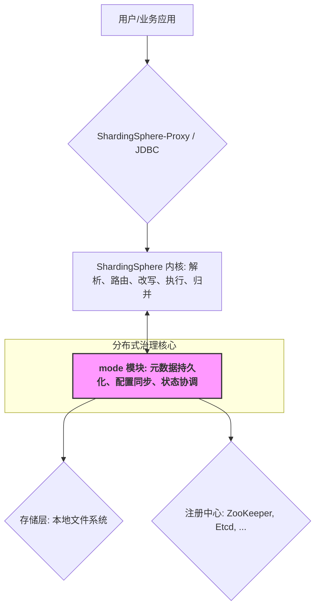
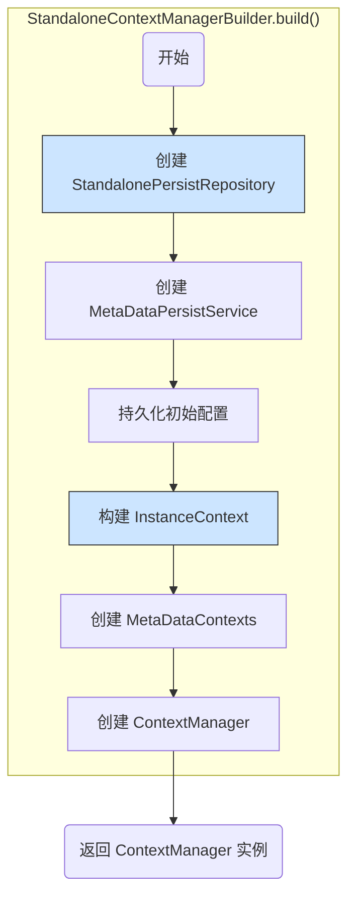
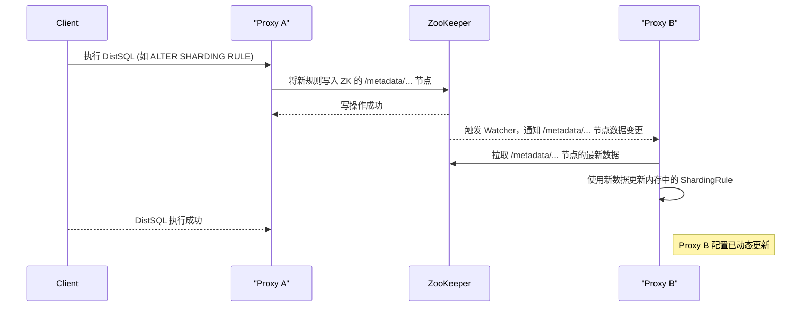
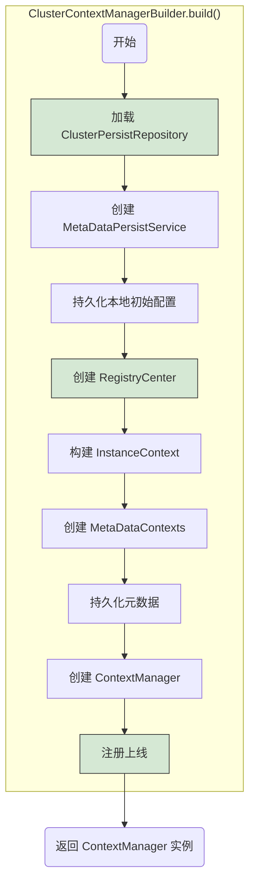
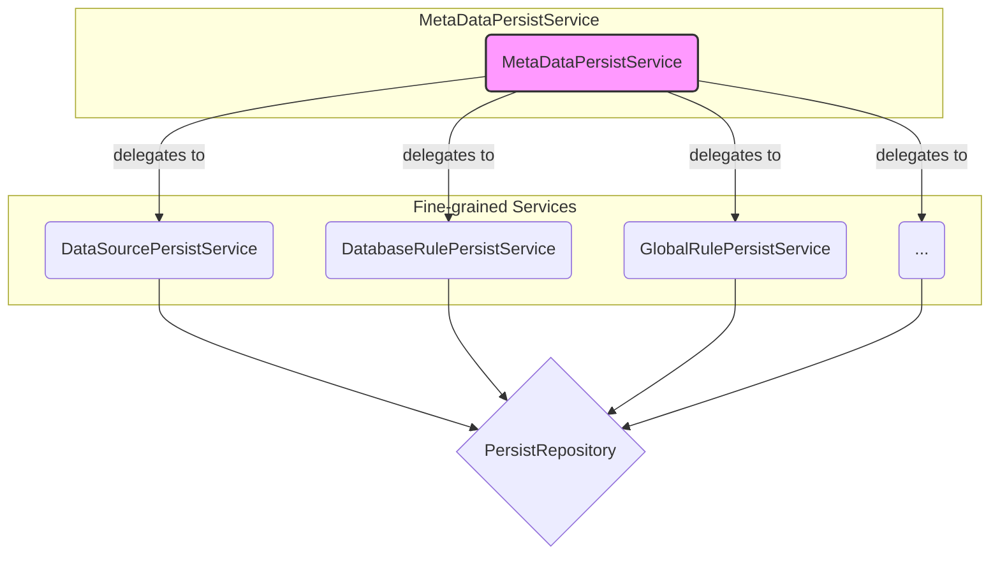
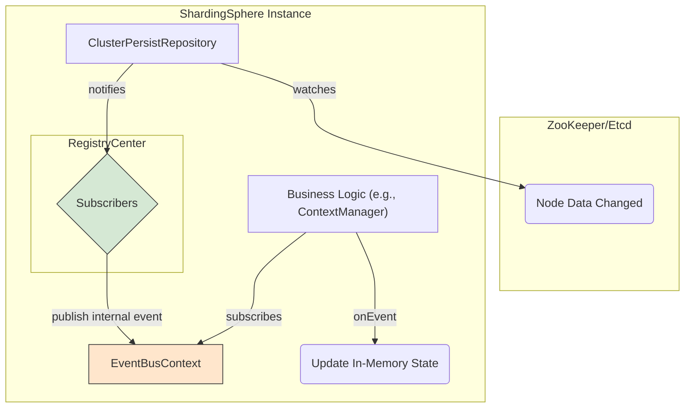
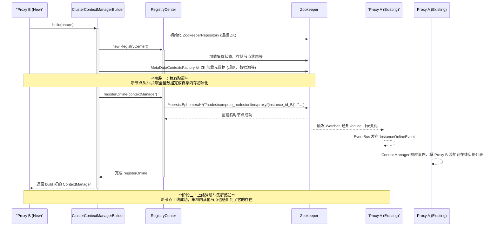
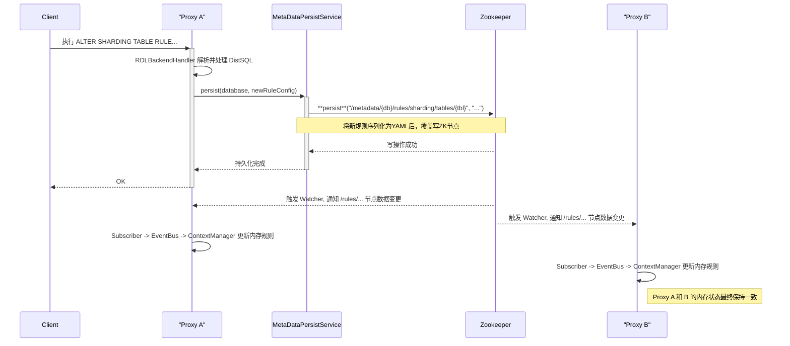

# ShardingSphere `mode` 模块深度解析：从单机到集群的分布式治理核心

## 第一部分：`mode` 模块概览 (What & Why)

### 1.1 `mode` 的核心定位

在深入 ShardingSphere 源码之前，理解 `mode` 模块的定位至关重要。它并非业务功能模块（如分片、加密），而是 ShardingSphere 的**分布式治理与协调中心**，是连接其强大内核与复杂分布式环境的桥梁。

从架构上看，`mode` 模块位于 ShardingSphere 架构的核心上方，它消费内核提供的元数据和配置信息，并通过底层的存储（本地文件或注册中心）进行持久化和同步。



`mode` 模块的核心职责可以概括为三点：

1.  **元数据存储 (Metadata Persistence)**: ShardingSphere 的运行依赖于大量的元数据，包括数据源信息、分片规则、加密规则等。`mode` 模块负责将这些内存中的对象持久化，确保实例重启或集群扩展时信息不丢失。
2.  **配置同步 (Configuration Synchronization)**: 在集群环境下，保证所有 ShardingSphere 节点（例如多个 Proxy 实例）的配置完全一致是至关重要的。`mode` 模块通过注册中心实现了配置的集中管理和动态同步，任何一个节点修改了配置，其他所有节点都能实时感知并更新。
3.  **状态协调 (State Coordination)**: 分布式环境下，除了静态配置，还需要管理动态的状态信息。例如，某个数据库实例因故障需要被临时禁用（熔断），或者某个 Proxy 实例下线。`mode` 模块负责协调这些状态，确保整个集群的稳定性和高可用。

为了满足不同场景的需求，ShardingSphere 抽象出了两种核心运行模式：

*   **`Standalone` (单机模式)**: 配置和状态仅存于本地。适用于开发、测试和功能验证，简单快捷。
*   **`Cluster` (集群模式)**: 依赖于一个独立的注册中心（如 ZooKeeper、Etcd）来存储和同步配置与状态。适用于生产环境，提供高可用和动态扩展能力。

### 1.2 核心概念与术语

在深入源码之前，先熟悉几个 `mode` 模块中的核心术语：

*   **元数据 (Metadata)**: 指 ShardingSphere 运行所需的核心配置信息，例如 `DataSourceConfiguration`、`ShardingRuleConfiguration` 等。它们是 `mode` 模块管理和持久化的主要对象。
*   **持久化 (Persist)**: 将内存中的元数据对象写入到指定的存储介质中。在单机模式下，可能是写入本地文件；在集群模式下，则是写入 ZooKeeper、Etcd 等注册中心。
*   **治理仓库 (Governance Repository)**: 这是对底层注册中心操作的统一封装。ShardingSphere 通过定义 `GovernanceRepository` 接口，将上层业务逻辑与具体的注册中心实现（如 `ZookeeperRepository`）解耦，使得接入新的注册中心变得非常容易。这是 SPI (Service Provider Interface) 设计思想的典型体现。
*   **订阅/监听 (Subscribe/Watch)**: 这是集群模式实现配置同步的关键机制。每个 ShardingSphere 节点都会 "订阅" 或 "监听" 注册中心上特定路径（Key）的变化。当某个节点修改了配置（即更新了某个 Key 的 Value），注册中心会通知所有订阅了该 Key 的节点，这些节点随即拉取最新数据并刷新自己的内存状态。

理解了以上概念和 `mode` 模块的定位后，我们将带着这些知识，开始深入不同模式的源码实现。

---

## 第二部分：单机模式 (Standalone) 源码分析

单机模式是 ShardingSphere 的默认运行模式，其特点是配置存储在本地，不依赖任何外部组件，非常适合用于开发、测试和快速原型验证。

### 2.1 启动流程

单机模式的初始化入口是 `StandaloneContextManagerBuilder`。当 ShardingSphere 启动时，如果检测到 `mode` 类型为 `Standalone`（或未配置，默认为此模式），就会调用其 `build` 方法来创建核心的 `ContextManager`。

`build` 方法的执行流程可以概括为以下几个关键步骤：



1.  **创建 `StandalonePersistRepository`**:
    *   这是单机模式下的“持久化仓库”。从源码中可以看到，它是一个基于本地文件的实现（具体实现类通常是 `LocalStandalonePersistRepository`），用于读写 ShardingSphere 的配置信息。
2.  **创建 `MetaDataPersistService`**:
    *   这是一个非常核心的服务，它封装了对 `PersistRepository` 的操作。`MetaDataPersistService` 定义了需要持久化的**内容**（如数据源、规则、Props等），而 `PersistRepository` 则负责具体的**存储行为**。这种设计将“什么需要存”和“如何存”进行了解耦。
3.  **持久化初始配置 (persistConfigurations)**:
    *   如果启动时提供了初始配置（例如，通过 `server.yaml`），`MetaDataPersistService` 会将这些配置写入到 `StandalonePersistRepository` 指定的存储位置（即本地文件）。
4.  **构建 `InstanceContext`**:
    *   `InstanceContext` 保存了实例运行时的上下文信息。**在这里，一个新的 `StandaloneModeContextManager` 实例被创建**，并与其他上下文信息（如实例元数据、Worker ID 生成器等）一同封装进 `InstanceContext`。
5.  **创建 `MetaDataContexts`**:
    *   `MetaDataContexts` 是 ShardingSphere 内核中元数据的总上下文，它持有所有数据库（`ShardingSphereDatabase`）的元数据信息。`MetaDataContextsFactory` 会从 `MetaDataPersistService` 中加载持久化的配置来构建它。
6.  **创建并返回 `ContextManager`**:
    *   最后，将 `MetaDataContexts` 和 `InstanceContext` 组装成最终的 `ContextManager`。这个对象是 ShardingSphere 运行时的核心协调者，后续的所有操作都将围绕它进行。

### 2.2 配置的存储与加载

从启动流程可以看出，单机模式的核心是 `StandalonePersistRepository`。它的默认实现 `LocalStandalonePersistRepository` 将所有配置信息以 YAML 的格式存储在本地文件系统中。

通常，这个存储路径位于用户主目录下的 `.shardingsphere` 文件夹内。这种设计使得配置能够在 ShardingSphere 实例重启后依然存在。

虽然名为“持久化”，但在单机模式下，配置的更新通常是**一次性的**。即启动时加载 `server.yaml` 等配置文件，写入到本地持久化目录，然后由 `MetaDataContextsFactory` 加载到内存。后续如果通过 API 或其他方式修改了配置，这些变更会刷新内存中的 `ContextManager`，但**不会反向写入 `server.yaml`**。

### 2.3 单机模式总结

*   **优点**:
    *   **零依赖**: 无需 ZooKeeper、Etcd 等外部组件，部署简单。
    *   **启动快速**: 省去了网络通信和集群协调的开销。
    *   **便于调试**: 逻辑清晰，问题排查方便。
*   **缺点**:
    *   **单点故障 (SPOF)**: 实例宕机将导致服务不可用。
    *   **配置管理不便**: 配置存储于本地，无法在多个实例间共享和动态同步。

单机模式为 ShardingSphere 的入门和功能测试提供了极大的便利。但要在生产环境获得高可用性和可扩展性，就必须深入理解其核心——集群模式。

---

## 第三部分：集群模式 (Cluster) 源码分析

集群模式是 ShardingSphere 面向生产环境设计的核心模式。它通过引入第三方注册中心（如 ZooKeeper, Etcd）作为统一的元数据和状态存储，解决了单机模式的单点问题，实现了配置的集中管理、动态更新和集群的高可用。

### 3.1 核心设计理念：`持久化` 与 `订阅`

要理解集群模式，必须首先掌握其背后的核心设计思想：**基于注册中心的“持久化-订阅”模型**。

这套机制是所有分布式协调功能的基础，其工作流程如下：

1.  **持久化 (Persist)**: 当集群中的任意一个 ShardingSphere 实例（如 Proxy）接收到配置变更请求时（例如，通过 DistSQL），它不会直接修改自己的内存对象。相反，它会将变更后的完整配置信息，按照预先定义好的数据结构，写入到注册中心（如 ZooKeeper）的特定节点（Key）上。
2.  **订阅 (Subscribe/Watch)**: 集群中所有的 ShardingSphere 实例在启动时，都会向注册中心“订阅”或“监听”它们关心的配置节点。
3.  **通知与更新 (Notify & Update)**: 一旦注册中心上的某个节点数据发生变化，注册中心会立即主动通知所有订阅了该节点的 ShardingSphere 实例。实例收到通知后，会从注册中心拉取最新的数据，并用这些新数据来更新自己内存中的配置对象。

这个流程可以用下图清晰地表示：



通过这套机制，ShardingSphere 将配置的一致性问题委托给了高可用的注册中心来保证，从而实现了自身计算节点的无状态化和可水平扩展性。

### 3.2 启动与初始化

集群模式的启动入口是 `ClusterContextManagerBuilder`，其 `build` 方法的复杂性远高于单机模式，因为它需要完成与注册中心的连接、数据的加载、状态的注册和事件的订阅等一系列初始化工作。

其核心流程如下：



与单机模式相比，集群模式的启动流程有几个显著的不同点：

1.  **加载 `ClusterPersistRepository`**:
    *   这是与注册中心交互的直接实现。ShardingSphere 使用了 **SPI (Service Provider Interface)** 机制来加载具体的实现。它会根据配置文件中 `mode.repository.type` 的值（如 `ZooKeeper`, `Etcd`）去寻找并实例化对应的 `ClusterPersistRepository` 服务。这种设计使得 ShardingSphere 可以非常方便地支持新的注册中心，具有极佳的**可扩展性**。
2.  **创建 `RegistryCenter`**:
    *   `RegistryCenter` 是集群模式下非常核心的协调器。它封装了 `ClusterPersistRepository`，并提供了更上层的 API，如节点状态管理（`ComputeNodeStatusService`）、存储单元状态管理（`StorageNodeStatusService`）等。它屏蔽了底层与 ZooKeeper/Etcd 直接交互的复杂细节。
3.  **构建 `InstanceContext`**:
    *   与单机模式类似，但这里创建的是 `ClusterModeContextManager`。同时，Worker ID 的生成器也换成了 `ClusterWorkerIdGenerator`，它能够通过注册中心确保整个集群中 Worker ID 的唯一性。
4.  **注册上线 (registerOnline)**:
    *   这是集群模式独有的关键步骤。在 `ContextManager` 构建完成后，当前实例需要执行一系列上线操作：
        *   **加载集群状态**: 从注册中心读取集群的当前状态（如是否已锁定等）。
        *   **注册订阅者**: 创建 `ContextManagerSubscriberFacade`，它会订阅注册中心上各类数据的变更事件。从此开始，任何来自注册中心的配置或状态变更都会被这个订阅者接收。
        *   **上线实例**: 将当前实例的信息（IP、端口、标签等）写入注册中心的 `/nodes/compute_nodes/online` 路径下，宣告自己已成为集群中的一个可用节点。

完成了这个复杂的启动流程后，当前实例就成功地融入了 ShardingSphere 集群，并具备了配置和状态的动态协调能力。接下来，我们将深入分析支撑起这一切的核心组件。

### 3.3 核心组件深入解析

集群模式的实现依赖于多个核心组件的协同工作。理解这些组件的职责和交互方式，是彻底掌握 `mode` 模块的关键。

#### 3.3.1 `ClusterPersistRepository`: 读写注册中心的统一 API

`ClusterPersistRepository` 是 ShardingSphere 对所有支持的注册中心（ZooKeeper, Etcd 等）进行操作的**统一抽象接口**。它位于整个集群模式架构的最底层，直接负责与注册中心进行网络通信和数据读写。

**1. 接口设计**

该接口定义了上层业务所需的所有原子操作，有效地将 ShardingSphere 的治理逻辑与具体的注册中心实现解耦。

*   **路径**: `mode/type/cluster/repository/api/src/main/java/org/apache/shardingsphere/mode/repository/cluster/ClusterPersistRepository.java`

其核心方法包括：

*   `void init(...)`: 初始化客户端，建立与注册中心的连接。
*   `String getDirectly(String key)`: 根据 key 获取其 value。
*   `List<String> getChildrenKeys(String key)`: 获取某个 key 下的所有子节点的名称。
*   `void persist(String key, String value)`: 持久化一个 KV 对（永久节点）。
*   `void persistEphemeral(String key, String value)`: 持久化一个 KV 对（临时节点）。当客户端会话结束后，该数据会自动删除。这是实现实例在线状态上报的核心。
*   `void watch(String key, DataChangedEventListener listener)`: **监听**一个 key。当该 key 的数据或其子节点发生变化时，会通过 `listener` 进行回调。这是实现配置动态同步的基石。
*   `void delete(String key)`: 删除一个 key。

**2. ZooKeeper 实现分析 (`ZookeeperRepository`)**

为了具体理解接口是如何工作的，我们以其默认的 ZooKeeper 实现 `ZookeeperRepository` 为例进行分析。

*   **路径**: `mode/type/cluster/repository/provider/zookeeper/src/main/java/org/apache/shardingsphere/mode/repository/cluster/zookeeper/ZookeeperRepository.java`

`ZookeeperRepository` 内部封装了 Netflix Curator 客户端，并将 `ClusterPersistRepository` 接口的方法调用，逐一翻译为对 Curator API 的调用。

*   **`persist` vs `persistEphemeral`**:
    *   `persist()` 方法在内部调用 `client.create().withMode(CreateMode.PERSISTENT)` 来创建 ZK 的**永久节点**。
    *   `persistEphemeral()` 方法则调用 `client.create().withMode(CreateMode.EPHEMERAL)` 来创建**临时节点**。ShardingSphere 正是利用这个特性来管理 Proxy 的在线实例列表。当一个 Proxy 实例正常启动，它会在 `/nodes/compute_nodes/online/{instance_id}` 下创建一个临时节点；如果 Proxy 异常宕机或与 ZK 断开连接，这个临时节点会自动消失，从而让集群中的其他节点感知到它的下线。

*   **`watch` 机制的实现**:
    `watch` 方法是整个动态同步功能的核心，其内部实现高度依赖 Curator 提供的 `CuratorCache` (旧版 Curator 中为 `TreeCache`)。

    ```java
    // ZookeeperRepository.java L:247 (simplified for clarity)
    public void watch(final String key, final DataChangedEventListener listener) {
        CuratorCache cache = caches.computeIfAbsent(key, k -> CuratorCache.build(client, k));
        CuratorCacheListener curatorListener = CuratorCacheListener.builder()
            .forTreeCache(client, (framework, event) -> {
                // 1. 将 Curator 的事件类型转换为 ShardingSphere 的事件类型
                Type changedType = getChangedType(event.getType());
                if (Type.IGNORED != changedType) {
                    // 2. 构造 DataChangedEvent
                    DataChangedEvent dataChangedEvent = new DataChangedEvent(
                        event.getData().getPath(),
                        new String(event.getData().getData()),
                        changedType);
                    // 3. 调用上层传入的 listener，完成通知
                    listener.onChange(dataChangedEvent);
                }
            }).build();
        cache.listenable().addListener(curatorListener);
        cache.start();
    }
    ```
    上述代码清晰地展示了 ShardingSphere 如何将底层的 ZK 事件，适配并桥接到自己上层的事件监听体系中。`ZookeeperRepository` 作为“适配器”，成功地屏蔽了底层注册中心客户端的复杂性。

#### 3.3.2 `MetaDataPersistService`: 元数据内容的定义与管理

如果说 `ClusterPersistRepository` 解决了**“如何存”**的问题，那么 `MetaDataPersistService` 则定义了**“存什么”**。它是一个门面 (Facade) 服务，负责对 ShardingSphere 的各类元数据进行分类管理和持久化。

*   **路径**: `mode/core/src/main/java/org/apache/shardingsphere/mode/metadata/persist/MetaDataPersistService.java`

`MetaDataPersistService` 本身不包含复杂的逻辑，它的核心作用是**聚合**。它将不同类型的元数据持久化工作，委托给了一系列更具体的子服务：

*   `DataSourcePersistService`: 负责数据源配置的持久化。
*   `DatabaseRulePersistService`: 负责数据库级规则（如分片规则、加密规则）的持久化。
*   `GlobalRulePersistService`: 负责全局规则（如 SQL 解析器规则、权限规则）的持久化。
*   `PropertiesPersistService`: 负责全局属性的持久化。
*   `DatabaseMetaDataPersistService`: 负责数据库和表的物理元数据（Schema, Table, Column）的持久化。

这种设计遵循了**单一职责原则**，使得每类元数据的管理逻辑都内聚在自己的服务中。例如，当需要修改分片规则时，上层调用者只需要与 `DatabaseRulePersistService` 交互，而无需关心数据是如何被序列化，以及存储在注册中心的哪个具体路径下。


所有的子服务都共享同一个 `PersistRepository` 实例，确保所有元数据最终都通过同一个通道写入注册中心。

#### 3.3.3 `RegistryCenter`: 分布式状态协调与事件发布

`RegistryCenter` 是 `mode` 模块中**承上启下的协调核心**。它封装了底层的 `ClusterPersistRepository`，但它提供的不再是简单的 KV 操作，而是具有明确业务含义的**领域服务**和**事件发布**机制。

*   **路径**: `mode/type/cluster/core/src/main/java/org/apache/shardingsphere/mode/manager/cluster/coordinator/RegistryCenter.java`

**1. 领域服务封装**

`RegistryCenter` 将对注册中心中不同路径节点的读写，封装成了对不同领域状态的管理服务：

*   `ComputeNodeStatusService`: 管理计算节点（Proxy/JDBC 实例）的状态，例如上线、下线、状态更新（如忙碌、空闲）、标签管理等。所有操作都围绕 ZK 的 `/nodes/compute_nodes` 路径进行。
*   `StorageNodeStatusService`: 管理存储节点（物理数据源）的状态，如启用、禁用（熔断）。所有操作都围绕 ZK 的 `/nodes/storage_nodes` 路径进行。
*   `ClusterStatusService`: 管理整个集群的状态，如集群是否被锁定。

**2. 事件驱动核心**

`RegistryCenter` 最核心的职责是将底层的**数据变更事件**，转化为 ShardingSphere 内部的**领域事件**。

这个过程在 `RegistryCenter` 的构造函数和 `onlineInstance` 方法中完成：

1.  **创建订阅者 (Subscribers)**: `RegistryCenter` 在初始化时，会创建一系列的订阅者，例如 `ComputeNodeStatusSubscriber`、`ClusterStatusSubscriber` 等。
2.  **注册监听**: 每个订阅者都会通过 `repository.watch()` 监听其关心的 ZK 路径。例如，`ComputeNodeStatusSubscriber` 会监听 `/nodes/compute_nodes` 的变化。
3.  **发布事件**: 当 ZK 路径发生变化时（例如，一个 Proxy 实例宕机，其在 `/nodes/compute_nodes/online` 下的临时节点被删除），`repository` 的 `watch` 机制会通知到对应的订阅者。
4.  **内部事件总线**: 订阅者接收到通知后，并不会直接执行业务逻辑，而是将这个原始的数据变更事件，封装成一个 ShardingSphere 内部的领域事件（例如 `InstanceOfflineEvent`），然后通过 `EventBusContext` (基于 Google Guava EventBus) 发布出去。
5.  **业务逻辑响应**: ShardingSphere 的其他模块（如 `ContextManager`）中，会有对应的类（`@Subscribe` 注解的方法）来订阅这些领域事件。当收到 `InstanceOfflineEvent` 时，`ContextManager` 就会执行具体的业务逻辑，例如从内存的在线实例列表中移除该实例。

这个**`ZK Watch -> Subscriber -> EventBus -> Business Handler`** 的链条，构成了 ShardingSphere 集群模式下所有分布式协调功能的基础。它是一种典型的**响应式编程**和**事件驱动**的架构，具有出色的解耦和扩展性。

#### 3.3.4 数据在注册中心的结构 (`ModeNode`)

前面我们分析了各个服务是如何工作的，但还有一个关键问题：这些元数据、状态、规则究竟是**如何**在 ZooKeeper/Etcd 这种 Key-Value 型存储中组织的？

答案就在 `mode/core/src/main/java/org/apache/shardingsphere/mode/metadata/persist/node/` 这个包下的各个 `*Node` 类中。这些类通过一系列静态方法，定义了各类数据在注册中心中的**层级路径 (Key)**。

这种设计将 ZK/Etcd 模拟成了一个具有层级结构的文件系统，所有的数据都根据其领域和归属，存放在预先定义好的路径下。

以 `ComputeNode.java` 和 `DatabaseMetaDataNode.java` (简化) 为例，我们可以窥见其核心结构：

```
/
└── nodes
    ├── compute_nodes
    │   ├── online
    │   │   ├── proxy
    │   │   │   └── {instance_id_1} (EPHEMERAL)
    │   │   │   └── {instance_id_2} (EPHEMERAL)
    │   │   └── jdbc
    │   │       └── {instance_id_3} (EPHEMERAL)
    │   ├── status
    │   │   └── {instance_id_1}
    │   ├── labels
    │   │   └── {instance_id_1}
    │   └── worker_id
    │       └── {instance_id_1}
    └── storage_nodes
        └── {database_name}.{group_name}.{data_source_name}
└── metadata
    └── {database_name}
        ├── data_sources
        │   └── {data_source_name}
        ├── rules
        │   ├── sharding
        │   │   ├── tables
        │   │   │   └── {table_name}
        │   │   └── auto_tables
        │   │       └── {auto_table_name}
        │   └── readwrite_splitting
        │       └── ...
        └── schemas
            └── {schema_name}
                └── tables
                    └── {table_name}
└── rules
    └── global
        ├── sql_parser
        └── ...
```

*   **`/nodes`**: 存放所有与“状态”相关的数据，是动态变化的。
    *   `compute_nodes`: 存放 ShardingSphere 实例本身的状态。`online` 子目录下的**临时节点**是实现服务注册与发现的关键。
    *   `storage_nodes`: 存放底层物理数据源的状态，用于实现熔断等功能。
*   **`/metadata`**: 存放数据库相关的元数据，主要是用户配置的各种规则。
*   **`/rules/global`**: 存放全局规则。

通过这种 **“按路径分类”** 的方式，ShardingSphere 将复杂的配置和状态信息，结构化、清晰地映射到了 KV 存储中，为上层服务提供了方便的访问模型。当一个服务需要操作某类数据时，它会先通过这些 `*Node` 类获取到正确的操作路径，然后再调用 `ClusterPersistRepository` 进行读写。

### 3.4 事件驱动的架构

综合前面几节的分析，我们可以清晰地勾勒出 ShardingSphere 集群模式的事件驱动脉络。这个脉络是理解所有动态协调行为的关键。



**一个事件的完整生命周期如下：**

1.  **外部触发**: 用户的 DistSQL 操作，或者某个 Proxy 实例的宕机，导致 ZooKeeper 中某个节点的数据发生 **创建、更新或删除**。
2.  **底层感知 (`ClusterPersistRepository`)**: `watch` 机制感知到 ZK 节点的变化，并将这个底层事件（如 `NODE_REMOVED`）封装成一个统一的 `DataChangedEvent`。
3.  **事件发布 (`RegistryCenter`)**: `RegistryCenter` 中对应的 `Subscriber`（如 `ComputeNodeStatusSubscriber`）接收到 `DataChangedEvent`。它会解析事件中的路径和数据，将其转化为一个具有明确业务含义的**领域事件**（如 `InstanceOfflineEvent`），并通过内部的 `EventBusContext` 发布出去。
4.  **业务响应 (`ContextManager`, etc.)**: ShardingSphere 内核中订阅了该领域事件的模块（通常是在 `ContextManager` 内部），其 `@Subscribe` 注解的方法会被调用。
5.  **内存状态更新**: 业务模块在响应方法中执行最终的业务逻辑，例如从内存的在线实例列表中移除已下线的实例，或者更新内存中的分片规则对象。

至此，一次从“分布式持久化存储”到“各个节点内存状态”的完整同步流程就完成了。这个高度解耦、异步化的事件驱动架构，是 ShardingSphere 集群模式能够实现高可用和高扩展性的核心基石。

---

## 第四部分：场景串联分析 (How It Works)

理论知识最终需要通过实际场景来检验。在这一部分，我们将通过几个典型的业务场景，将前面分析的组件和流程串联起来，看看它们是如何协同工作以完成分布式协调的。

### 4.1 场景一：Proxy 节点上线

这是一个最基础也最重要的场景。当我们在集群中启动一个新的 ShardingSphere-Proxy 实例时，它需要完成一系列动作来融入现有集群。

**目标**:
1.  从注册中心拉取最新的全量配置，完成自身初始化。
2.  向集群宣告自己的存在，让其他节点能够感知到它。

**调用链路分析**:



**详细步骤分解**:

1.  **初始化与拉取配置 (对应 `build` 方法的前半部分)**
    *   **连接注册中心**: Proxy B 启动，`ClusterContextManagerBuilder` 首先通过 SPI 机制实例化 `ZookeeperRepository`，并建立与 ZooKeeper 的连接。
    *   **创建协调器**: `RegistryCenter` 被创建，它会立即从 ZK 加载一些集群范围的状态信息，例如存储节点（数据源）的状态。
    *   **加载元数据**: `MetaDataContextsFactory` 通过 `MetaDataPersistService` 从 ZK 的 `/metadata` 路径下，**递归地、全量地**拉取所有数据库的配置，包括数据源、所有分片规则、加密规则等，并在 Proxy B 的内存中构建出完整的 `MetaDataContexts`。

2.  **上线注册 (对应 `build` 方法的 `registerOnline` 调用)**
    *   **注册订阅者**: 在正式上线前，Proxy B 会在 `RegistryCenter` 内部注册一系列的 Watcher，开始监听 ZK 中它所关心的路径。这样，它就能从此刻开始接收集群中的任何变化。
    *   **创建临时节点**: 最关键的一步。`RegistryCenter` 调用 `ComputeNodeStatusService`，后者通过 `repository.persistEphemeral()` 方法，在 ZK 的 `/nodes/compute_nodes/online/proxy/{instance_id_B}` 路径下创建一个**临时节点**。节点的内容通常是该实例的元数据信息（如 IP、端口）。
    *   **持久化状态**: 同时，也会在 `/nodes/compute_nodes/status/{instance_id_B}` 等路径下写入该实例的初始状态。

3.  **集群感知**
    *   由于集群中所有其他在线的 Proxy（例如 Proxy A）都在 `watch` 着 `/nodes/compute_nodes/online/proxy` 这个父路径，当 ZK 在该路径下成功创建一个新的子节点 (`{instance_id_B}`) 后，会立刻通知 Proxy A。
    *   Proxy A 的 `ComputeNodeStatusSubscriber` 收到这个 `NODE_ADDED` 事件，随即发布一个 ShardingSphere 内部的 `InstanceOnlineEvent`。
    *   Proxy A 的 `ContextManager` 监听到这个事件，就会将 Proxy B 的信息添加到一个内存的在线实例列表中。

至此，新节点 Proxy B 不仅成功地用集群的最新配置初始化了自己，也成功地让集群中的其他成员认识了自己，整个上线过程无缝完成。

### 4.2 场景二：动态修改分片规则 (DistSQL)

在 ShardingSphere 集群中，我们经常需要在不停机的情况下，在线变更某些配置，例如修改一个分片表的算法。这是通过 DistSQL (分布式 SQL) 实现的。

**目标**:
1.  客户端向任意一个 Proxy 实例发送 `ALTER SHARDING TABLE RULE` 语句。
2.  该规则的变更最终同步到集群中的**所有** Proxy 实例，并生效。

**调用链路分析**:



**详细步骤分解**:

1.  **接收与处理 (Proxy A)**
    *   Proxy A 的前端模块接收到客户端发来的 `ALTER SHARDING TABLE RULE...` DistSQL 语句。
    *   DistSQL 被路由到 `RuleDefinitionBackendHandler` (或类似的 RDL 后端处理器)。
    *   该处理器会加载当前已有的规则，根据 `ALTER` 语句的意图，在内存中计算出**变更后的全量规则配置对象**。

2.  **持久化 (Proxy A -> MetaDataPersistService -> Zookeeper)**
    *   `RDLBackendHandler` 调用 `MetaDataPersistService` (通过 `ContextManager`) 来持久化这个**新的**规则配置对象。
    *   `MetaDataPersistService` 将请求委托给 `DatabaseRulePersistService`。
    *   `DatabaseRulePersistService` 使用 `DatabaseMetaDataNode` 工具类来生成该分片规则在 ZK 中对应的**精确路径**，例如 `/metadata/my_db/rules/sharding/tables/t_order`。
    *   服务将新的 `ShardingTableRuleConfiguration` 对象**序列化成 YAML 字符串**。
    *   最终，通过 `repository.persist()` 方法，将这个 YAML 字符串**覆盖写入 (UPDATE)** 到 ZK 的目标路径上。

3.  **通知与更新 (Zookeeper -> All Proxies)**
    *   当 ZK 上的 `/metadata/.../t_order` 节点的数据被成功覆盖后，ZK 会立刻通知所有 `watch` 了这个节点的客户端。
    *   由于集群中**所有的 Proxy 实例** (包括 Proxy A 和 Proxy B) 在启动时，都通过 `ShardingRuleChangedSubscriber` (这是一个假设的、具体的订阅者) 监听了规则相关的路径，因此它们都会收到此变更通知。
    *   `ShardingRuleChangedSubscriber` 接收到 `DataChangedEvent` (事件类型为 `UPDATED`)，它解析出事件中的 YAML 字符串，并将其**反序列化**为 `ShardingTableRuleConfiguration` 对象。
    *   订阅者发布一个内部的 `RuleConfigurationsChangedEvent` 事件，并将新的规则对象作为载荷。
    *   所有 Proxy 实例的 `ContextManager` 都会响应这个内部事件，用新的规则对象替换掉内存中旧的规则对象。

至此，一次规则的动态变更就完成了。整个过程是**原子性**的 (对 ZK 的写操作是原子的) 和**最终一致性**的 (所有节点最终都会更新到最新版本)。这个机制确保了集群在运行时变更配置的可靠性和一致性。

---

## 第五部分：扩展与总结

经过前面四个部分的深入分析，我们不仅理解了 `mode` 模块的实现细节，更重要的是，能够体会其背后优秀的设计思想。

### 5.1 如何实现一个新的 `ClusterPersistRepository`

ShardingSphere 的 `mode` 模块具有优秀的可扩展性，其核心就体现在 `ClusterPersistRepository` 的 SPI (Service Provider Interface) 设计上。如果我们希望 ShardingSphere 支持一种新的注册中心，例如 Nacos 或 Consul，我们只需要遵循 SPI 规范实现一个新的 `ClusterPersistRepository` 即可。

步骤如下：

1.  **创建 Maven 模块**: 新建一个 Maven 模块，例如 `shardingsphere-mode-repository-nacos`。
2.  **实现接口**: 创建一个类，例如 `NacosRepository`，实现 `ClusterPersistRepository` 接口。
    *   在 `init()` 方法中，初始化 Nacos 客户端。
    *   在 `getDirectly()`, `persist()`, `delete()` 等方法中，调用 Nacos 客户端的相应 API。
    *   在 `watch()` 方法中，利用 Nacos 的 `ConfigService.addListener()` 来实现数据变更的监听，并在回调中构造 `DataChangedEvent`，通知上层。
3.  **创建 SPI 文件**: 在模块的 `src/main/resources/META-INF/services/` 目录下，创建一个名为 `org.apache.shardingsphere.mode.repository.cluster.ClusterPersistRepository` 的文件。
4.  **注册实现**: 在该文件中，写入你的实现类的全限定名，例如 `org.apache.shardingsphere.mode.repository.nacos.NacosRepository`。
5.  **实现 `getType()`**: 在 `NacosRepository` 中重写 `getType()` 方法，返回一个唯一的类型字符串，例如 `"Nacos"`。

完成以上步骤后，用户只需要在 `server.yaml` 中将 `mode.repository.type` 配置为 `Nacos`，ShardingSphere 就会通过 `TypedSPILoader` 自动加载并实例化你的 `NacosRepository`，从而无缝地将底层注册中心切换为 Nacos。

### 5.2 `mode` 模块设计思想总结

`mode` 模块作为 ShardingSphere 的分布式治理核心，其优秀的设计思想值得我们学习和借鉴：

1.  **分层与解耦**:
    *   模块在纵向上被清晰地划分为 **API 抽象层** (`ClusterPersistRepository`)、**功能服务层** (`MetaDataPersistService`, `RegistryCenter`) 和 **SPI 实现层** (`ZookeeperRepository`)，层次分明，职责清晰。
    *   通过 `PersistRepository` 接口，成功地将上层业务逻辑与底层 KV 存储的实现细节解耦。

2.  **事件驱动架构 (EDA)**:
    *   整个集群的状态同步，都构建在一套**`外部事件 -> 内部领域事件 -> 业务响应`**的异步事件驱动模型之上。
    *   这种架构极大地降低了组件之间的直接耦合度。当需要增加一种新的协调逻辑时，往往只需要增加一种新的事件和对应的订阅者即可，而无需修改现有流程，符合**开闭原则**。

3.  **SPI 实现的可扩展性**:
    *   无论是 `ClusterPersistRepository` 还是 `StandalonePersistRepository`，都通过 SPI 机制加载，这使得 ShardingSphere 在不修改核心代码的情况下，能够方便地适配不同的存储介质和注册中心，具备极强的扩展能力和生态集成潜力。

4.  **面向领域的建模**:
    *   `RegistryCenter` 将对 ZK/Etcd 中零散路径的读写，抽象成了对 `ComputeNode`、`StorageNode` 等领域对象的状态管理服务。这种面向领域的建模方式，使得上层业务逻辑更加清晰，易于理解和维护。

通过对 `mode` 模块的学习，我们不仅掌握了 ShardingSphere 分布式能力的实现原理，更能从中汲取到构建大型分布式系统的宝贵经验。
