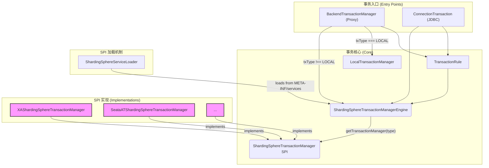
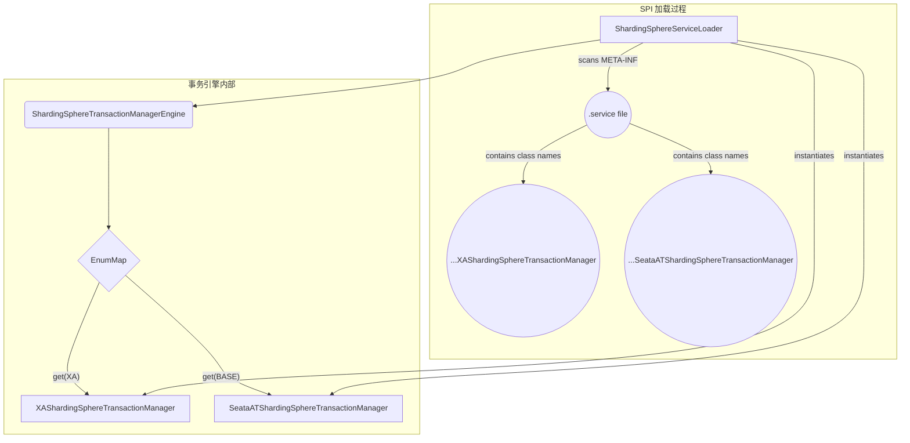
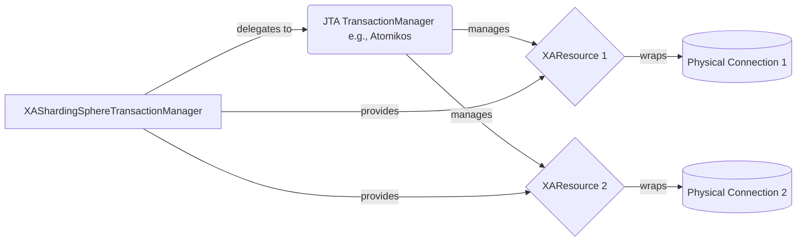
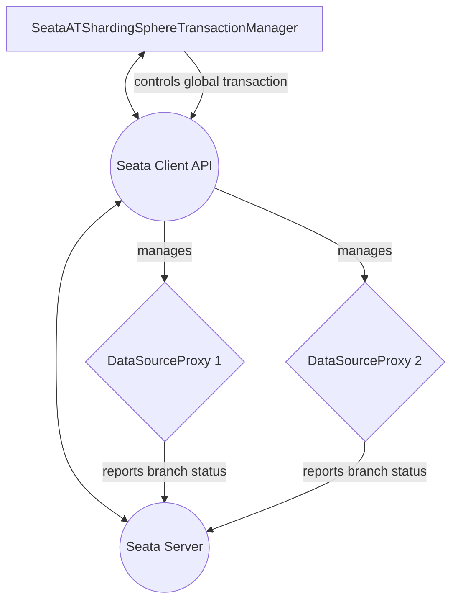
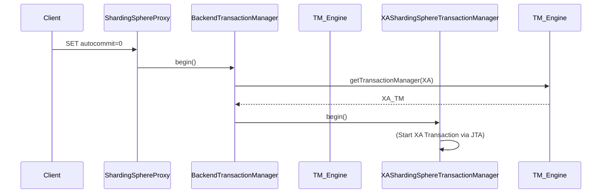
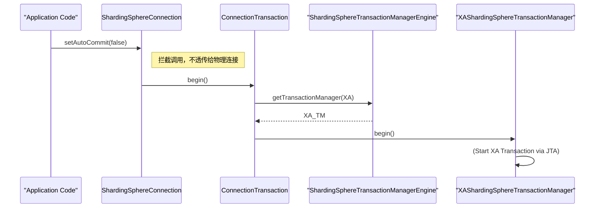
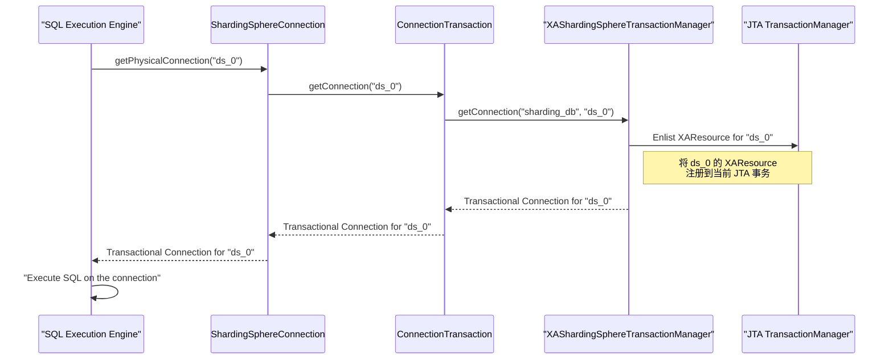

# ShardingSphere 事务管理源码学习文档

## 1. 概述

Apache ShardingSphere 旨在提供一个统一的分布式事务解决方案，它整合了本地事务、XA 分布式事务和 BASE 柔性事务，并为用户提供了统一的、透明的事务管理接口。

ShardingSphere 支持三种事务类型：

*   **LOCAL**: 基于数据库原生的事务实现，性能高，但无法保证跨库数据的一致性。
*   **XA**: 基于 X/Open DTP 模型的两阶段提交协议，保证数据的强一致性，但性能开销较大。
*   **BASE**: 实现了“基本可用、柔性状态、最终一致性”的柔性事务，性能较好，适用于高并发场景 (通过集成 Seata 实现)。

## 2. 核心架构

ShardingSphere 的事务管理模块设计精良，通过 SPI 机制实现了高度的可扩展性。其核心组件之间的关系如下图所示：

*   **事务入口**:
    *   `BackendTransactionManager`: ShardingSphere-Proxy 的事务协调器。
    *   `ConnectionTransaction`: ShardingSphere-JDBC 的事务协调器。

*   **事务核心**:
    *   `TransactionRule`: 作为全局规则，持有 `ShardingSphereTransactionManagerEngine` 的实例，是事务入口获取引擎的桥梁。
    *   `ShardingSphereTransactionManagerEngine`: 事务引擎，负责加载、管理和分发不同类型的事务管理器。
    *   `ShardingSphereTransactionManager` SPI: 定义了分布式事务管理器的标准接口 (`begin`, `commit`, `rollback` 等)。
    *   `LocalTransactionManager`: 专门处理 `LOCAL` 事务，直接操作 JDBC Connection。

*   **SPI 实现**:
    *   `XAShardingSphereTransactionManager`: XA 事务的具体实现。
    *   `SeataATShardingSphereTransactionManager`: BASE (Seata) 事务的具体实现。

*   **调用流程**:
    *   无论是 Proxy 还是 JDBC，事务的发起首先会经过 `TransactionRule` 获取到 `ShardingSphereTransactionManagerEngine`。
    *   `BackendTransactionManager` (Proxy) 会判断事务类型：
        *   如果是 `LOCAL`，则直接使用 `LocalTransactionManager` 进行处理。
        *   如果是 `XA` 或 `BASE`，则通过 `ShardingSphereTransactionManagerEngine` 获取对应的 SPI 实现进行处理。
    *   `ConnectionTransaction` (JDBC) 的逻辑类似，也会通过引擎获取 SPI 实现。
    *   `ShardingSphereTransactionManagerEngine` 在启动时，会通过 `ShardingSphereServiceLoader` 扫描 `META-INF/services` 路径，动态加载所有 `ShardingSphereTransactionManager` 接口的实现类。

## 3. 源码深度分析

本章节将深入剖析事务管理模块的核心组件，并通过图例详细阐述其内部工作机制。

### 3.1. `ShardingSphereTransactionManagerEngine`：事务引擎

`ShardingSphereTransactionManagerEngine` 是整个事务模块的“调度中心”。它的核心职责是**加载**、**存储**并**分发**不同类型的分布式事务管理器。

#### 内部机制

该引擎在系统初始化时，利用 Java 的 SPI (Service Provider Interface) 机制，通过 `ShardingSphereServiceLoader` 扫描 classpath 下所有 `META-INF/services/org.apache.shardingsphere.transaction.spi.ShardingSphereTransactionManager` 文件，动态加载其中定义的实现类。

加载后的实例被存储在一个 `EnumMap<TransactionType, ShardingSphereTransactionManager>` 中，以事务类型（`XA`, `BASE`）作为 Key。当上层（如 `BackendTransactionManager`）请求特定类型的事务管理器时，引擎便能高效地从 Map 中查找并返回。

### 3.2. `ShardingSphereTransactionManager`：统一事务接口 (SPI)

此接口是 ShardingSphere 事务模块**可扩展性**的基石。它定义了一套标准的事务操作，所有具体的分布式事务方案（XA、Seata 等）都必须实现这个接口，从而对上层调用者屏蔽了底层实现的差异。

#### 核心方法详解

*   `void init(databaseTypes, dataSources, providerType)`: **初始化**。在系统启动阶段被调用，用于初始化事务管理器，例如建立与 Seata Server 的连接，或配置 XA 数据源。
*   `TransactionType getTransactionType()`: **表明身份**。返回自身的事务类型（`XA` 或 `BASE`）。
*   `boolean isInTransaction()`: **状态查询**。判断当前线程是否处于一个由该管理器发起的全局事务中。
*   `Connection getConnection(databaseName, dataSourceName)`: **获取事务性连接**。这是实现分布式事务的关键。对于 XA 事务，此方法会返回一个包裹了 `XAResource` 的连接，确保后续的 SQL 操作能被纳入 JTA 事务管理器的两阶段提交流程。
*   `void begin()`: **开启全局事务**。
*   `void commit(boolean rollbackOnly)`: **提交全局事务**。参数 `rollbackOnly` 用于处理事务已被标记为只能回滚的场景。
*   `void rollback()`: **回滚全局事务**。

### 3.3. `XAShardingSphereTransactionManager`：XA 事务适配器

该类是 XA 协议的实现，但它本身**不是**一个完整的 XA 事务管理器（Transaction Manager, TM）。它更像是一个**适配器（Adapter）**，桥接了 ShardingSphere 的事务接口与具体的 JTA/XA 实现（如 Atomikos、Narayana）。

#### 工作模式

1.  **资源注册**: 在 `init` 阶段，它会接收 ShardingSphere 管理的所有物理数据源 (`DataSource`)。
2.  **XA 资源转换**: 它会通过底层的 XA 事务管理器（如 `AtomikosTransactionManager`）将这些普通数据源包装成 `XADataSource`，并从中获取 `XAConnection` 和 `XAResource`。
3.  **事务委托**: 当 `begin`, `commit`, `rollback` 被调用时，它会将这些操作委托给底层的 JTA `TransactionManager` 来执行标准的 XA 两阶段提交流程。`TransactionManager` 会协调所有注册到当前线程的 `XAResource`，完成原子性的提交或回滚。

### 3.4. `SeataATShardingSphereTransactionManager`：Seata 事务适配器

与 `XAShardingSphereTransactionManager` 类似，该类也是一个**适配器**，它将 ShardingSphere 的事务管理需求转换为对 Seata 客户端 API 的调用。

#### 工作模式

1.  **初始化**: 在 `init` 阶段，它会初始化 Seata 的 `GlobalTransactionScanner` 和 `ResourceManager`，并与 Seata Server 建立连接。
2.  **全局事务管理**: 当 `begin` 被调用时，它会通过 Seata 的 `GlobalTransactionContext` 开启一个新的全局事务或加入一个已存在的全局事务，并向 Seata Server 注册。
3.  **分支事务**: 当 `getConnection` 被调用时，它会返回一个由 Seata `DataSourceProxy` 代理的数据源连接。这个代理连接会自动向 Seata Server 注册分支事务，并记录 undo_log。
4.  **决议**: 当 `commit` 或 `rollback` 被调用时，它会通知 Seata Server 对该全局事务进行提交或回滚决议。Seata Server 会根据全局事务的状态，异步通知所有分支事务的资源方执行第二阶段的提交或基于 undo_log 的补偿回滚。

## 4. 流程追踪

本节将分别追踪 ShardingSphere-Proxy 和 ShardingSphere-JDBC 两个入口在处理分布式事务时的内部调用流程。

### 4.1. ShardingSphere-Proxy 流程

以 Proxy 处理 XA 事务的 `begin` 请求为例，其处理流程如下：

1.  **客户端请求**: 用户通过 MySQL 客户端等工具向 Proxy 发送 `SET autocommit=0` 或 `BEGIN` 命令，意图开启一个事务。
2.  **Proxy 接收**: ShardingSphere-Proxy 接收到命令后，会将其委托给 `BackendTransactionManager` 进行处理。
3.  **调用 `begin()`**: `BackendTransactionManager` 调用自身的 `begin()` 方法。
4.  **获取事务管理器**: 在 `begin()` 方法内部，它会通过 `TransactionRule` 持有的 `ShardingSphereTransactionManagerEngine` 实例，根据当前会话设置的事务类型（例如 `XA`）调用 `getTransactionManager(TransactionType.XA)`。
5.  **返回适配器**: 事务引擎从其内部的 Map 中返回 `XAShardingSphereTransactionManager` 的单例。
6.  **启动全局事务**: `BackendTransactionManager` 调用 `XAShardingSphereTransactionManager` 实例的 `begin()` 方法，后者将操作进一步委托给底层的 JTA `TransactionManager`，从而正式开启一个全局分布式事务。

`commit` 和 `rollback` 的流程与 `begin` 类似，最终都会通过 `BackendTransactionManager` 委托给具体的 `ShardingSphereTransactionManager` 实现来处理。

### 4.2. ShardingSphere-JDBC 流程深度解析

在 JDBC 模式下，开发者面对的是标准的 `java.sql.Connection` 接口，ShardingSphere 通过对该接口的实现 (`ShardingSphereConnection`)，无缝地将分布式事务管理融入到了标准的 JDBC 编程模型中。

#### 阶段一：开启全局事务

事务的起点与 Proxy 模式类似但更为隐蔽，它由 `connection.setAutoCommit(false)` 触发。

1.  **用户调用**: 业务代码调用 `connection.setAutoCommit(false)`。
2.  **内部委托**: `ShardingSphereConnection` 将此调用委托给内部持有的 `ConnectionTransaction` 对象的 `begin()` 方法。
3.  **启动事务**: `ConnectionTransaction` 随后通过事务引擎 `ShardingSphereTransactionManagerEngine` 获取具体的事务管理器（如 `XAShardingSphereTransactionManager`），并调用其 `begin()` 方法，一个全局事务就此开启。

#### 阶段二：执行 SQL 与连接管理 (核心)

这是理解 JDBC 模式事务管理**最关键**的部分。全局事务开启后，任何通过 `ShardingSphereConnection` 执行的 SQL 语句（`executeUpdate`, `executeQuery` 等）都必须确保其底层的物理连接被正确地纳入到全局事务中。

**核心机制**：每当需要执行一条物理 SQL 时，ShardingSphere 的执行引擎会向 `ShardingSphereConnection` 请求一个到底层物理数据源的连接。此时，`ShardingSphereConnection` **不会直接从连接池获取新连接**，而是会执行以下关键流程：

1.  **请求连接**: ShardingSphere 的 SQL 执行引擎根据路由结果，需要一个指向物理库 `ds_0` 的连接。
2.  **事务性获取**: 请求被转交给 `ConnectionTransaction`。
3.  **委托管理器**: `ConnectionTransaction` 调用 `XAShardingSphereTransactionManager` 的 `getConnection()` 方法。
4.  **注册 XAResource**: `XAShardingSphereTransactionManager` 的 `getConnection()` 方法是核心所在。它会：
    a. 从 ShardingSphere 管理的物理数据源 `ds_0` 获取一个物理连接。
    b. 将这个物理连接包装成一个 `XAResource`。
    c. 调用底层 JTA `TransactionManager` 的 `enlistResource(XAResource)` 方法，将这个新获取的 `XAResource` **注册（enlist）**到当前线程的 JTA 全局事务中。
    d. 返回这个已被 JTA 管理的事务性连接。
5.  **执行SQL**: SQL 执行引擎拿到这个特殊的连接后，在其上执行物理 SQL。由于该连接的 `XAResource` 已经被 JTA `TransactionManager` 所管理，因此这次 SQL 操作的成败将受到两阶段提交的约束。

#### 阶段三：提交或回滚事务

当业务代码调用 `connection.commit()` 或 `connection.rollback()` 时，流程与开启事务类似，最终会委托给 `XAShardingSphereTransactionManager`。

*   **`commit()`**: `XAShardingSphereTransactionManager` 调用底层 JTA `TransactionManager` 的 `commit()`。JTA `TransactionManager` 会对自己管理的所有 `XAResource`（即本次事务中涉及到的所有物理连接）发起 **两阶段提交** (prepare -> commit)。
*   **`rollback()`**: `XAShardingSphereTransactionManager` 调用底层 JTA `TransactionManager` 的 `rollback()`，指示所有 `XAResource` 执行回滚。

通过以上三个阶段的配合，ShardingSphere-JDBC 巧妙地将分布式事务的复杂性隐藏在标准的 `java.sql.Connection` 接口之下，为开发者提供了无侵入的编程体验。

## 5. 总结

ShardingSphere 的事务管理模块通过 SPI 机制实现了高度的可扩展性，并为用户提供了统一、透明的分布式事务解决方案。其清晰的架构和分层设计，使得开发者可以很容易地理解和扩展其功能。
