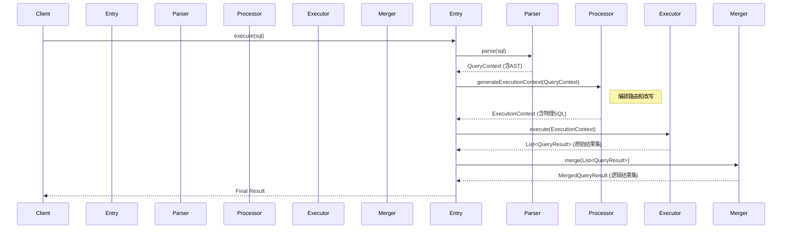
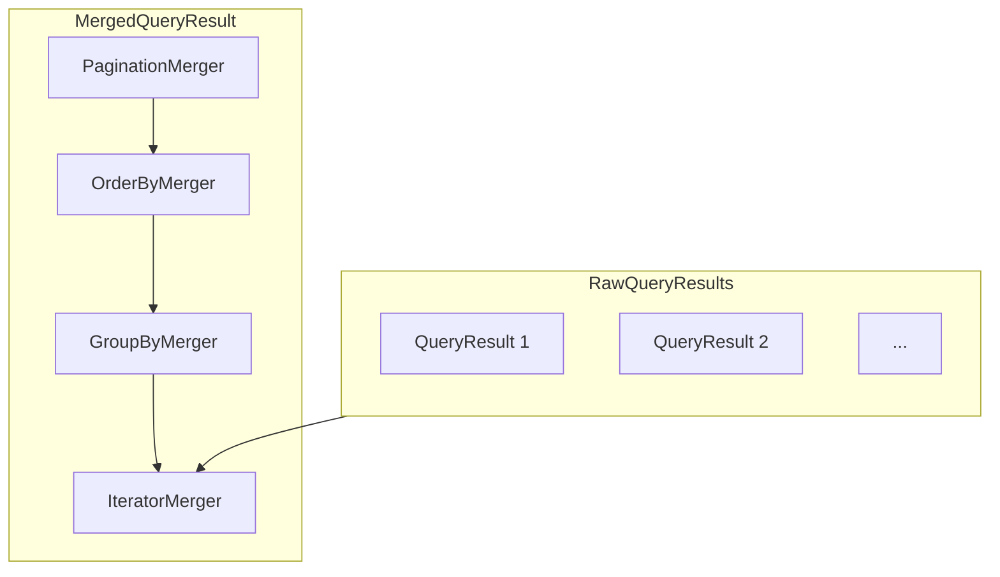

# ShardingSphere 内核源码学习指南 - SQL 的生命周期 (v3)

> **目标**：本文档旨在提供一份自顶向下的 ShardingSphere 内核源码学习指南。它不仅会阐明内核处理 SQL 的**流程 (How)**，更会深入探讨其背后的**设计思想 (Why)**。通过丰富的图表和源码分析，帮助您快速、深入地建立起对 ShardingSphere 内部工作原理的宏观认知，并为后续深入学习每个模块提供精确的“源码地图”。

## 1. 宏观架构

在深入动态的 SQL 生命周期之前，我们先通过两张图建立宏观认知。

### 1.1. 内核模块架构图

下图展示了 ShardingSphere 几个核心模块之间的**静态依赖关系**。

```mermaid
graph TD
    subgraph 用户入口 (Entry)
        A["ShardingSphere-JDBC"];
        B["ShardingSphere-Proxy"];
    end

    subgraph 功能插件 (Features)
        F1["sharding"];
        F2["readwrite-splitting"];
        F3["encrypt"];
        F4["..."];
    end

    subgraph 内核引擎 (Kernel)
        K["kernel (transaction, metadata, ...)"];
    end
    
    subgraph 基础设施 (Infrastructure)
        I["infra (route, rewrite, merge, executor, ...)"];
    end

    subgraph 解析引擎 (Parser)
        P["sql-parser (ANTLR)"];
    end

    A & B --> F1 & F2 & F3 & F4;
    A & B --> K;
    F1 & F2 & F3 & F4 -- 功能实现依赖 --> I;
    K -- 核心流程依赖 --> I;
    I -- 解析能力依赖 --> P;
```
**解读**：`Proxy` 和 `JDBC` 是提供给用户的外壳，所有具体功能（如分片、加密）都是可插拔的 `features`。这些功能和内核本身都依赖于 `infra` 提供的路由、改写、归并等基础能力，而所有能力的起点，都来自于 `sql-parser` 提供的 SQL 解析能力。

### 1.2. 整体处理时序图

下图通过**时序图 (Sequence Diagram)**，描绘了从接收 SQL 到返回结果的**动态调用流程**。


**解读**：整个流程是一个**分段驱动、有序编排**的过程。`Proxy/JDBC` 作为上层入口，负责驱动整个流程，依次调用 `Parser`, `Processor`, `Executor`, `Merger` 等核心组件，完成 SQL 的“变形记”。

---

## 2. SQL 生命周期深度解析

### 2.1. 阶段一：SQL 解析 (Parse) - 从文本到“意图”

-   **核心目标**: 将 SQL 纯文本转换成内核可以理解的、携带明确业务意图的结构化对象——**抽象语法树 (AST)**。
-   **源码入口**: `org.apache.shardingsphere.infra.parser.SQLParserEngineFacade`
-   **关键流程**:
    1.  **调用门面**: 上层模块调用 `SQLParserEngineFacade.parse()`。`Facade` 提供了基于 `Caffeine` 的缓存，避免对相同 SQL 的重复解析。
    2.  **调用引擎**: 若缓存未命中，则调用 `sql-parser` 模块的 `SQLParserEngine`。
    3.  **ANTLR 生成解析树**: `SQLParserEngine` 内部使用 ANTLR4 工具，根据方言的 `.g4` 文法文件，对 SQL 文本进行词法和语法分析，生成一个通用的**解析树 (Parse Tree)**。
    4.  **Visitor 提炼 AST**: ShardingSphere 通过**访问者模式** (`SQLStatementVisitor`) 遍历解析树。在遍历过程中，`Visitor` 根据节点类型（如 `CreateTableContext`），创建出 ShardingSphere 自定义的、携带业务含义的 `SQLStatement` 对象（如 `CreateTableStatement`）。这棵 `SQLStatement` 树就是 AST。
-   **输入**: SQL 字符串。
-   **输出**: `QueryContext` 对象，其核心是 `SQLStatement` (AST)。

#### 设计思想 (Why?)
> **问**：为什么不直接在 ANTLR 生成的 Parser 中构建 AST，而是要引入一层 Visitor？
> **答**：为了**解耦**。ANTLR 自动生成的 Parser 类包含了复杂的语法分析逻辑，是“纯粹”的语法层。如果将构建 AST 这个“业务逻辑”耦合进去，会导致 Parser 难以维护和升级。通过 Visitor 模式，将**“遍历树的逻辑”**（由 ANTLR 完成）和**“处理树节点的逻辑”**（由 `SQLStatementVisitor` 完成）彻底分离，使得 AST 的构建过程更清晰、更灵活，也更容易独立演进。

### 2.2. 阶段二：SQL 路由 (Route) - “决定去哪里”

-   **核心目标**: 根据解析出的 AST 和用户配置的规则，计算出逻辑 SQL 应该被发往哪些**物理数据源**和**物理表**。
-   **源码入口**: `org.apache.shardingsphere.infra.route.engine.SQLRouteEngine`
-   **关键流程**:
    1.  `KernelProcessor` 调用 `SQLRouteEngine.route()`。
    2.  **责任链模式**: 引擎通过 SPI 机制加载所有 `SQLRouter` 接口的实现（如 `ShardingSQLRouter`, `ReadwriteSplittingSQLRouter` 等），构成一个**责任链（或装饰器）**。
    3.  **逐一路由**: `RouteContext` 对象会依次经过链上的每一个 `SQLRouter`。每个 `SQLRouter` 都会在前一个路由结果的基础上，进一步细化或修饰 `RouteContext`。
-   **输入**: `QueryContext` 对象。
-   **输出**: `RouteContext` 对象，内部包含了最终的、精确的路由路径（`RouteUnit`）。

#### 设计思想 (Why?)
> **问**：为什么要设计成一个 `SQLRouter` 的责任链？
> **答**：为了**可插拔性**和**功能组合**。ShardingSphere 的每一个核心功能（分片、读写分离、数据加密、影子库等）都可能有自己的路由逻辑。通过 SPI + 责任链模式，每个功能的路由逻辑可以被封装在一个独立的 `SQLRouter` 实现中。这使得内核无需关心具体功能的实现，当需要增加新功能时，只需开发一个新的 `SQLRouter` 即可，完全符合“对修改关闭，对扩展开放”的原则。同时，责任链也让多个功能的路由逻辑可以优雅地叠加生效。

### 2.3. 阶段三：SQL 改写 (Rewrite) - “翻译成方言”

-   **核心目标**: 将用户输入的逻辑 SQL，根据路由结果，改写成能在目标物理数据库上正确执行的一条或多条物理 SQL。
-   **源码入口**: `org.apache.shardingsphere.infra.rewrite.SQLRewriteEntry`
-   **关键流程**:
    1.  `KernelProcessor` 调用 `SQLRewriteEntry.rewrite()`。
    2.  引擎同样通过 SPI 加载一系列 `SQLRewriter`（如 `ShardingSQLRewriter`, `EncryptSQLRewriter`），它们会**协同**对 `SQLRewriteContext` 进行修改，并最终生成物理 SQL。
-   **输入**: `QueryContext`, `RouteContext`。
-   **输出**: `SQLRewriteResult` 对象，包含了每个物理数据源对应的物理 SQL。

#### 设计思想 (Why?)
> **问**：SQL 改写的设计思想和路由类似吗？
> **答**：完全一致，同样是基于 **SPI + 责任链**的**可插拔**设计。每个需要改写 SQL 的功能（分片、加密、分页等）都可以提供自己的 `SQLRewriter`。例如，`EncryptSQLRewriter` 负责将 SQL 中的明文参数替换为密文，而 `ShardingSQLRewriter` 负责将逻辑表名替换为物理表名。它们各司其职，共同完成最终的 SQL 改写，保证了功能之间的正交性。

### 2.4. 阶段四：SQL 执行 (Execute) - “真正干活”

-   **核心目标**: 高效地获取数据库连接，并安全、并发地执行所有物理 SQL。
-   **源码入口**: `org.apache.shardingsphere.infra.executor.sql.execute.engine.SQLExecutor`
-   **关键流程**:
    1.  上层模块调用执行引擎，传入 `ExecutionContext`。
    2.  **连接模式选择**: 引擎会在两种连接模式中做选择：
        -   `MEMORY_STRICTLY` (内存优先): 尽可能复用和持有连接，性能高，但占用连接多。适用于 OLTP。
        -   `CONNECTION_STRICTLY` (连接优先): 严格控制并发连接数，用完即释放。适用于 OLAP。
    3.  **并发执行**: 通过内部线程池，将发往不同数据源的 SQL 请求并发执行。
-   **输入**: `ExecutionContext`。
-   **输出**: `List<QueryResult>`，即来自每个物理数据源的原始结果集列表。

#### 设计思想 (Why?)
> **问**：为什么需要两种连接模式？
> **答**：为了在**性能和资源之间取得平衡**，适应不同业务场景。OLTP 场景（高并发、短事务）对响应延迟极度敏感，`MEMORY_STRICTLY` 模式通过保持连接来换取更快的响应速度。而 OLAP 场景（低并发、长查询）可能导致连接被长时间占用，`CONNECTION_STRICTLY` 模式则能有效避免连接池被打满，保证系统的稳定性。这种设计体现了 ShardingSphere 作为基础组件的**适应性**和**健壮性**。

### 2.5. 阶段五：结果归并 (Merge) - “化零为整”

-   **核心目标**: 将来自多个数据源的、零散的 `QueryResult` 列表，通过流式处理，合并成一个对用户透明的统一逻辑结果集。
-   **源码入口**: `org.apache.shardingsphere.infra.merge.engine.ResultMergeEngine`
-   **关键流程**:
    1.  上层模块调用 `ResultMergeEngine.merge()`。
    2.  **装饰器模式**: 归并引擎是**装饰器模式**的绝佳体现。它会根据 AST 中的 SQL 类型（是否包含 `ORDER BY`, `GROUP BY`, `LIMIT` 等），创建一系列 `ResultMerger` 并将它们**层层嵌套**。
    3.  **流式处理**: 当上层代码从最外层的 `ResultMerger` 获取数据时，请求会逐层向内传递，每一层 `Merger` 都会对内层结果进行处理（排序、分组、分页等）。整个过程是流式的，内存占用极低。
-   **输入**: `List<QueryResult>` 和 `SQLStatement`。
-   **输出**: 一个统一的、逻辑的 `QueryResult`。

#### 归并装饰器图
下图展示了一个复杂查询的归并器嵌套结构：


#### 设计思想 (Why?)
> **问**：为什么归并要设计成流式的、层层嵌套的装饰器模式？
> **答**：为了**极致的内存效率**。想象一下，如果一个分片查询从 10 个库中各返回 100 万行数据，总共 1000 万行。如果采用非流式处理，需要将这 1000 万行数据全部加载到内存中进行排序、分组，这极易导致 `OutOfMemoryError`。**流式归并**的核心在于，每次 `next()` 调用只从下游拉取“刚好够用”的数据进行计算，然后返回一行结果，从而将内存占用降到最低。而**装饰器模式**则完美地实现了这种可组合的流式处理，需要排序就加一层 `OrderByMerger`，需要分页就再加一层 `PaginationMerger`，极其灵活和高效。