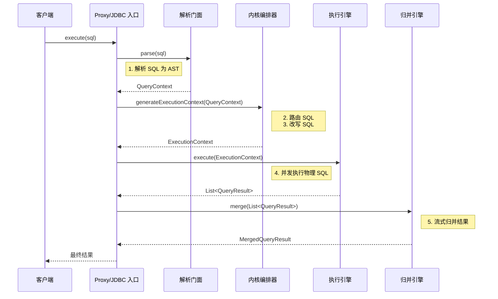

# ShardingSphere 顶层设计与内核原理白皮书 (v4)

> **目标**：本文档是遵从“详实、深度、探究本源”的要求，对 ShardingSphere 的架构设计、内核原理进行的一次彻底重述。它不仅描绘了系统的运行流程 (How)，更致力于揭示其背后的设计哲学 (Why)，旨在成为一份可以帮助您从架构师视角理解 ShardingSphere 的深度白皮书。

## 1. 设计哲学：Database Plus 与可插拔内核

在深入代码之前，理解 ShardingSphere 的设计哲学至关重要。官方将其定义为 **“Database Plus”**，即“可插拔的数据库增强计算平台”。

-   **Database**：意味着它立足于对现有数据库的操作，但**自身并不存储数据**。它的所有功能都构建在对数据库协议、SQL 和存储的增强之上。
-   **Plus (可插拔)**：这是 ShardingSphere 架构的灵魂。内核被设计成一个高度可扩展的平台，所有核心功能（如数据分片、读写分离、数据加密、分布式事务等）都被实现为**独立的、可插拔的插件**。

这种设计的**核心优势**在于：
1.  **极致的扩展性**：当需要支持新的功能或数据库方言时，只需开发新的插件，而无需改动内核主干。
2.  **功能正交性**：每个功能插件只关心自己的职责，例如加密插件无需关心 SQL 是否需要分片，这使得功能可以任意组合、独立演进。
3.  **开放的生态**：允许社区和第三方开发者轻松地贡献新的功能插件，丰富 ShardingSphere 的生态。

这个哲学的技术落地，依赖于贯穿整个项目的**微内核与 SPI (Service Provider Interface) 机制**。

---

## 2. 整体架构与核心模块

ShardingSphere 的架构在物理上表现为一系列清晰的 Maven 模块，它们共同构成了“Database Plus”的宏伟蓝图。

### 2.1. 整体模块架构图

```mermaid
graph TD
    subgraph 用户入口 (Entry Points)
        direction LR
        JDBC["shardingsphere-jdbc-driver"];
        PROXY["shardingsphere-proxy"];
    end

    subgraph 功能层 (Features)
        direction TB
        F_SHARD["features/sharding"];
        F_RWS["features/readwrite-splitting"];
        F_ENC["features/encrypt"];
        F_OTH["..."];
    end

    subgraph 内核层 (Kernel)
        direction TB
        K_TRANS["kernel/transaction"];
        K_META["kernel/metadata"];
        K_CORE["..."];
    end
    
    subgraph 基础设施层 (Infrastructure)
        direction TB
        I_ROUTE["infra/route"];
        I_REWRITE["infra/rewrite"];
        I_MERGE["infra/merge"];
        I_EXEC["infra/executor"];
        I_PARSER["infra/parser"];
        I_SPI["infra/spi"];
    end

    subgraph SQL解析引擎 (SQL Parser)
        P["sql-parser"];
    end

    JDBC & PROXY -- 依赖 --> K_TRANS & K_META;
    JDBC & PROXY -- 依赖 --> F_SHARD & F_RWS & F_ENC;
    
    F_SHARD & F_RWS & F_ENC & K_TRANS & K_META -- 依赖基础能力 --> I_ROUTE & I_REWRITE & I_MERGE & I_EXEC;
    
    I_ROUTE & I_REWRITE & I_MERGE & I_EXEC -- 依赖解析结果 --> I_PARSER;
    
    I_PARSER -- 依赖底层解析能力 --> P;

    I_SPI -.-> F_SHARD & F_RWS & F_ENC;
    I_SPI -.-> K_TRANS;
    I_SPI -.-> I_ROUTE;
    I_SPI -.-> I_REWRITE;
    style I_SPI fill:#f9f,stroke:#333,stroke-width:2px
```

### 2.2. 模块职责剖析

-   **用户入口 (Entry Points)**
    -   `shardingsphere-jdbc-driver`：JDBC 驱动形态。它实现了标准 JDBC 接口，对用户透明。应用在代码中只需替换 `DataSource`，即可无缝集成 ShardingSphere 的能力。它性能最高，但与应用代码耦合。
    -   `shardingsphere-proxy`：数据库代理形态。它伪装成一个真实的 MySQL/PostgreSQL 数据库，任何语言的客户端都可以连接它。它实现了与内核的解耦，便于统一治理，但会引入额外的网络开销。

-   **功能层 (Features)**：所有核心功能的家园。每个子模块都是一个可插拔的功能插件，如 `sharding`（分片）、`readwrite-splitting`（读写分离）等。

-   **内核层 (Kernel)**：承载了更为底层的、与具体功能无关的核心机制，如 `transaction`（分布式事务）、`metadata`（元数据管理）等。

-   **基础设施层 (Infrastructure)**：这是内核的“工具箱”，为上层所有模块提供原子化的基础能力。
    -   `infra/spi`：**设计的基石**。提供了服务提供者接口（SPI）的实现，是整个系统可插拔的根本。
    -   `infra/parser`：作为 SQL 解析能力的**门面 (Facade)**，提供缓存等优化。
    -   `infra/route`, `infra/rewrite`, `infra/executor`, `infra/merge`：分别对应 SQL 生命周期的**路由、改写、执行、归并**四大核心能力。

-   **SQL 解析引擎 (SQL Parser)**：完全独立的 SQL 解析模块，基于 ANTLR 实现，能将 SQL 文本解析为结构化的**抽象语法树 (AST)**。

---

## 3. SQL 的完整生命周期 (附时序图)

### 3.1. 整体处理时序图



### 3.2. 生命周期阶段深度解析

#### 阶段一：SQL 解析 (Parse)
-   **目标**：`String -> AST` (抽象语法树)。
-   **核心设计**：采用**访问者模式 (Visitor Pattern)**，将纯粹的语法分析与业务的 AST 构建解耦。
    1.  **ANTLR 生成解析树**：`sql-parser` 模块中的 `.g4` 文件定义了 SQL 文法。ANTLR 根据文法，将 SQL 字符串转换成一个通用的**解析树 (Parse Tree)**。
    2.  **Visitor 遍历**：`SQLStatementVisitor` 的实现类（如 `MySQLStatementVisitor`）遍历这棵解析树。
    3.  **构建 AST**：Visitor 在访问每个节点时，根据节点类型创建出 ShardingSphere 自定义的、携带业务含义的 `SQLStatement` 对象（如 `SelectStatement`），最终形成 AST。
-   **入口类**：`org.apache.shardingsphere.infra.parser.SQLParserEngineFacade`。

#### 阶段二：SQL 路由 (Route)
-   **目标**：根据 AST 和规则，计算出 SQL 要去的**物理库/表**。
-   **核心设计**：基于 **SPI 的责任链模式 (Chain of Responsibility)**。
    1.  **加载路由链**: `SQLRouteEngine` 通过 SPI 加载所有 `SQLRouter` 接口的实现，如 `ShardingSQLRouter`、`ReadwriteSplittingSQLRouter`。
    2.  **链式处理**：`RouteContext` 对象依次通过链上的每个 `SQLRouter`。`ShardingSQLRouter` 负责计算分片，`ReadwriteSplittingSQLRouter` 负责决定主从库。每个 Router 都在前一个的基础上增强路由结果。
-   **入口类**：`org.apache.shardingsphere.infra.route.engine.SQLRouteEngine`。

#### 阶段三：SQL 改写 (Rewrite)
-   **目标**：将逻辑 SQL 改写为可在物理库执行的**物理 SQL**。
-   **核心设计**：同样是基于 **SPI 的责任链模式**。
    1.  **加载改写链**: `SQLRewriteEntry` 加载所有 `SQLRewriter` 的实现。
    2.  **协同改写**：不同的 Rewriter 各司其职，例如 `ShardingSQLRewriter` 负责改写表名、`EncryptSQLRewriter` 负责将明文参数改写为密文。
-   **入口类**：`org.apache.shardingsphere.infra.rewrite.SQLRewriteEntry`。

#### 阶段四：SQL 执行 (Execute)
-   **目标**：高效、安全地执行所有物理 SQL。
-   **核心设计**：提供**两种可自适应的连接模式**，在性能和资源间取得平衡。
    -   `MEMORY_STRICTLY` (内存优先)：为每个物理 SQL 都持有连接，并发度最高，性能最好，但消耗连接多。适用于低延迟的 OLTP 场景。
    -   `CONNECTION_STRICTLY` (连接优先)：严格控制并发连接数，串行获取连接执行，性能较低，但最节省资源。适用于长耗时的 OLAP 场景。
-   **入口类**：`org.apache.shardingsphere.infra.executor.sql.execute.engine.SQLExecutor`。

#### 阶段五：结果归并 (Merge)
-   **目标**：将多个物理库返回的结果集，合并成一个统一的逻辑结果集。
-   **核心设计**：采用**流式处理的装饰器模式 (Decorator Pattern)**，实现极致的内存效率。
    1.  **创建归并链**: `ResultMergeEngine` 根据 AST 判断需要哪些归并能力（排序、分组、分页等）。
    2.  **装饰器嵌套**: 通过 SPI 创建 `ResultMerger` 并层层嵌套。例如，一个复杂查询的最终 Merger 可能是 `Pagination(OrderBy(GroupBy(Iterator)))` 这样的结构。
    3.  **流式拉取**: 上层应用每次调用 `next()`，都是从最外层装饰器拉取数据。该请求会层层向内传递，最内层的 `IteratorMerger` 从原始 `QueryResult` 中拉取数据，然后数据再逐层向外处理和计算，最终返回给调用方一行。这个过程避免了将所有结果加载到内存，内存占用极低。
-   **入口类**：`org.apache.shardingsphere.infra.merge.engine.ResultMergeEngine`。