# ShardingSphere 执行引擎架构深度剖析

> **阅读建议**: 本文档采用架构视图式组织,从宏观到微观、从整体到局部逐层递进。建议按章节顺序阅读,先建立全局认知,再深入实现细节。

---

## 文档导航

**第一部分: 宏观视图** - 理解执行引擎的位置与价值
- 第一章: 执行引擎在 ShardingSphere 中的战略定位
- 第二章: 核心挑战与设计目标

**第二部分: 逻辑视图** - 理解核心模块与协作关系
- 第三章: 逻辑架构全景图
- 第四章: 五大核心模块详解

**第三部分: 进程视图** - 理解并发执行与线程模型
- 第五章: 并行执行策略深度解析
- 第六章: 串行执行策略与事务保障

**第四部分: 开发视图** - 理解核心类与源码实现
- 第七章: ExecutorEngine - 核心调度器实现
- 第八章: JDBCExecutor - JDBC 执行入口实现
- 第九章: 回调机制与模板方法模式

**第五部分: 场景视图** - 理解完整执行流程
- 第十章: 典型场景执行流程全景
- 第十一章: 关键决策点深度分析

**第六部分: 总结与扩展**
- 第十二章: 设计思想总结与最佳实践
- 第十三章: 扩展开发指南

---

# 第一部分: 宏观视图

## 第一章: 执行引擎在 ShardingSphere 中的战略定位

### 1.1 ShardingSphere SQL 处理全景

ShardingSphere 作为分布式数据库中间件,需要将用户的逻辑 SQL 转化为对多个真实数据库的物理操作。这个过程可以抽象为一条清晰的流水线:

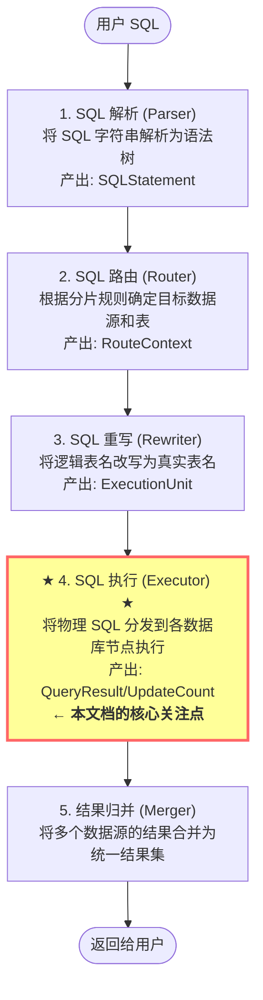
```mermaid
flowchart TB
    Start([用户 SQL])

    Parser["1. SQL 解析 (Parser)<br/>将 SQL 字符串解析为语法树<br/>产出: SQLStatement"]
    Router["2. SQL 路由 (Router)<br/>根据分片规则确定目标数据源和表<br/>产出: RouteContext"]
    Rewriter["3. SQL 重写 (Rewriter)<br/>将逻辑表名改写为真实表名<br/>产出: ExecutionUnit"]
    Executor["★ 4. SQL 执行 (Executor) ★<br/>将物理 SQL 分发到各数据库节点执行<br/>产出: QueryResult/UpdateCount<br/><b>← 本文档的核心关注点</b>"]
    Merger["5. 结果归并 (Merger)<br/>将多个数据源的结果合并为统一结果集"]
    End([返回给用户])

    Start --> Parser
    Parser --> Router
    Router --> Rewriter
    Rewriter --> Executor
    Executor --> Merger
    Merger --> End

    style Executor fill:#ff9,stroke:#f66,stroke-width:3px
```

**执行引擎的战略定位**:

执行引擎是**逻辑层与物理层的桥梁**,位于流水线的第四个环节:

- **承上**: 接收路由和重写模块产出的 `ExecutionUnit` 集合(包含数据源名称和可执行 SQL)
- **启下**: 产出 `QueryResult` 或更新结果,交给结果归并模块处理
- **核心职责**:
  1. 将逻辑上的一次查询转化为对多个物理数据库的并发/串行操作
  2. 管理数据库连接、线程池等资源
  3. 保证执行效率与数据一致性的平衡

### 1.2 执行引擎的三大核心价值

#### 价值一: 性能加速 - 化串为并

**传统单库场景**:

```sql
SELECT * FROM t_order WHERE user_id IN (1, 2, 3, ..., 100)
-- 单次查询,耗时 T
```

**ShardingSphere 分片场景** (假设分 10 个库):


```mermaid
gantt
    title 串行执行 vs 并行执行对比
    dateFormat X
    axisFormat %L

    section 串行执行(未优化)
    db0: 0, 100
    db1: 100, 200
    db2: 200, 300
    db3: 300, 400
    db4: 400, 500
    db5: 500, 600
    db6: 600, 700
    db7: 700, 800
    db8: 800, 900
    db9: 900, 1000

    section 并行执行(优化后)
    db0: crit, 0, 100
    db1: crit, 0, 100
    db2: crit, 0, 100
    db3: crit, 0, 100
    db4: crit, 0, 100
    db5: crit, 0, 100
    db6: crit, 0, 100
    db7: crit, 0, 100
    db8: crit, 0, 100
    db9: crit, 0, 100
```

**性能对比**:
- **串行执行**: 总耗时 = T (无性能提升!)
- **并行执行**: 总耗时 = T/10 (10倍性能提升!)

**关键实现**: `ExecutorEngine.parallelExecute()` - 基于线程池的并发调度

#### 价值二: 资源管控 - 避免连接风暴

**挑战**: 假设有 100 个分片,如果每次查询都打开 100 个数据库连接:

```
10 个并发用户 × 100 个分片 = 1000 个数据库连接
→ 连接池耗尽,数据库崩溃!
```

**执行引擎的解决方案**:

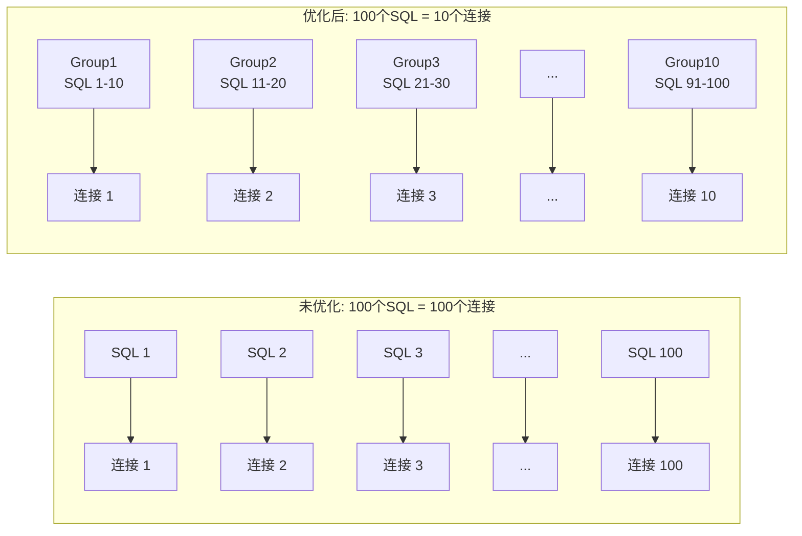
```mermaid
graph LR
    subgraph "未优化: 100个SQL = 100个连接"
        SQL1[SQL 1] --> Conn1[连接 1]
        SQL2[SQL 2] --> Conn2[连接 2]
        SQL3[SQL 3] --> Conn3[连接 3]
        SQL4[...] --> Conn4[...]
        SQL5[SQL 100] --> Conn5[连接 100]
    end

    subgraph "优化后: 100个SQL = 10个连接"
        G1[Group1<br/>SQL 1-10] --> C1[连接 1]
        G2[Group2<br/>SQL 11-20] --> C2[连接 2]
        G3[Group3<br/>SQL 21-30] --> C3[连接 3]
        G4[...] --> C4[...]
        G5[Group10<br/>SQL 91-100] --> C5[连接 10]
    end
```

**关键配置**:
```
maxConnectionsSizePerQuery = 10
→ 分 10 组,每组 10 个 SQL
→ 最多使用 10 个连接
→ 每个连接顺序执行 10 个 SQL
```

**关键实现**: `AbstractExecutionPrepareEngine.group()` - 分组算法

#### 价值三: 一致性保障 - 事务场景的串行化

**挑战**: 在分布式事务场景下,并行执行可能导致数据不一致:

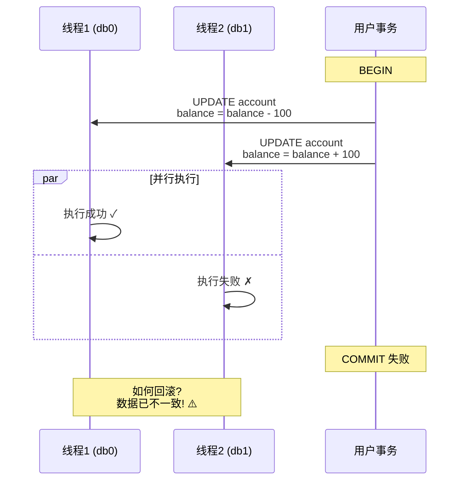
```mermaid
sequenceDiagram
    participant T1 as 线程1 (db0)
    participant T2 as 线程2 (db1)
    participant User as 用户事务

    Note over User: BEGIN;
    User->>T1: UPDATE account<br/>balance = balance - 100
    User->>T2: UPDATE account<br/>balance = balance + 100

    par 并行执行
        T1->>T1: 执行成功 ✓
    and
        T2->>T2: 执行失败 ✗
    end

    Note over User: COMMIT 失败
    Note over T1,T2: 如何回滚?<br/>数据已不一致! ⚠️
```

**执行引擎的解决方案**:

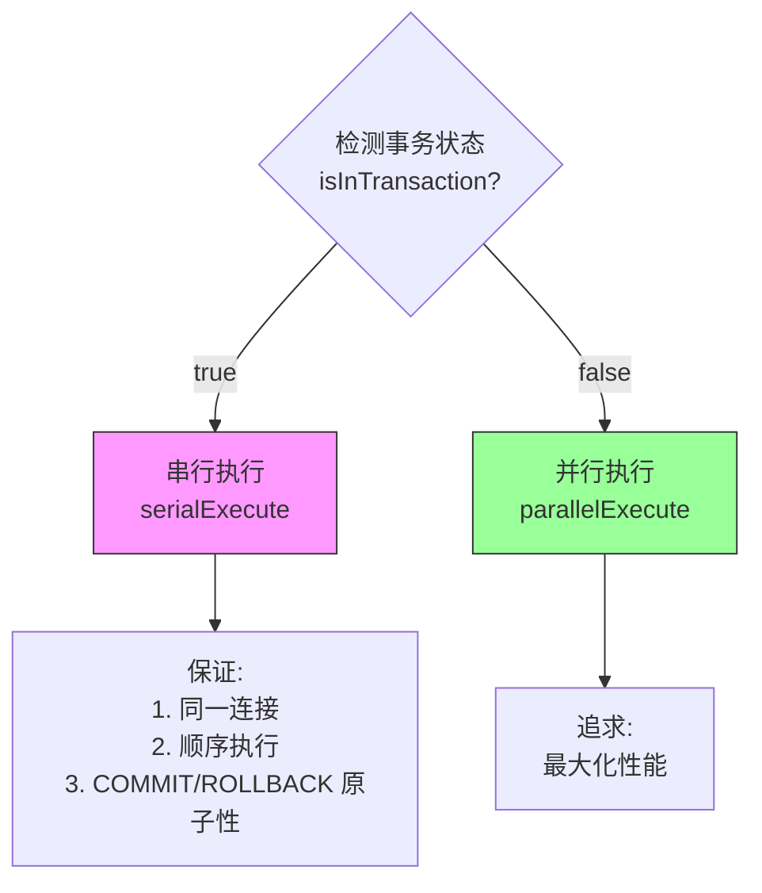
```mermaid
graph TD
    Check{检测事务状态<br/>isInTransaction?}
    Check -->|true| Serial[串行执行<br/>serialExecute]
    Check -->|false| Parallel[并行执行<br/>parallelExecute]

    Serial --> Guarantee[保证:<br/>1. 同一连接<br/>2. 顺序执行<br/>3. COMMIT/ROLLBACK 原子性]
    Parallel --> Performance[追求:<br/>最大化性能]

    style Serial fill:#f9f,stroke:#333
    style Parallel fill:#9f9,stroke:#333
```

**关键实现**: `JDBCExecutor.execute()` 中的 `serial` 参数决策

### 1.3 执行引擎的设计哲学

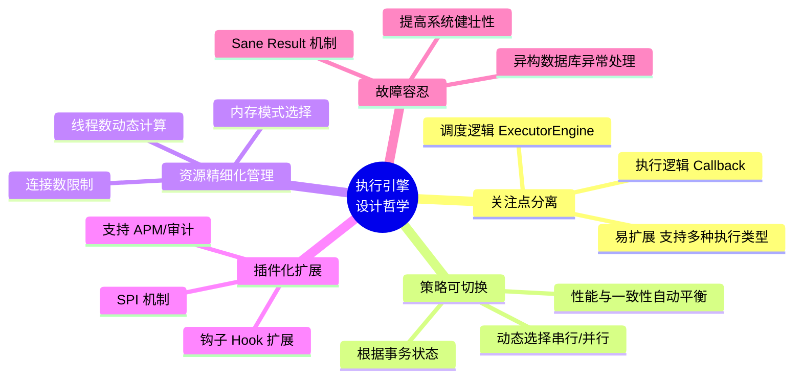
```mermaid
mindmap
  root((执行引擎<br/>设计哲学))
    关注点分离
      调度逻辑 ExecutorEngine
      执行逻辑 Callback
      易扩展 支持多种执行类型
    策略可切换
      根据事务状态
      动态选择串行/并行
      性能与一致性自动平衡
    资源精细化管理
      线程数动态计算
      连接数限制
      内存模式选择
    插件化扩展
      SPI 机制
      钩子 Hook 扩展
      支持 APM/审计
    故障容忍
      Sane Result 机制
      异构数据库异常处理
      提高系统健壮性
```

---

## 第二章: 核心挑战与设计目标

### 2.1 执行引擎面临的四大核心挑战

#### 挑战一: 并发执行的死锁问题

**场景**: 假设有 4 个分片,线程池大小为 3

```mermaid
sequenceDiagram
    participant Main as 主线程
    participant T1 as Worker 线程1
    participant T2 as Worker 线程2
    participant T3 as Worker 线程3
    participant Pool as 线程池队列

    Note over Main: 错误策略:<br/>全部提交到线程池

    Main->>Pool: submit(Group1)
    Main->>Pool: submit(Group2)
    Main->>Pool: submit(Group3)
    Main->>Pool: submit(Group4)

    Pool->>T1: 分配 Group1
    Pool->>T2: 分配 Group2
    Pool->>T3: 分配 Group3

    Note over Pool: Group4 在队列等待

    T1->>T1: 执行 Group1
    T2->>T2: 执行 Group2
    T3->>T3: 执行 Group3

    Note over Main: 等待所有 Future.get()
    Note over T1,T2,T3: 工作线程执行完,等待
    Note over Pool: Group4 永远无法调度
    Note over Main,Pool: 死锁! ☠️
```

**ShardingSphere 的解决方案**:

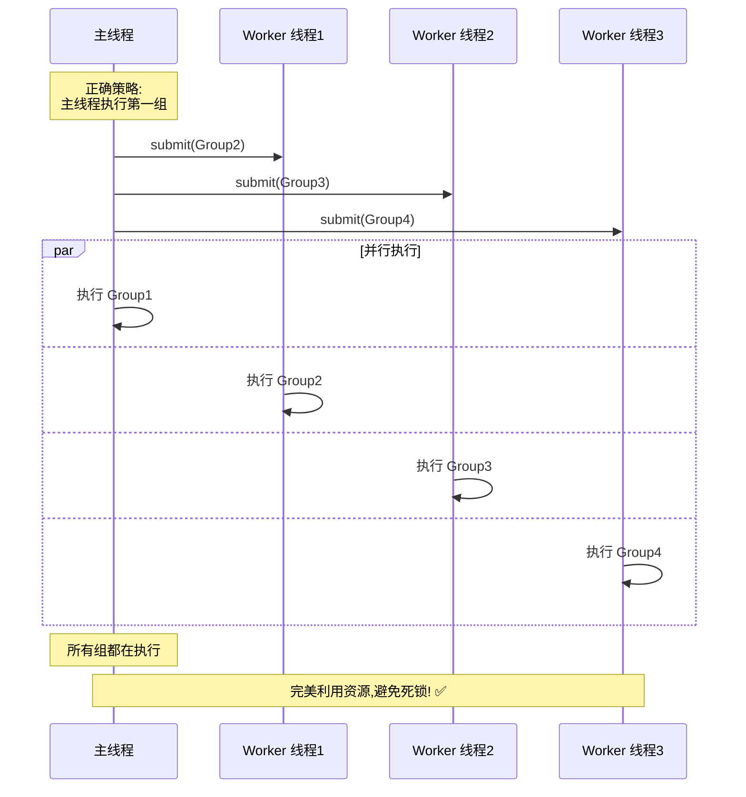
```mermaid
sequenceDiagram
    participant Main as 主线程
    participant T1 as Worker 线程1
    participant T2 as Worker 线程2
    participant T3 as Worker 线程3

    Note over Main: 正确策略:<br/>主线程执行第一组

    Main->>T1: submit(Group2)
    Main->>T2: submit(Group3)
    Main->>T3: submit(Group4)

    par 并行执行
        Main->>Main: 执行 Group1
    and
        T1->>T1: 执行 Group2
    and
        T2->>T2: 执行 Group3
    and
        T3->>T3: 执行 Group4
    end

    Note over Main: 所有组都在执行
    Note over Main,T3: 完美利用资源,避免死锁! ✅
```

**关键源码**: `ExecutorEngine.parallelExecute()` - infra/executor/src/main/java/org/apache/shardingsphere/infra/executor/kernel/ExecutorEngine.java:92

#### 挑战二: 连接数爆炸问题

**场景**: 100 个分片 × 10 个并发用户 = 1000 个连接

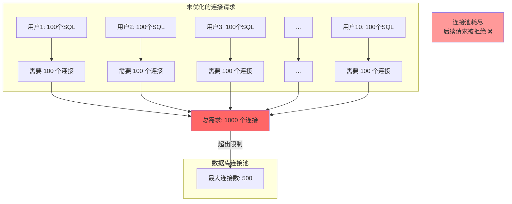
```mermaid
graph TB
    subgraph "数据库连接池"
        Max[最大连接数: 500]
    end

    subgraph "未优化的连接请求"
        U1[用户1: 100个SQL] --> R1[需要 100 个连接]
        U2[用户2: 100个SQL] --> R2[需要 100 个连接]
        U3[用户3: 100个SQL] --> R3[需要 100 个连接]
        U4[...] --> R4[...]
        U5[用户10: 100个SQL] --> R5[需要 100 个连接]
    end

    Total[总需求: 1000 个连接]

    R1 --> Total
    R2 --> Total
    R3 --> Total
    R4 --> Total
    R5 --> Total

    Total -->|超出限制| Max

    Result[连接池耗尽<br/>后续请求被拒绝 ❌]

    style Total fill:#f66
    style Result fill:#f99
```

**ShardingSphere 的解决方案 - 分组复用**:

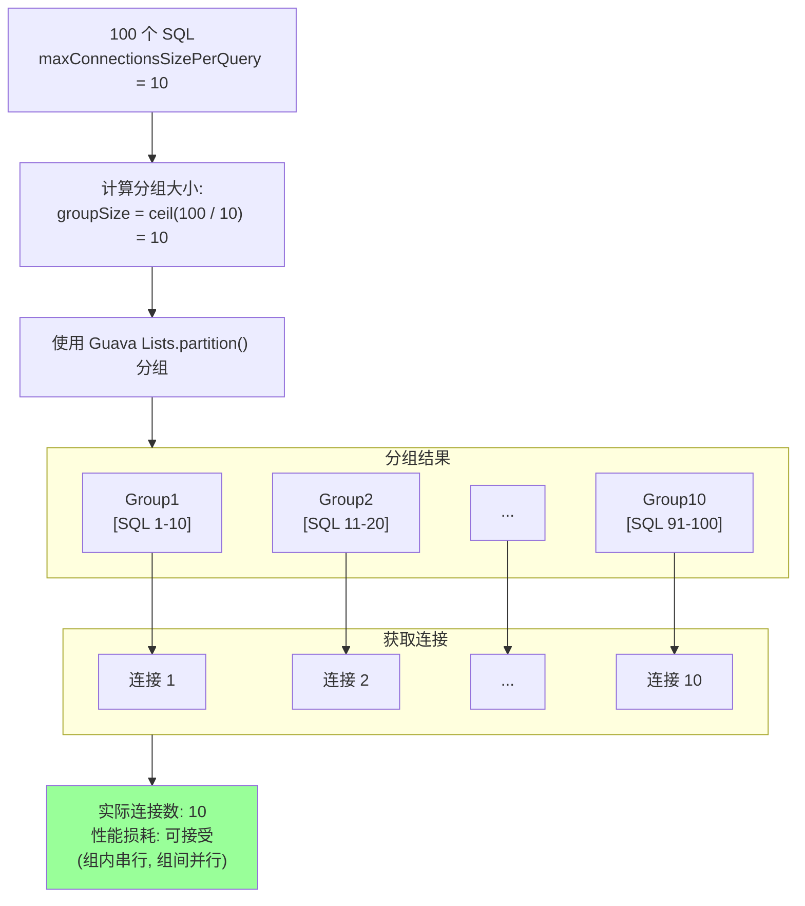
```mermaid
flowchart TB
    Input["100 个 SQL<br/>maxConnectionsSizePerQuery = 10"]

    Calc["计算分组大小:<br/>groupSize = ceil(100 / 10) = 10"]

    Input --> Calc

    Partition["使用 Guava Lists.partition() 分组"]

    Calc --> Partition

    subgraph Groups["分组结果"]
        G1["Group1<br/>[SQL 1-10]"]
        G2["Group2<br/>[SQL 11-20]"]
        G3["..."]
        G4["Group10<br/>[SQL 91-100]"]
    end

    Partition --> Groups

    subgraph Connections["获取连接"]
        C1[连接 1]
        C2[连接 2]
        C3[...]
        C4[连接 10]
    end

    G1 --> C1
    G2 --> C2
    G3 --> C3
    G4 --> C4

    Result["实际连接数: 10<br/>性能损耗: 可接受<br/>(组内串行, 组间并行)"]

    Connections --> Result

    style Result fill:#9f9
```

**关键源码**: `AbstractExecutionPrepareEngine.group()` - infra/executor/src/main/java/org/apache/shardingsphere/infra/executor/sql/prepare/AbstractExecutionPrepareEngine.java:58

#### 挑战三: 内存占用与性能的权衡

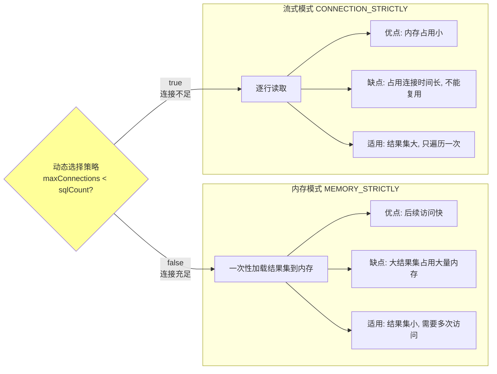
```mermaid
graph LR
    subgraph "内存模式 MEMORY_STRICTLY"
        M1[一次性加载结果集到内存]
        M2[优点: 后续访问快]
        M3[缺点: 大结果集占用大量内存]
        M4[适用: 结果集小, 需要多次访问]

        M1 --> M2
        M1 --> M3
        M1 --> M4
    end

    subgraph "流式模式 CONNECTION_STRICTLY"
        S1[逐行读取]
        S2[优点: 内存占用小]
        S3[缺点: 占用连接时间长, 不能复用]
        S4[适用: 结果集大, 只遍历一次]

        S1 --> S2
        S1 --> S3
        S1 --> S4
    end

    Decision{动态选择策略<br/>maxConnections < sqlCount?}

    Decision -->|true<br/>连接不足| S1
    Decision -->|false<br/>连接充足| M1

    style Decision fill:#ff9
```

**动态选择示例**:

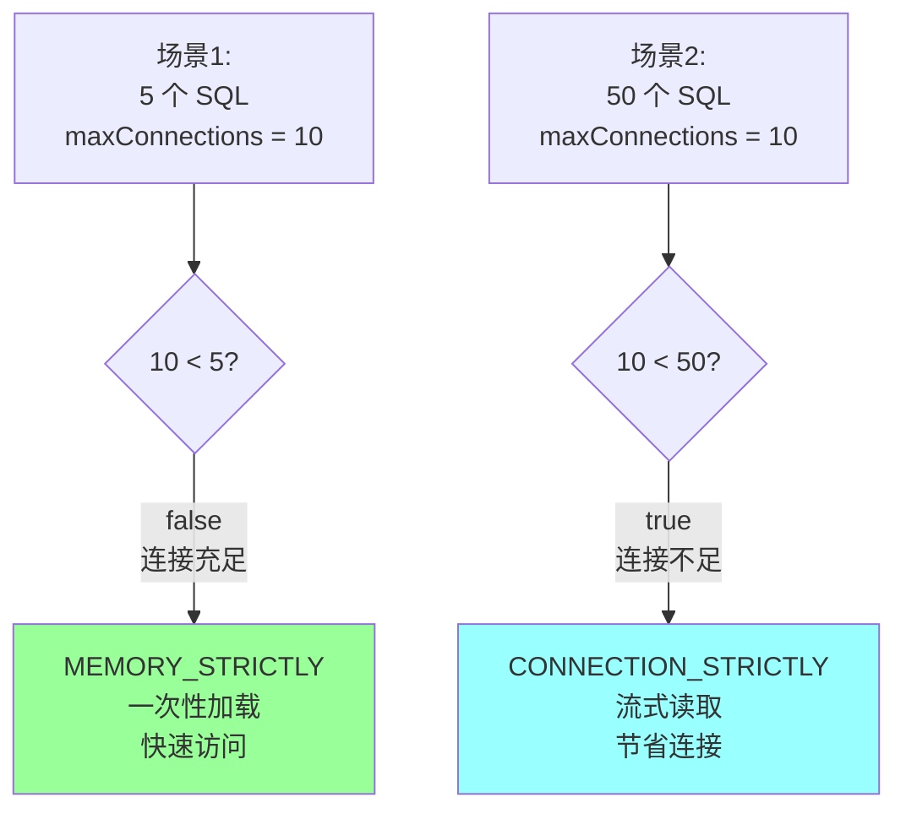
```mermaid
flowchart TD
    Scene1["场景1:<br/>5 个 SQL<br/>maxConnections = 10"]
    Scene2["场景2:<br/>50 个 SQL<br/>maxConnections = 10"]

    Check1{10 < 5?}
    Check2{10 < 50?}

    Scene1 --> Check1
    Scene2 --> Check2

    Check1 -->|false<br/>连接充足| Memory1[MEMORY_STRICTLY<br/>一次性加载<br/>快速访问]
    Check2 -->|true<br/>连接不足| Stream1[CONNECTION_STRICTLY<br/>流式读取<br/>节省连接]

    style Memory1 fill:#9f9
    style Stream1 fill:#9ff
```

**关键源码**: `AbstractExecutionPrepareEngine.prepare()` - infra/executor/src/main/java/org/apache/shardingsphere/infra/executor/sql/prepare/AbstractExecutionPrepareEngine.java:45

#### 挑战四: 异构数据库的兼容性

**场景**: ShardingSphere-Proxy 同时代理 MySQL 和 PostgreSQL

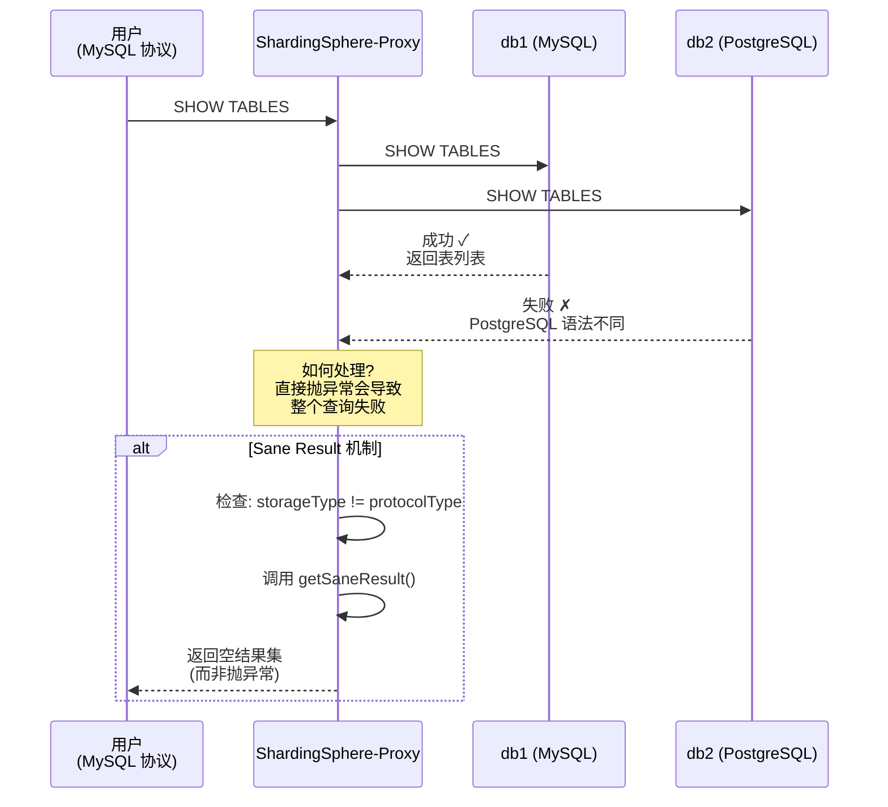
```mermaid
sequenceDiagram
    participant User as 用户<br/>(MySQL 协议)
    participant Proxy as ShardingSphere-Proxy
    participant DB1 as db1 (MySQL)
    participant DB2 as db2 (PostgreSQL)

    User->>Proxy: SHOW TABLES;

    Proxy->>DB1: SHOW TABLES;
    Proxy->>DB2: SHOW TABLES;

    DB1-->>Proxy: 成功 ✓<br/>返回表列表
    DB2-->>Proxy: 失败 ✗<br/>PostgreSQL 语法不同

    Note over Proxy: 如何处理?<br/>直接抛异常会导致<br/>整个查询失败

    alt Sane Result 机制
        Proxy->>Proxy: 检查: storageType != protocolType
        Proxy->>Proxy: 调用 getSaneResult()
        Proxy-->>User: 返回空结果集<br/>(而非抛异常)
    end
```

**Sane Result 实现**:

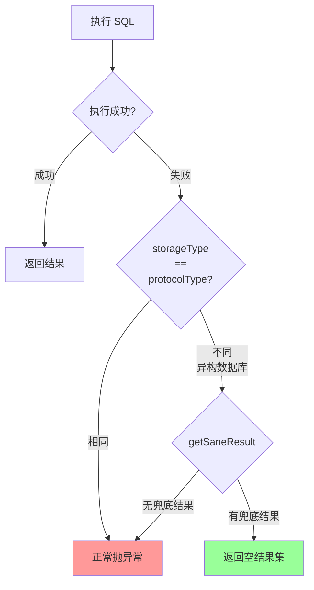
```mermaid
flowchart TD
    Execute["执行 SQL"]

    Execute --> Check{执行成功?}

    Check -->|成功| Return[返回结果]

    Check -->|失败| TypeCheck{storageType<br/>==<br/>protocolType?}

    TypeCheck -->|相同| Throw[正常抛异常]

    TypeCheck -->|不同<br/>异构数据库| Sane{getSaneResult}

    Sane -->|有兜底结果| ReturnSane[返回空结果集]
    Sane -->|无兜底结果| Throw

    style ReturnSane fill:#9f9
    style Throw fill:#f99
```

**关键源码**: `JDBCExecutorCallback.execute()` - infra/executor/src/main/java/org/apache/shardingsphere/infra/executor/sql/execute/engine/driver/jdbc/JDBCExecutorCallback.java:108

### 2.2 设计目标的优先级排序

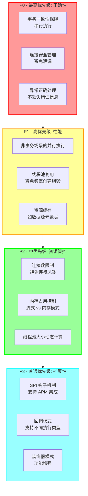
```mermaid
graph TB
    subgraph P0["P0 - 最高优先级: 正确性"]
        P01[事务一致性保障<br/>串行执行]
        P02[连接安全管理<br/>避免泄漏]
        P03[异常正确处理<br/>不丢失错误信息]
    end

    subgraph P1["P1 - 高优先级: 性能"]
        P11[非事务场景的并行执行]
        P12[线程池复用<br/>避免频繁创建销毁]
        P13[资源缓存<br/>如数据源元数据]
    end

    subgraph P2["P2 - 中优先级: 资源管控"]
        P21[连接数限制<br/>避免连接风暴]
        P22[内存占用控制<br/>流式 vs 内存模式]
        P23[线程池大小动态计算]
    end

    subgraph P3["P3 - 普通优先级: 扩展性"]
        P31[SPI 钩子机制<br/>支持 APM 集成]
        P32[回调模式<br/>支持不同执行类型]
        P33[装饰器模式<br/>功能增强]
    end

    P0 --> P1
    P1 --> P2
    P2 --> P3

    style P0 fill:#f99,stroke:#f00,stroke-width:3px
    style P1 fill:#ff9,stroke:#f90,stroke-width:2px
    style P2 fill:#9f9,stroke:#0f0,stroke-width:2px
    style P3 fill:#9ff,stroke:#0ff,stroke-width:1px
```

**设计决策示例**:

| 场景 | 冲突的目标 | ShardingSphere 的选择 | 理由 |
|-----|-----------|---------------------|------|
| 事务执行 | 性能(并行) vs 正确性(一致性) | ✅ 选择串行执行 | 正确性优先级高于性能 |
| 大量分片 | 性能(并发) vs 资源(连接) | ✅ 分组复用连接 | 在性能损失可控的前提下,优先资源管控 |
| 异构数据库 | 严格校验 vs 兼容性 | ✅ Sane Result 兜底 | 提升用户体验,但仅限特定场景 |

---

# 第二部分: 逻辑视图

## 第三章: 逻辑架构全景图

### 3.1 执行引擎的逻辑分层架构

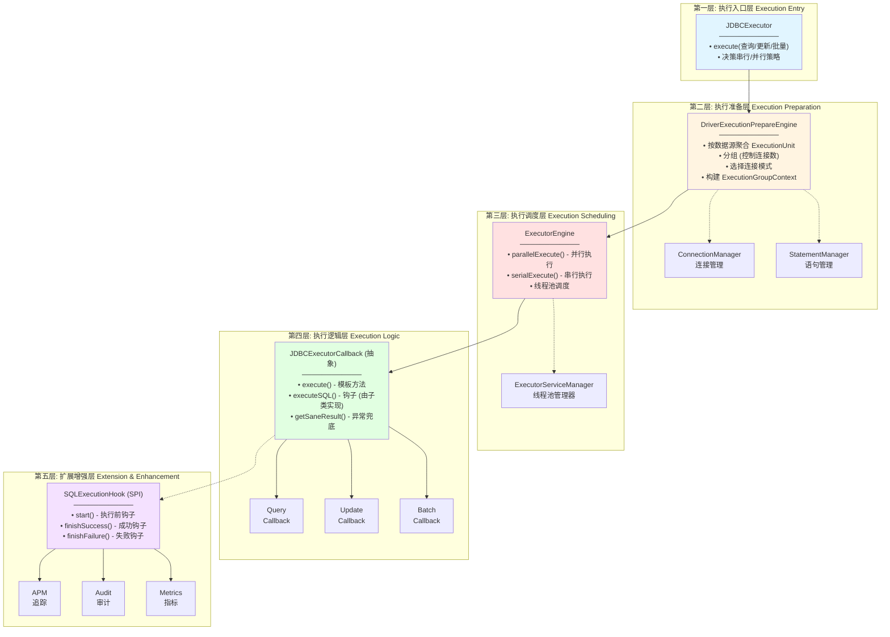
```mermaid
graph TB
    subgraph Layer1["第一层: 执行入口层 Execution Entry"]
        Entry["JDBCExecutor<br/>────────────<br/>• execute(查询/更新/批量)<br/>• 决策串行/并行策略"]
    end

    subgraph Layer2["第二层: 执行准备层 Execution Preparation"]
        Prepare["DriverExecutionPrepareEngine<br/>────────────<br/>• 按数据源聚合 ExecutionUnit<br/>• 分组 (控制连接数)<br/>• 选择连接模式<br/>• 构建 ExecutionGroupContext"]
        ConnMgr[ConnectionManager<br/>连接管理]
        StmtMgr[StatementManager<br/>语句管理]

        Prepare -.-> ConnMgr
        Prepare -.-> StmtMgr
    end

    subgraph Layer3["第三层: 执行调度层 Execution Scheduling"]
        Engine["ExecutorEngine<br/>────────────<br/>• parallelExecute() - 并行执行<br/>• serialExecute() - 串行执行<br/>• 线程池调度"]
        ServiceMgr[ExecutorServiceManager<br/>线程池管理器]

        Engine -.-> ServiceMgr
    end

    subgraph Layer4["第四层: 执行逻辑层 Execution Logic"]
        Callback["JDBCExecutorCallback (抽象)<br/>────────────<br/>• execute() - 模板方法<br/>• executeSQL() - 钩子 (由子类实现)<br/>• getSaneResult() - 异常兜底"]
        Query[Query<br/>Callback]
        Update[Update<br/>Callback]
        Batch[Batch<br/>Callback]

        Callback --> Query
        Callback --> Update
        Callback --> Batch
    end

    subgraph Layer5["第五层: 扩展增强层 Extension & Enhancement"]
        Hook["SQLExecutionHook (SPI)<br/>────────────<br/>• start() - 执行前钩子<br/>• finishSuccess() - 成功钩子<br/>• finishFailure() - 失败钩子"]
        APM[APM<br/>追踪]
        Audit[Audit<br/>审计]
        Metrics[Metrics<br/>指标]

        Hook --> APM
        Hook --> Audit
        Hook --> Metrics
    end

    Entry --> Prepare
    Prepare --> Engine
    Engine --> Callback
    Callback -.-> Hook

    style Entry fill:#e1f5ff
    style Prepare fill:#fff4e1
    style Engine fill:#ffe1e1
    style Callback fill:#e1ffe1
    style Hook fill:#f4e1ff
```

**分层职责说明**:

| 层次 | 核心职责 | 关键类 | 设计模式 |
|-----|---------|-------|---------|
| **执行入口层** | 统一的执行接口,决策执行策略 | `JDBCExecutor` | 外观模式 |
| **执行准备层** | 构建执行上下文,管理资源 | `DriverExecutionPrepareEngine` | 建造者模式 |
| **执行调度层** | 并发调度,线程池管理 | `ExecutorEngine` | 策略模式 |
| **执行逻辑层** | 具体 SQL 执行 | `JDBCExecutorCallback` | 模板方法模式 |
| **扩展增强层** | 插件化扩展 | `SQLExecutionHook` | SPI 模式 |

### 3.2 核心数据流转

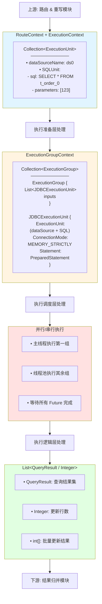
```mermaid
flowchart TD
    Input1["上游: 路由 & 重写模块"]

    subgraph RC["RouteContext + ExecutionContext"]
        EU["Collection&lt;ExecutionUnit&gt;<br/>────────────<br/>• dataSourceName: ds0<br/>• SQLUnit:<br/>  - sql: SELECT * FROM t_order_0<br/>  - parameters: [123]"]
    end

    Input1 --> RC

    Prepare["执行准备层处理"]

    RC --> Prepare

    subgraph EGC["ExecutionGroupContext"]
        EG["Collection&lt;ExecutionGroup&gt;<br/>────────────<br/>ExecutionGroup {<br/>  List&lt;JDBCExecutionUnit&gt; inputs<br/>}<br/><br/>JDBCExecutionUnit {<br/>  ExecutionUnit: (dataSource + SQL)<br/>  ConnectionMode: MEMORY_STRICTLY<br/>  Statement: PreparedStatement<br/>}"]
    end

    Prepare --> EGC

    Schedule["执行调度层处理"]

    EGC --> Schedule

    subgraph Exec["并行/串行执行"]
        E1["• 主线程执行第一组"]
        E2["• 线程池执行其余组"]
        E3["• 等待所有 Future 完成"]
    end

    Schedule --> Exec

    Logic["执行逻辑层处理"]

    Exec --> Logic

    subgraph Result["List&lt;QueryResult / Integer&gt;"]
        R1["• QueryResult: 查询结果集"]
        R2["• Integer: 更新行数"]
        R3["• int[]: 批量更新结果"]
    end

    Logic --> Result

    Output["下游: 结果归并模块"]

    Result --> Output

    style RC fill:#e1f5ff
    style EGC fill:#fff4e1
    style Exec fill:#ffe1e1
    style Result fill:#e1ffe1
```

### 3.3 核心模块协作关系 (查询场景)

```mermaid
sequenceDiagram
    participant User as 用户
    participant Entry as JDBC入口<br/>JDBCExecutor
    participant Prepare as 准备引擎<br/>DriverExecutionPrepareEngine
    participant Schedule as 调度引擎<br/>ExecutorEngine

    User->>Entry: executeQuery()

    Entry->>Prepare: prepare()

    Note over Prepare: 1. 聚合 SQL 按数据源<br/>2. 分组 (控制连接数)<br/>3. 获取连接<br/>4. 构建执行上下文

    Prepare-->>Entry: ExecutionGroupContext

    Entry->>Schedule: execute(context, callback, serial)

    Note over Schedule: 判断事务状态<br/>isInTransaction()?

    alt 并行执行
        Note over Schedule: serial = false
        Note over Schedule: 1. 主线程执行第一组<br/>2. 线程池执行其余组<br/>3. 等待 Future 完成
    else 串行执行
        Note over Schedule: serial = true
        Note over Schedule: 主线程顺序执行所有组
    end

    Schedule-->>Entry: List&lt;QueryResult&gt;

    Entry-->>User: ResultSet
```

---

## 第四章: 五大核心模块详解

### 4.1 模块一: 执行入口 (JDBCExecutor)

**职责**: 对外提供统一的执行接口,是执行引擎的门面

**关键决策逻辑**:

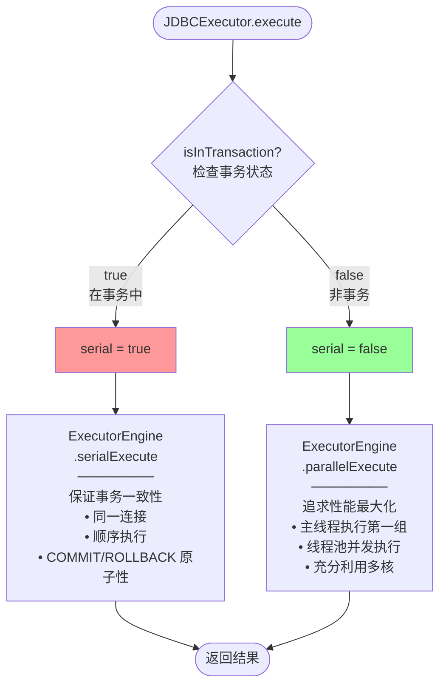
```mermaid
flowchart TD
    Start([JDBCExecutor.execute])

    Check{isInTransaction?<br/>检查事务状态}

    Start --> Check

    Check -->|true<br/>在事务中| Serial[serial = true]
    Check -->|false<br/>非事务| Parallel[serial = false]

    Serial --> SerialExec[ExecutorEngine<br/>.serialExecute<br/>────────<br/>保证事务一致性<br/>• 同一连接<br/>• 顺序执行<br/>• COMMIT/ROLLBACK 原子性]

    Parallel --> ParallelExec[ExecutorEngine<br/>.parallelExecute<br/>────────<br/>追求性能最大化<br/>• 主线程执行第一组<br/>• 线程池并发执行<br/>• 充分利用多核]

    SerialExec --> Return([返回结果])
    ParallelExec --> Return

    style Serial fill:#f99
    style Parallel fill:#9f9
```

**源码位置**: `infra/executor/.../driver/jdbc/JDBCExecutor.java`

### 4.2 模块二: 执行准备 (DriverExecutionPrepareEngine)

**职责**: 将 `ExecutionUnit` 集合转化为可调度的 `ExecutionGroupContext`

**处理流程**:

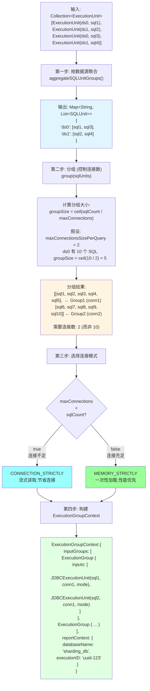
```mermaid
flowchart TD
    Input["输入: Collection&lt;ExecutionUnit&gt;<br/>[ExecutionUnit(ds0, sql1),<br/> ExecutionUnit(ds1, sql2),<br/> ExecutionUnit(ds0, sql3),<br/> ExecutionUnit(ds1, sql4)]"]

    Aggregate["第一步: 按数据源聚合<br/>aggregateSQLUnitGroups()"]

    Input --> Aggregate

    Output1["输出: Map&lt;String, List&lt;SQLUnit&gt;&gt;<br/>{<br/>  'ds0': [sql1, sql3],<br/>  'ds1': [sql2, sql4]<br/>}"]

    Aggregate --> Output1

    Group["第二步: 分组 (控制连接数)<br/>group(sqlUnits)"]

    Output1 --> Group

    Calc["计算分组大小:<br/>groupSize = ceil(sqlCount / maxConnections)<br/><br/>假设: maxConnectionsSizePerQuery = 2<br/>      ds0 有 10 个 SQL<br/>      groupSize = ceil(10 / 2) = 5"]

    Group --> Calc

    Output2["分组结果:<br/>[[sql1, sql2, sql3, sql4, sql5],  ← Group1 (conn1)<br/> [sql6, sql7, sql8, sql9, sql10]] ← Group2 (conn2)<br/><br/>需要连接数: 2 (而非 10)"]

    Calc --> Output2

    Mode["第三步: 选择连接模式"]

    Output2 --> Mode

    Check{maxConnections<br/>&lt;<br/>sqlCount?}

    Mode --> Check

    Check -->|true<br/>连接不足| Conn[CONNECTION_STRICTLY<br/>流式读取,节省连接]
    Check -->|false<br/>连接充足| Mem[MEMORY_STRICTLY<br/>一次性加载,性能优先]

    Build["第四步: 构建 ExecutionGroupContext"]

    Conn --> Build
    Mem --> Build

    Final["ExecutionGroupContext {<br/>  inputGroups: [<br/>    ExecutionGroup {<br/>      inputs: [<br/>        JDBCExecutionUnit(sql1, conn1, mode),<br/>        JDBCExecutionUnit(sql2, conn1, mode)<br/>      ]<br/>    },<br/>    ExecutionGroup { ... }<br/>  ],<br/>  reportContext: {<br/>    databaseName: 'sharding_db',<br/>    executionID: 'uuid-123'<br/>  }<br/>}"]

    Build --> Final

    style Output1 fill:#e1f5ff
    style Output2 fill:#fff4e1
    style Conn fill:#9ff
    style Mem fill:#9f9
    style Final fill:#e1ffe1
```

**源码位置**: `infra/executor/.../prepare/AbstractExecutionPrepareEngine.java`

### 4.3 模块三: 执行调度 (ExecutorEngine)

**两种调度策略对比**:

```mermaid
graph TB
    subgraph Parallel["并行执行 parallelExecute"]
        P1["适用场景: 非事务查询"]

        P2["执行流程:<br/>1. 取出第一个 ExecutionGroup<br/>2. 将其余 ExecutionGroup 提交到线程池<br/>3. 主线程同步执行第一个 ExecutionGroup<br/>4. 等待线程池中的 Future 完成<br/>5. 合并所有结果"]

        P3["总耗时:<br/>max(T(Group1), T(Group2), T(Group3))"]

        P1 --> P2
        P2 --> P3
    end

    subgraph Serial["串行执行 serialExecute"]
        S1["适用场景: 事务操作"]

        S2["执行流程:<br/>1. 主线程顺序执行每个 ExecutionGroup<br/>2. 不使用线程池<br/>3. 保证执行顺序"]

        S3["总耗时:<br/>T(Group1) + T(Group2) + T(Group3)"]

        S1 --> S2
        S2 --> S3
    end

    style Parallel fill:#9f9
    style Serial fill:#f99
```

**并行执行时序图**:

```mermaid
gantt
    title 并行执行时序
    dateFormat X
    axisFormat %L ms

    section 主线程
    Submit Group2,3 to pool: milestone, 0, 0
    Execute Group1: crit, 0, 100
    Merge Results: 100, 120

    section Worker1
    Execute Group2: 0, 90

    section Worker2
    Execute Group3: 0, 95
```

**串行执行时序图**:

```mermaid
gantt
    title 串行执行时序
    dateFormat X
    axisFormat %L ms

    section 主线程
    Execute Group1: crit, 0, 100
    Execute Group2: crit, 100, 190
    Execute Group3: crit, 190, 285
```

**线程池管理**:

```mermaid
flowchart TD
    Create["创建 ExecutorEngine"]

    CalcSize["计算线程池大小<br/>threadCount = CPU_CORES * 2 - 1"]

    Create --> CalcSize

    Note1["为什么 -1?<br/>因为主线程会执行第一组<br/>减少一个工作线程避免资源浪费"]

    CalcSize -.-> Note1

    ChooseType{executorSize == 0?}

    CalcSize --> ChooseType

    ChooseType -->|true| Cached[CachedThreadPool<br/>动态扩容]
    ChooseType -->|false| Fixed[FixedThreadPool<br/>固定大小]

    TTL["TTL 包装<br/>TtlExecutors.getTtlExecutorService<br/>支持 ThreadLocal 传递"]

    Cached --> TTL
    Fixed --> TTL

    Final[ExecutorService]

    TTL --> Final

    style Note1 fill:#ff9
```

**源码位置**: `infra/executor/.../kernel/ExecutorEngine.java`

### 4.4 模块四: 执行逻辑 (JDBCExecutorCallback)

**模板方法模式**:

```mermaid
classDiagram
    class JDBCExecutorCallback {
        <<abstract>>
        +execute(units, isTrunkThread) Collection~T~
        #executeSQL(sql, stmt, mode, dbType)* T
        #getSaneResult(stmt, ex)* Optional~T~
        -getDataSourceMetaData() DataSourceMetaData
    }

    class ExecuteQueryCallback {
        #executeSQL() QueryResult
        #getSaneResult() Optional~QueryResult~
    }

    class ExecuteUpdateCallback {
        #executeSQL() Integer
        #getSaneResult() Optional~Integer~
    }

    class BatchExecutorCallback {
        #executeSQL() int[]
        #getSaneResult() Optional~int[]~
    }

    JDBCExecutorCallback <|-- ExecuteQueryCallback
    JDBCExecutorCallback <|-- ExecuteUpdateCallback
    JDBCExecutorCallback <|-- BatchExecutorCallback

    note for JDBCExecutorCallback "模板方法 (final):\nexecute() 定义执行框架\n\n钩子方法 (abstract):\nexecuteSQL() 由子类实现\ngetSaneResult() 由子类实现"
```

**execute() 模板方法流程**:

```mermaid
flowchart TD
    Start([execute 模板方法])

    Step1["1. 设置异常处理策略<br/>SQLExecutorExceptionHandler.setExceptionThrown"]

    Step2["2. 获取数据源元数据 (缓存)<br/>getDataSourceMetaData"]

    Step3["3. 创建执行钩子<br/>new SPISQLExecutionHook"]

    Step4["4. 钩子开始<br/>hook.start(dataSource, sql, params)"]

    Step5["5. 执行 SQL (钩子方法)<br/>executeSQL(sql, stmt, mode, dbType)"]

    Step6["6. 钩子成功<br/>hook.finishSuccess()"]

    Step7["7. 上报执行进度<br/>finishReport()"]

    Return([返回结果])

    Catch["捕获 SQLException"]

    Step8["8. 尝试 Sane Result<br/>getSaneResult(stmt, ex)"]

    Check{有兜底结果?}

    Step9a["9a. 返回兜底结果"]
    Step9b["9b. 钩子失败<br/>hook.finishFailure(ex)"]

    Step10["10. 异常处理<br/>handleException(ex)"]

    Start --> Step1
    Step1 --> Step2
    Step2 --> Step3
    Step3 --> Step4
    Step4 --> Step5
    Step5 -->|成功| Step6
    Step6 --> Step7
    Step7 --> Return

    Step5 -->|失败| Catch
    Catch --> Step8
    Step8 --> Check
    Check -->|是| Step9a
    Check -->|否| Step9b
    Step9a --> Return
    Step9b --> Step10
    Step10 --> Return

    style Step5 fill:#ff9
    style Step8 fill:#9ff
```

**源码位置**: `infra/executor/.../driver/jdbc/JDBCExecutorCallback.java`

### 4.5 模块五: 扩展增强 (SQLExecutionHook)

**SPI 加载机制**:

```mermaid
graph LR
    subgraph "SPI 接口定义"
        Interface["SQLExecutionHook<br/>────────<br/>start()<br/>finishSuccess()<br/>finishFailure()"]
    end

    subgraph "SPI 加载器"
        Loader["SPISQLExecutionHook<br/>────────<br/>加载所有 SPI 实现<br/>遍历调用"]
    end

    subgraph "第三方实现"
        Impl1["APMHook<br/>────────<br/>SkyWalking<br/>追踪"]
        Impl2["SlowQueryHook<br/>────────<br/>慢查询<br/>监控"]
        Impl3["AuditHook<br/>────────<br/>审计<br/>日志"]
    end

    Interface -.实现.-> Impl1
    Interface -.实现.-> Impl2
    Interface -.实现.-> Impl3

    Loader -.加载.-> Impl1
    Loader -.加载.-> Impl2
    Loader -.加载.-> Impl3

    style Interface fill:#e1f5ff
    style Loader fill:#fff4e1
```

**APM 追踪应用场景**:

```mermaid
sequenceDiagram
    participant Exec as SQL 执行
    participant Hook as APMHook
    participant Tracer as APM 追踪系统<br/>(SkyWalking)

    Exec->>Hook: start(dataSource, sql, params)
    Hook->>Tracer: createSpan("SQL-Execution")
    Tracer-->>Hook: span
    Hook->>Tracer: span.tag("datasource", "ds0")
    Hook->>Tracer: span.tag("sql", "SELECT ...")

    Note over Exec: 执行 SQL...

    alt 执行成功
        Exec->>Hook: finishSuccess()
        Hook->>Tracer: span.finish()
    else 执行失败
        Exec->>Hook: finishFailure(exception)
        Hook->>Tracer: span.error(exception)
        Hook->>Tracer: span.finish()
    end
```

**如何注册自定义钩子**:

```mermaid
flowchart TD
    Step1["1. 实现接口<br/>public class MyHook implements SQLExecutionHook"]

    Step2["2. 创建 SPI 配置文件<br/>META-INF/services/<br/>org.apache.shardingsphere.infra.executor.sql.hook.SQLExecutionHook"]

    Step3["3. 文件内容<br/>com.example.MyHook"]

    Step4["4. 打包 JAR<br/>放入 ShardingSphere 的 lib 目录"]

    Step5["5. 自动加载<br/>ShardingSphere 启动时通过 SPI 加载"]

    Step1 --> Step2
    Step2 --> Step3
    Step3 --> Step4
    Step4 --> Step5

    style Step5 fill:#9f9
```

**源码位置**: `infra/executor/.../sql/hook/SQLExecutionHook.java`

---

## (未完待续...)

**说明**: 这是文档的前两部分 (宏观视图 + 逻辑视图),所有图表已转换为 Mermaid 格式。后续章节将包括:

- **第三部分: 进程视图** - 详细的并发执行机制、线程模型、死锁避免策略
- **第四部分: 开发视图** - 核心类的完整源码实现、设计模式应用
- **第五部分: 场景视图** - 典型场景的端到端执行流程、关键决策点分析
- **第六部分: 总结与扩展** - 设计思想总结、最佳实践、扩展开发指南

Mermaid 图表的优势:
- ✅ 更清晰的可视化效果
- ✅ 支持 GitHub/GitLab 渲染
- ✅ 易于维护和修改
- ✅ 支持多种图表类型 (流程图、时序图、甘特图、类图等)
