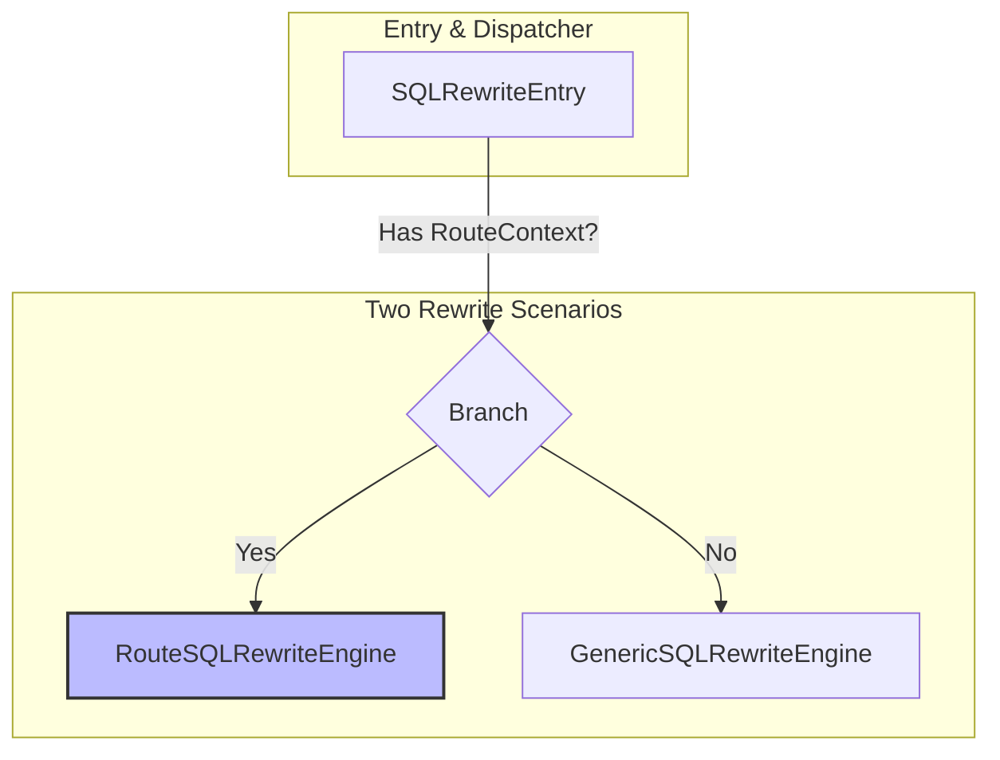
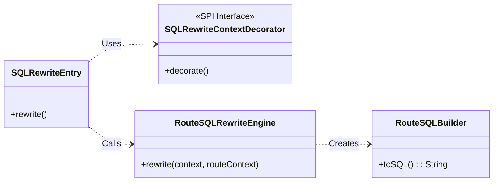
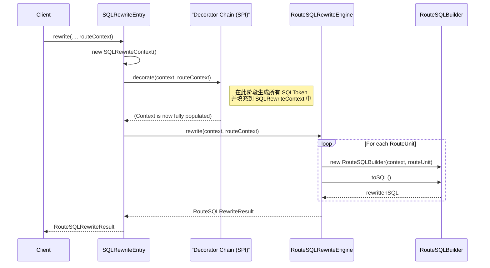

# ShardingSphere 源码深度解析：SQL 改写引擎的设计与实现 (V4 - Architecture Insights Edition)

## 1. 引言：从逻辑到物理的“精准翻译官”

在深入理解了 ShardingSphere **路由引擎**如何为一条逻辑 SQL 精心规划出“执行蓝图”——`RouteContext` 之后，我们迎来了数据操作链路中承前启后的关键一环：**SQL 改写**。

`RouteContext` 告诉我们 SQL *应该*去哪里，但它并没有改变 SQL 本身。用户输入的 SQL 仍然是面向逻辑表（如 `t_order`）的，而底层的物理数据库只认识物理表（如 `t_order_0`）。更重要的是，在分库分表的分布式环境下，分页、排序等操作若不经特殊“翻译”，便会产生谬以千里的结果。

**SQL 改写引擎（SQL Rewrite Engine）**，正是承担这一关键职责的“精准翻译官”。它位于路由引擎之后、执行引擎之前，其核心使命是：**依据 `RouteContext` 提供的精确路由信息，将一条逻辑 SQL，严谨地翻译成一组（一个或多个）可以在物理数据库上正确执行的物理 SQL。**

本文档在 V3 精准分析的基础上，进一步融入了“设计思想 (The Why)”的探讨，旨在不仅揭示其“如何运作”，更阐明其“为何如此设计”，力求为读者呈现一份既有深度又有思想的源码学习指南。

## 2. 体系结构：职责分离与可插拔设计 (`The What`)

在您当前的项目版本中，ShardingSphere 对改写引擎进行了精心的重构，其设计思想充分体现了“单一职责”和“可插拔”的现代软件工程原则。

### 2.1 架构思想：为何采用“双引擎”设计？

ShardingSphere 将改写场景一分为二，形成了**双引擎**的结构。


*   **`RouteSQLRewriteEngine`**: 专门负责处理**经过路由**的 SQL，是分库分表等复杂场景的核心。
*   **`GenericSQLRewriteEngine`**: 负责处理**无需路由**的 SQL，如在单库上进行数据脱敏。

**设计思想剖析 (The Why):** 这种职责分离的设计，体现了**单一职责原则**。它让处理复杂分片逻辑的 `RouteSQLRewriteEngine` 更加纯粹和内聚，避免了通用改写逻辑（如脱敏）对其造成的干扰。反之亦然。这种清晰的边界划分，使得框架在不同场景下都能以最高效、最清晰的方式工作，大大降低了系统的复杂度和维护成本。

### 2.2 核心组件与数据流

在我们的焦点——路由改写的分支下，核心组件与数据流如下：


*   **`SQLRewriteEntry`**: 顶层入口，负责创建上下文，并调度 `Decorator` 链。
*   **`SQLRewriteContextDecorator` (SPI)**: **可插拔能力的基石**。所有令牌生成逻辑都封装在此类接口的实现中。
*   **`RouteSQLRewriteEngine`**: 顶层协调器，负责遍历 `RouteUnit` 并调用 `Builder`。
*   **`RouteSQLBuilder`**: 核心执行者，封装了将 `SQLToken` 应用于 SQL 并生成最终字符串的逻辑。

## 3. 核心流程：装饰器模式驱动的“两阶段”改写 (`The How`)

经过对 `SQLRewriterIT` 集成测试的深度分析，我们得以揭示当前版本真实的、以“装饰器模式”为核心的调用链。

### 3.1 改写阶段核心调用链

下图清晰地展示了从 `RouteContext` 输入到 `SQLRewriteResult` 输出的核心调用链路：


### 3.2 设计思想剖析：为何采用“装饰器模式”？

当前版本最核心的架构演进，就是采用**装饰器模式**重构了令牌生成逻辑。`SQLRewriteEntry` 先创建一个“裸”的上下文 (`SQLRewriteContext`)，然后通过 SPI 加载一系列 `SQLRewriteContextDecorator` (如 `ShardingSQLRewriteContextDecorator`, `EncryptSQLRewriteContextDecorator` 等)，依次调用它们的 `decorate()` 方法，不断地为这个上下文“添砖加瓦”（即添加 `SQLToken`）。

**架构优势 (The Why):**
1.  **准备与执行的解耦**：此模式将“令牌生成”（由 `Decorator` 负责）与“SQL拼接”（由 `Builder` 负责）彻底分离。`RouteSQLRewriteEngine` 作为执行者，无需关心 `Token` 是如何生成的，它只消费一个“全信息”的 `SQLRewriteContext` 即可，职责更单一。
2.  **强大的可扩展性**：任何新的改写需求（例如，增加一种全新的“数据水印”规则），只需要开发一个新的 `SQLRewriteContextDecorator` 实现，并遵循 SPI 规范进行注册即可，对现有核心流程**零侵入**。

## 4. 关键实现：深入核心路径与协同场景

### 4.1 优化路径剖析：聚合改写 (`UNION ALL`)

在 `RouteSQLRewriteEngine.rewrite()` 方法中，存在一个重要的优化路径：

```java
// File: infra/rewrite/src/main/java/org/apache/shardingsphere/infra/rewrite/engine/RouteSQLRewriteEngine.java
if (isNeedAggregateRewrite(sqlRewriteContext.getSqlStatementContext(), routeUnits)) {
    // 3a. 聚合改写
    sqlRewriteUnits.put(routeUnits.iterator().next(), createSQLRewriteUnit(...));
} else {
    // 3b. 常规改写
    addSQLRewriteUnits(...);
}
```
**`isNeedAggregateRewrite`** 方法会判断，如果当前 SQL 是一个**不含 `JOIN`、子查询、`ORDER BY`、`LIMIT` 和 `LOCK` 的简单 `SELECT` 语句**，且需要发往同一数据源的多个分片表（例如 `t_user_0` 和 `t_user_1`），它就会将这些独立的查询用 `UNION ALL` 合并成一个大的查询。

**设计思想 (The Why):** 这是一个典型的**性能优化**。在特定场景下，将多个独立的网络请求合并为一个，可以极大地**减少数据库的连接开销和请求响应的往返时间 (RTT)**，从而显著提升查询效率。这体现了 ShardingSphere 在追求架构优雅的同时，也对性能进行了细致的打磨。

### 4.2 核心令牌剖析：`TableToken` 的“模板”与“实例化”

在 `4.1` 节的实例跟踪中，我们提到了 `TableToken` 是一个“模板令牌”，这个概念是理解 `RouteUnitAware` 接口设计的关键。

`ShardingSQLRewriteContextDecorator` 在生成 `TableToken` 时，它面对的是一个包含了**所有**路由结果的 `RouteContext`。它并不知道这个 `Token` 最终会被用在哪一个 `RouteUnit` 上。因此，它创建的 `TableToken` 内部，实际上是持有一个包含了**所有逻辑表到物理表映射关系**的集合（例如一个 `Map`）。

当 `RouteSQLBuilder` 在处理一个具体的 `RouteUnit(ds_0.t_order_0)` 并回调 `tableToken.toString(routeUnit)` 时：
1.  `toString(RouteUnit)` 方法被触发。
2.  它利用传入的 `routeUnit` 作为“钥匙”。
3.  从内部的映射关系集合中，精确地查找出当前 `RouteUnit` 所对应的那个物理表名 `t_order_0`。
4.  返回这个精确的物理表名。

这个过程，就如同用一个“模具”(`TableToken`) 和具体的“材料”(`RouteUnit`)，生产出最终的“零件”(物理表名字符串)。这是一种**延迟决策**的设计，使得令牌的生成可以和应用相分离，非常优雅。

### 4.3 协同工作场景：分片 + 加密

ShardingSphere 改写引擎最强大的地方，在于其能让多种规则无缝协同工作。假设我们同时配置了**分片规则**和**加密规则**：

1.  **装饰阶段**: `SQLRewriteEntry` 会依次调用 `ShardingSQLRewriteContextDecorator` 和 `EncryptSQLRewriteContextDecorator`。
2.  **令牌生成**:
    *   `Sharding...Decorator` 会生成 `TableToken` (例如 `t_order` -> `t_order_0`)。
    *   `Encrypt...Decorator` 会分析 `WHERE` 子句，并生成 `EncryptColumnToken` (例如 `plain_col = ?` -> `cipher_col = ?`)，同时还会对参数进行加密。
3.  **拼接阶段**: `AbstractSQLBuilder` 会拿到一个**同时包含 `TableToken` 和 `EncryptColumnToken` 的列表**。由于它们各自拥有精确的 `startIndex`，`toSQL()` 方法会在一次遍历中，同时完成对表名的替换和对列名的替换。

最终，一条逻辑 SQL `SELECT ... FROM t_order WHERE plain_col = '123'` 会被 seamlessly 地改写成 `SELECT ... FROM t_order_0 WHERE cipher_col = 'xyz'`。这就是 ShardingSphere **可插拔架构**魅力的完美体现。

## 5. 总结与展望

### 5.1 核心设计思想总结

通过本次深度剖析，我们可以总结出 ShardingSphere SQL 改写引擎的几点核心设计哲学：

*   **职责分离 (SoC)**: 通过“双引擎”设计，清晰地划分了路由改写和通用改写的边界。
*   **面向接口与 SPI**: `Decorator` 和 `Generator` 都基于 SPI 机制，提供了极致的可扩展性，形成了强大的“微内核”架构。
*   **装饰器模式**: 将“上下文构建”与“业务执行”解耦，使得核心流程更加稳定和清晰。
*   **延迟决策**: 通过 `RouteUnitAware` 接口，实现了令牌的“模板化”创建和“按需实例化”，优雅地解决了动态改写的问题。
*   **性能导向**: 在关键路径上（如 `UNION ALL` 优化），毫不妥协地追求性能提升。

### 5.2 展望：通往结果归并

在整个分析过程中，我们多次提到，改写引擎的很多精妙设计，其最终目的都是为了服务于它的下游——**结果归并 (Result Merging)**。

*   为什么分页改写需要将 `LIMIT 10, 5` 变成 `LIMIT 0, 15`？
*   为什么 `ORDER BY` 的排序列如果不在 `SELECT` 中，就必须被自动“补列”？
*   为什么 `AVG` 聚合函数会被改写成 `SUM` 和 `COUNT`？

所有这些问题的答案，都指向了同一个终点：**只有这样改写，后续的归并模块才能拿到足够的信息，将来自多个数据分片的、零散的结果集，正确地合并成一个仿佛只查询了一张单表的、对用户透明的最终结果集。**

因此，为了真正地、完整地理解 ShardingSphere 的核心数据链路，我们的下一站，必然是探索**结果归并**的奥秘。
