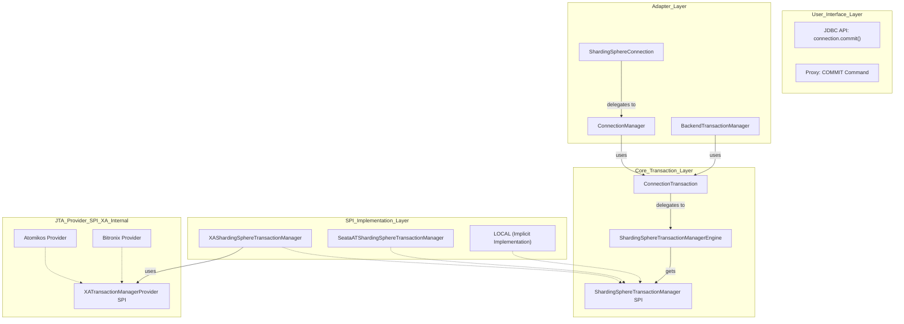

# ShardingSphere 事务模块源码学习文档 (JDBC & Proxy 全景分析)

## 1. 概述

ShardingSphere 的事务模块旨在为分布式数据库场景提供一致性的事务解决方案。它遵循 ShardingSphere 一贯的“可插拔”设计哲学，通过统一的 SPI 接口，适配了多种主流的事务实现方案，能够灵活地满足不同业务场景对数据一致性的要求。

本文档基于对 ShardingSphere `kernel/transaction`, `jdbc/core`, `proxy/backend` 等核心模块的源码分析，旨在从高屋建瓴的视角，全面厘清其在 **ShardingSphere-JDBC** 和 **ShardingSphere-Proxy** 两种适配器下的架构设计、核心流程与扩展机制。

## 2. 核心概念与统一架构

无论是在 JDBC 还是 Proxy 模式下，ShardingSphere 的事务管理都构建在一套统一的核心模型之上。其关键在于定义了一套标准的事务管理器接口，并通过 SPI 机制加载具体的实现。

### 2.1 支持的事务类型

ShardingSphere 支持三种核心事务类型：

*   **`LOCAL` (本地事务)**: 默认事务类型。利用数据库自身提供的原生事务能力。性能开销最小，但无法保证跨库操作的原子性。
*   **`XA` (两阶段提交事务)**: 基于 JTA 规范的标准分布式事务协议，保证跨库操作的强一致性。ShardingSphere 通过集成第三方的 JTA 实现（如 Atomikos, Bitronix, Narayana）来提供支持。
*   **`BASE` (柔性事务)**: 支持最终一致性事务模型，目前通过集成 Seata 的 AT 模式实现，适用于高并发、长事务场景。

### 2.2 统一架构设计图

下图清晰地展示了 ShardingSphere 事务模块的分层设计，并特别标明了 JDBC 和 Proxy 两种模式下的不同入口和适配器。



**架构解析**:

*   **统一核心**: `ConnectionTransaction`, `ShardingSphereTransactionManagerEngine` 和 `ShardingSphereTransactionManager` SPI 构成了与具体适配器无关的、可复用的事务核心。
*   **双重入口**:
    *   **JDBC**: 用户通过标准的 JDBC API (`Connection.commit()`) 与系统交互，入口是 `ShardingSphereConnection`。
    *   **Proxy**: 用户通过 MySQL/PostgreSQL 客户端发送 `COMMIT` 命令，入口是 `BackendTransactionManager`。
*   **适配器差异**:
    *   **`ConnectionManager` (JDBC 专有)**: 负责管理物理数据库连接，并将 JDBC 的 `setAutoCommit`, `commit`, `rollback` 等调用翻译成对 `ConnectionTransaction` 的操作。
    *   **`BackendTransactionManager` (Proxy 专有)**: 直接与 `ConnectionTransaction` 交互，处理来自客户端的事务命令。
*   **SPI 机制**: 分布式事务 (`XA`, `BASE`) 的具体实现通过 `ShardingSphereTransactionManager` SPI 被动态加载。`LOCAL` 事务则是一种隐式实现，其逻辑直接在 `ConnectionManager` (JDBC) 和 `BackendTransactionManager` (Proxy) 中通过操作原生 JDBC 连接来完成。

## 3. 关键流程解析

### 3.1 ShardingSphere-JDBC 事务流程

JDBC 模式通过巧妙地适配标准 `java.sql.Connection` 接口，将事务控制无缝集成。

1.  **事务开启**: 用户调用 `connection.setAutoCommit(false)`。
    *   `ShardingSphereConnection` 捕捉到此调用。在其 `setAutoCommit()` 方法内部，它会判断当前事务类型。
    *   如果是 `LOCAL`，它会通过 `ConnectionManager` 将 `autoCommit=false` 设置到所有底层的物理连接。
    *   如果是 `XA` 或 `BASE`，它会调用 `connectionTransaction.begin()`，最终触发 `ShardingSphereTransactionManager` 的 `begin()` 方法，开启一个全局事务。

2.  **事务提交**: 用户调用 `connection.commit()`。
    *   调用链: `ShardingSphereConnection` -> `ConnectionManager` -> `ConnectionTransaction` (如果是分布式事务) 或 直接操作物理连接 (如果是本地事务)。
    *   `ConnectionManager` 的 `commit()` 方法是关键：
        *   **本地事务**: 它会遍历所有缓存的物理连接，并直接调用每个连接的 `commit()`。
        *   **分布式事务**: 它将调用委托给 `connectionTransaction.commit()`，后者会找到对应的 `ShardingSphereTransactionManager` SPI 实现 (如 `XAShardingSphereTransactionManager`) 并调用其 `commit()` 方法，从而启动 JTA 的两阶段提交。

### 3.2 ShardingSphere-Proxy 事务流程

Proxy 模式的事务流程更为直接，因为它直接处理客户端的事务协议命令。

1.  **事务开启**: 客户端发送 `START TRANSACTION` 或 `BEGIN` 命令。
    *   Proxy 的前端解析命令，`BackendTransactionManager` 被调用。
    *   `BackendTransactionManager` 直接调用 `connectionTransaction.begin()`，开启事务。后续流程与 JDBC 分布式事务相同。

2.  **事务提交**: 客户端发送 `COMMIT` 命令。
    *   `BackendTransactionManager` 的 `commit()` 方法被调用。
    *   与 `ConnectionManager` 类似，它会检查 `isLocalTransaction()`。
    *   **本地事务**: 它会获取当前会话的所有物理连接，并逐个执行 `commit`。
    *   **分布式事务**: 它调用 `connectionTransaction.commit()`，触发 SPI 实现的 `commit` 逻辑。

## 4. 配置与扩展机制

配置与扩展机制对于 JDBC 和 Proxy 模式是完全**统一**的，都作用于底层的事务核心。

### 4.1 事务配置

用户在 `server.yaml` (Proxy) 或 `config-xxx.yaml` (JDBC) 的 `transaction` 规则中进行配置。

```yaml
# 示例
rules:
  - !TRANSACTION
    defaultType: XA           # 设置默认事务类型
    providerType: Atomikos    # 指定 XA 的 JTA 提供商 (如 Atomikos, Bitronix)
    props:
      # JTA provider 的特定属性
```

### 4.2 扩展机制

扩展一个新的分布式事务解决方案的步骤是统一的：

1.  实现 `ShardingSphereTransactionManager` 接口。
2.  (对于 XA) 如果是新的 JTA 实现，则实现 `XATransactionManagerProvider` 接口。
3.  遵循 ShardingSphere SPI 规范，在 `META-INF/services` 目录下注册实现。
4.  将 JAR 包放入 classpath，即可在配置文件中通过自定义的 `type` 来启用。

## 5. 总结

ShardingSphere 通过一套设计精良的**统一事务核心**和两套独立的**适配器（JDBC 和 Proxy）**，成功地为用户提供了在不同场景下一致的、功能强大的分布式事务体验。

*   **架构的优雅之处**在于，它将与具体协议（JDBC API, MySQL/PG 协议）相关的适配逻辑严格限制在适配器层，而将底层的事务管理（类型选择、生命周期、SPI 加载）沉淀为可复用的核心模块。
*   这使得无论是 JDBC 用户还是 Proxy 用户，都能够享受到同样的事务能力（LOCAL, XA, BASE），并且可以通过完全相同的配置方式来管理和扩展事务行为，充分体现了其“可插拔”的核心设计理念。