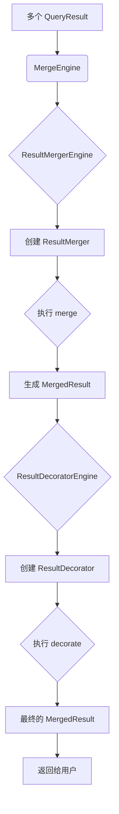

# ShardingSphere 归 бъ引擎源码学习文档

## 1. 概述

ShardingSphere 的归 бъ引擎是其核心功能之一，它负责将从多个数据节点获取的数据结果集合并成一个统一的、对用户透明的结果集。理解归 бъ引擎的工作原理，对于深入掌握 ShardingSphere 的分库分表、读写分离等核心功能至关重要。

本文档将深入分析 ShardingSphere 归 бъ引擎的源代码，从顶层设计、核心组件、工作流程到具体的归 бъ策略，为你揭示其内部的实现细节。

## 2. 整体架构

ShardingSphere 的归 бъ引擎采用了一种高度可扩展的、基于 SPI（Service Provider Interface）的架构。其核心设计思想是将归 бъ过程分为两个阶段：**归 бъ（Merge）** 和 **装饰（Decorate）**。

*   **归 бъ（Merge）**: 这个阶段负责将来自不同数据源的多个 `QueryResult` 合并成一个统一的 `MergedResult`。这是归 бъ引擎最核心的功能。
*   **装饰（Decorate）**: 这个阶段负责对 `MergedResult` 进行再加工，以实现诸如排序（ORDER BY）、分页（LIMIT）、聚合（GROUP BY）、数据解密等功能。

这种两阶段的设计，使得归 бъ引擎的职责更加清晰，也更容易进行功能扩展。

下图展示了归 бъ引擎的整体架构：



## 3. 核心组件（深度剖析）

为了真正理解归 бъ引擎的精髓，我们需要深入到其核心组件的内部实现和协作细节中。

### 3.1. `MergeEngine`: 归 бъ流程的 orchestrator

`MergeEngine` 是整个归 бъ流程的“编排者”。它本身不包含具体的归 бъ或装饰逻辑，而是通过 SPI 机制动态地加载 `ResultProcessEngine`（即 `ResultMergerEngine` 和 `ResultDecoratorEngine`），并将它们像积木一样组合起来，完成整个归 бъ任务。

**关键方法剖析 (`executeMerge` & `decorate`):**

在 `MergeEngine` 的 `merge` 方法中，`executeMerge` 和 `decorate` 是两个核心的私有方法。

```java
// in MergeEngine.java

// executeMerge 负责第一阶段：归 бъ
@SuppressWarnings({"unchecked", "rawtypes"})
private Optional<MergedResult> executeMerge(final List<QueryResult> queryResults, final SQLStatementContext<?> sqlStatementContext) throws SQLException {
    for (Entry<ShardingSphereRule, ResultProcessEngine> entry : engines.entrySet()) {
        if (entry.getValue() instanceof ResultMergerEngine) {
            // 1. 找到合适的 ResultMergerEngine
            ResultMergerEngine engine = (ResultMergerEngine) entry.getValue();
            // 2. 通过引擎创建 ResultMerger 实例
            ResultMerger resultMerger = engine.newInstance(database.getName(), database.getProtocolType(), entry.getKey(), props, sqlStatementContext);
            // 3. 执行归 бъ
            return Optional.of(resultMerger.merge(queryResults, sqlStatementContext, database, connectionContext));
        }
    }
    return Optional.empty();
}

// decorate 负责第二阶段：装饰
@SuppressWarnings({"unchecked", "rawtypes"})
private MergedResult decorate(final MergedResult mergedResult, final SQLStatementContext<?> sqlStatementContext) throws SQLException {
    MergedResult result = null;
    for (Entry<ShardingSphereRule, ResultProcessEngine> entry : engines.entrySet()) {
        if (entry.getValue() instanceof ResultDecoratorEngine) {
            // 1. 找到合适的 ResultDecoratorEngine
            ResultDecoratorEngine engine = (ResultDecoratorEngine) entry.getValue();
            // 2. 通过引擎创建 ResultDecorator 实例
            ResultDecorator resultDecorator = engine.newInstance(database, entry.getKey(), props, sqlStatementContext);
            // 3. 执行装饰（注意：这里是链式调用，后一个装饰器包装前一个的结果）
            result = null == result ? resultDecorator.decorate(mergedResult, sqlStatementContext, entry.getKey()) : resultDecorator.decorate(result, sqlStatementContext, entry.getKey());
        }
    }
    return null == result ? mergedResult : result;
}
```

从源码中我们可以看到，`MergeEngine` 通过遍历所有与当前 `ShardingSphereRule` 相关的 `ResultProcessEngine`，来动态地应用归 бъ和装饰逻辑。这种设计完全将核心归 бъ流程与具体的功能（如分片、加密、影子库等）解耦。

### 3.2. `ResultMerger` & `TransparentResultMerger`: 归 бъ的基石

`ResultMerger` 定义了归 бъ的接口，而 `TransparentResultMerger` 是其最基础、最简单的实现。当一个 SQL 请求只路由到单个数据节点时，ShardingSphere 就会使用 `TransparentResultMerger`。

**源码分析 (`TransparentResultMerger`):**

```java
// in TransparentResultMerger.java
public final class TransparentResultMerger implements ResultMerger {
    
    @Override
    public MergedResult merge(final List<QueryResult> queryResults, final SQLStatementContext<?> sqlStatementContext, final ShardingSphereDatabase database, final ConnectionContext connectionContext) {
        // 直接返回一个 TransparentMergedResult，包装了唯一的 QueryResult
        return new TransparentMergedResult(queryResults.get(0));
    }
}
```

它的 `merge` 方法非常简单：直接将 `queryResults` 列表中的第一个（也是唯一一个）`QueryResult` 包装成一个 `TransparentMergedResult` 并返回。它本身不执行任何数据合并操作，仅仅是做了一层“透明”的包装，因此得名。

### 3.3. `ResultDecorator` & `EncryptDQLResultDecorator`: 装饰的艺术

装饰器模式是 ShardingSphere 归 бъ引擎实现功能扩展的关键。我们以加密模块的 `EncryptDQLResultDecorator` 为例，来深入理解其工作原理。

**源码分析 (`EncryptDQLResultDecorator`):**

```java
// in EncryptDQLResultDecorator.java
@RequiredArgsConstructor
public final class EncryptDQLResultDecorator implements ResultDecorator<EncryptRule> {
    
    private final EncryptAlgorithmMetaData metaData;
    
    @Override
    public MergedResult decorate(final MergedResult mergedResult, final SQLStatementContext<?> sqlStatementContext, final EncryptRule rule) {
        // 核心：用 EncryptMergedResult 来包装原始的 MergedResult
        return new EncryptMergedResult(metaData, mergedResult);
    }
    
    // ... 省略了 decorate(QueryResult, ...) 的重载方法
}
```

`EncryptDQLResultDecorator` 的 `decorate` 方法，就是用另一个 `MergedResult` 的实现——`EncryptMergedResult`——来包装原始的 `mergedResult`。真正的解密逻辑，就封装在 `EncryptMergedResult` 的 `getValue` 方法中。

**源码分析 (`EncryptMergedResult`):**

```java
// in EncryptMergedResult.java
@RequiredArgsConstructor
public final class EncryptMergedResult implements MergedResult {
    
    private final EncryptAlgorithmMetaData metaData;
    
    private final MergedResult mergedResult; // 持有被装饰的对象
    
    @Override
    public boolean next() throws SQLException {
        return mergedResult.next(); // 直接转发调用
    }
    
    @SuppressWarnings({"rawtypes", "unchecked"})
    @Override
    public Object getValue(final int columnIndex, final Class<?> type) throws SQLException {
        // 检查当前列是否需要解密
        Optional<EncryptContext> encryptContext = metaData.findEncryptContext(columnIndex);
        if (!encryptContext.isPresent() || !metaData.isQueryWithCipherColumn(...)) {
            return mergedResult.getValue(columnIndex, type); // 不需要解密，直接返回
        }
        
        // 获取解密算法
        Optional<StandardEncryptAlgorithm> encryptAlgorithm = metaData.findEncryptor(...);
        if (!encryptAlgorithm.isPresent()) {
            return mergedResult.getValue(columnIndex, type); // 没有算法，直接返回
        }
        
        // 核心：从被装饰对象获取值，然后执行解密
        Object cipherValue = mergedResult.getValue(columnIndex, Object.class);
        return null == cipherValue ? null : encryptAlgorithm.get().decrypt(cipherValue, encryptContext.get());
    }
    
    // ... 其他直接转发调用的方法
}
```

通过这种方式，加密模块在完全不修改 `MergeEngine` 核心代码的前提下，为查询结果赋予了数据解密的能力。

### 3.4. 组件协作流程（具体实例）

现在，我们可以用具体的类名来更新之前的序列图，使其更贴近真实的执行过程。假设我们执行了一个查询，命中了加密规则：

```mermaid
sequenceDiagram
    participant Client
    participant MergeEngine
    participant TransparentResultMerger
    participant EncryptResultDecoratorEngine
    participant EncryptDQLResultDecorator
    participant EncryptMergedResult

    Client->>MergeEngine: merge(queryResults, ...)
    MergeEngine->>TransparentResultMerger: merge(queryResults, ...)
    TransparentResultMerger-->>MergeEngine: transparentMergedResult
    
    MergeEngine->>EncryptResultDecoratorEngine: newInstance(...)
    EncryptResultDecoratorEngine-->>MergeEengine: encryptDQLResultDecorator
    
    MergeEngine->>EncryptDQLResultDecorator: decorate(transparentMergedResult, ...)
    create participant EncryptMergedResult
    EncryptDQLResultDecorator->>EncryptMergedResult: new(metaData, transparentMergedResult)
    EncryptMergedResult-->>EncryptDQLResultDecorator: encryptMergedResult
    EncryptDQLResultDecorator-->>MergeEngine: encryptMergedResult
    
    MergeEngine-->>Client: final MergedResult (EncryptMergedResult)

    ... later ...

    Client->>EncryptMergedResult: getValue(columnIndex, type)
    EncryptMergedResult->>EncryptAlgorithm: decrypt(cipherValue)
    EncryptAlgorithm-->>EncryptMergedResult: plainValue
    EncryptMergedResult-->>Client: plainValue
```

这个详尽的序列图，清晰地展示了从归 бъ到装饰，再到最终获取解密数据的完整流程。

## 4. 归 бъ策略

ShardingSphere 提供了两种主要的归 бъ策略：**流式归 бъ（Stream Merging）** 和 **内存归 бъ（Memory Merging）**。它们各有优劣，适用于不同的业务场景。

### 4.1. 流式归 бъ (Stream Merging)

流式归 бъ是指 ShardingSphere 在合并来自不同数据源的结果集时，并不会将所有的数据都加载到内存中，而是采用一种“边读边归 бъ”的方式。它通过维护一个指向当前数据行的游标，在调用 `next()` 方法时，动态地从各个 `QueryResult` 中获取数据，并按照指定的规则（例如 `ORDER BY` 的排序规则）返回最合适的一行。

**优点:**

*   **内存消耗低**: 由于不需要在内存中缓存整个结果集，因此流式归 бъ的内存消耗非常低，可以有效避免 OOM（Out of Memory）的风险。

**缺点:**

*   **实现复杂**: 流式归 бъ的实现逻辑相对复杂，需要精巧地控制多个 `QueryResult` 的数据读取和比较。
*   **CPU 消耗**: 每次调用 `next()` 方法，都需要进行一次比较和计算，会带来一定的 CPU 消耗。

**源码分析 (`StreamMergedResult`):**

`StreamMergedResult` 是流式归 бъ的核心抽象类。它内部维护了一个 `currentQueryResult`，代表当前正在读取的 `QueryResult`。它的 `getValue()` 等方法都是直接委托给 `currentQueryResult` 来实现的。而最关键的 `next()` 方法则是由其子类来实现，例如：

*   **`OrderByStreamMergedResult`**: 用于处理带有 `ORDER BY` 子句的查询。它内部维护了一个优先级队列（Min-Heap），用于对来自不同 `QueryResult` 的数据行进行排序。
*   **`GroupByStreamMergedResult`**: 用于处理带有 `GROUP BY` 子句的查询。它会将相同分组的数据行进行聚合计算。

### 4.2. 内存归 бъ (Memory Merging)

内存归 бъ是指 ShardingSphere 将所有 `QueryResult` 的数据一次性加载到内存中，然后在内存中进行排序、聚合、分页等操作。

**优点:**

*   **实现简单**: 内存归 бъ的逻辑相对简单，易于实现和维护。
*   **处理灵活**: 由于所有数据都在内存中，因此可以方便地进行各种复杂的计算和处理。

**缺点:**

*   **内存消耗高**: 内存归 бъ需要将所有数据都加载到内存中，当结果集很大时，容易导致 OOM。

**源码分析 (`MemoryMergedResult`):**

`MemoryMergedResult` 是内存归 бъ的核心抽象类。它在构造函数中，通过调用抽象的 `init` 方法，将所有 `QueryResult` 的数据加载到一个 `List<MemoryQueryResultRow>` 结构中。`MemoryQueryResultRow` 代表了内存中的一行数据。之后，`next()` 方法的调用就变成了对这个 List 的遍历。

### 4.3. 如何选择归 бъ策略？

ShardingSphere 会根据 SQL 语句的类型来自动选择合适的归 бъ策略。通常来说：

*   对于带有 `ORDER BY` 或 `GROUP BY` 的查询，会优先选择**流式归 бъ**，以避免内存溢出。
*   对于不带 `ORDER BY` 和 `GROUP BY` 的查询，如果需要进行分页（LIMIT），则会选择**内存归 бъ**，因为分页操作需要在知道全量数据的情况下才能进行。

## 5. 装饰器模式的应用

在 `MergeEngine` 中，我们可以清晰地看到装饰器模式的应用。在 `merge` 方法的第二阶段，`decorate` 方法会被调用，它会遍历所有的 `ResultDecoratorEngine`，并创建出相应的 `ResultDecorator`，对 `MergedResult` 进行层层包装。

这种设计的好处是，可以将不同的功能（例如分页、聚合、排序）解耦，并通过装饰器的方式进行动态组合，从而实现灵活的功能扩展。

## 6. 总结

ShardingSphere 的归 бъ引擎是一个设计精良、功能强大的模块。它通过 SPI 机制实现了高度的可扩展性，通过流式归 бъ和内存归 бъ两种策略，在性能和内存消耗之间取得了良好的平衡。而装饰器模式的应用，则进一步增强了其灵活性和可维护性。

希望通过本文档的分析，你能对 ShardingSphere 的归 бъ引擎有一个更加深入的理解。