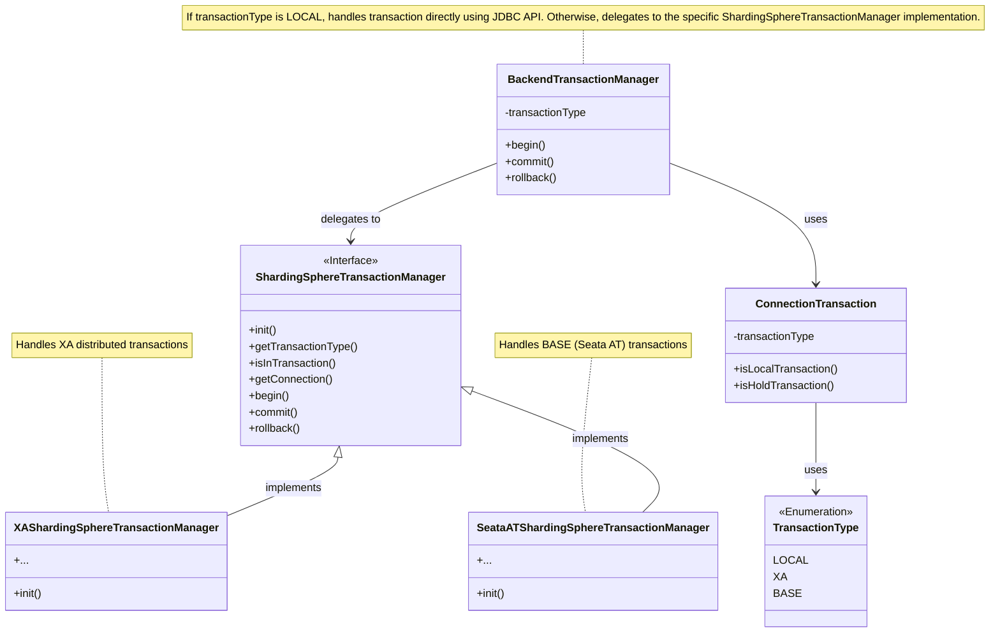

```mermaid
classDiagram
    direction TB

    class ShardingSphereTransactionManager {
        <<Interface>>
        +init()
        +getTransactionType()
        +isInTransaction()
        +getConnection()
        +begin()
        +commit()
        +rollback()
    }

    class XAShardingSphereTransactionManager {
        +init()
        +...
    }

    class SeataATShardingSphereTransactionManager {
        +init()
        +...
    }

    class ConnectionTransaction {
        -transactionType
        +isLocalTransaction()
        +isHoldTransaction()
    }
    
    class BackendTransactionManager {
        -transactionType
        +begin()
        +commit()
        +rollback()
    }

    class TransactionType {
        <<Enumeration>>
        LOCAL
        XA
        BASE
    }

    ShardingSphereTransactionManager <|-- XAShardingSphereTransactionManager : implements
    ShardingSphereTransactionManager <|-- SeataATShardingSphereTransactionManager : implements

    BackendTransactionManager --> ShardingSphereTransactionManager : delegates to
    BackendTransactionManager --> ConnectionTransaction : uses
    ConnectionTransaction --> TransactionType : uses
    
    note for XAShardingSphereTransactionManager "Handles XA distributed transactions"
    note for SeataATShardingSphereTransactionManager "Handles BASE (Seata AT) transactions"
    note for BackendTransactionManager "If transactionType is LOCAL, handles transaction directly using JDBC API. Otherwise, delegates to the specific ShardingSphereTransactionManager implementation."

```
