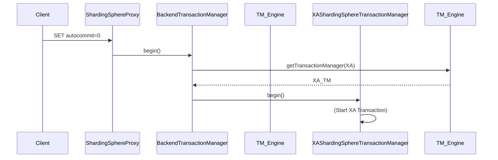

```mermaid
sequenceDiagram
    participant Client
    participant ShardingSphereProxy
    participant BackendTransactionManager
    participant ShardingSphereTransactionManagerEngine as TM_Engine
    participant XA_TM as XAShardingSphereTransactionManager

    Client->>ShardingSphereProxy: SET autocommit=0
    ShardingSphereProxy->>BackendTransactionManager: begin()
    BackendTransactionManager->>TM_Engine: getTransactionManager(XA)
    TM_Engine-->>BackendTransactionManager: XA_TM
    BackendTransactionManager->>XA_TM: begin()
    XA_TM->>XA_TM: (Start XA Transaction)
```
